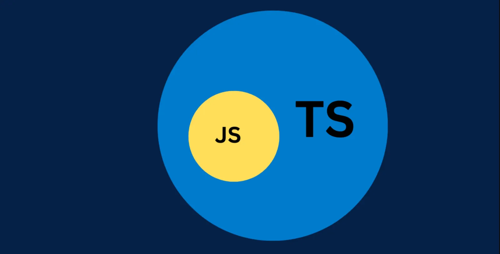
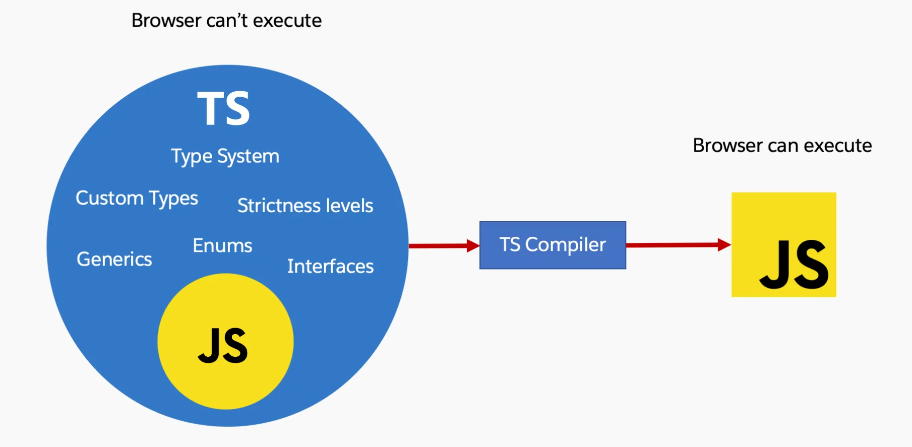

# All About TS

## 1. What are these types of languages: Static Type, Loose Type?
## Explanation :-
* **Static (Statically Typed) Languages**
    * In a statically typed language, variable types are checked at compile-time. 
    * This means if you declare a variable with a specific type, you cannot assign a value of a different type later without causing a compilation error. 
    * Examples include C, C++, Java, and TypeScript.
* **Loose Type (or Dynamically Typed) Languages**
    * In a dynamically typed language, types are checked at runtime. 
    * You can assign different types of values to the same variable, and the interpreter will only throw an error if it encounters an operation that doesn’t make sense at runtime. 
    * Examples include JavaScript, Python, and Ruby.
* **Example Snippet** : 
```typescript
// Statically Typed Example (TypeScript-like pseudocode)
let userName: string = "Alice";
userName = 42; // ERROR: type mismatch

// Dynamically Typed Example (JavaScript-like pseudocode)
let userName = "Alice";
userName = 42; // Allowed at assignment time, might lead to runtime errors later
```
* **Real-Life Use Case :**
	* When building large applications, static typing helps catch errors early and maintain code consistency as the app grows.
	* For quick scripting or prototypes, dynamic typing offers speed and flexibility.

## 2. What is TypeScript (TS)?
## Explanation :-
* TypeScript is a typed superset of JavaScript, meaning all valid JavaScript code is also valid TypeScript code. 
* TypeScript adds static typing, interfaces, and other features that help you write more robust, maintainable code.
* **Why TS :**
	* JavaScript is a powerful and widely used programming language, but it has a dynamic typing system, which means variable types are determined at runtime. 
	* While dynamic typing provides flexibility, it can lead to runtime errors that are challenging to catch during development.
	* In response to these challenges, Microsoft introduced TypeScript, a superset of JavaScript that adds static typing to the language. 
	* TypeScript is designed to address some of the limitations of JavaScript by providing developers with a more robust type system. 
	
* **Real-Life Use Case :**
	* **Enterprise Applications** - Large teams use TypeScript for better tooling, collaboration, and fewer runtime errors.
	* **Open-Source Libraries** - Many modern frameworks/libraries (Angular, NestJS) are built in TypeScript.

## 3. Is it a Different Language?
## Explanation :-
* Yes and No.
    * **Yes** - It has additional syntax and a compiler of its own. You write .ts files, not .js files.
    * **No** - Under the hood, it transpiles/compiles to plain JavaScript, which is what browsers and Node.js actually execute.

## 4. How TS Works When JS Is the Only Language the Browser Understands?
## Explanation :-
* TS is compiled (or transpiled) into JavaScript using the TypeScript Compiler (tsc) or other tools. 
* The resulting JavaScript is then runnable by browsers, Node.js, or any JavaScript engine.

## 5. Where and How Does TS Code Run?
## Explanation :-
* **Where** - Primarily in environments that run JavaScript (browsers, Node.js).
* **How** - 
	* You write .ts files → TypeScript Compiler transpiles them into .js → The .js files are then executed.
	* TypeScript code doesn't run natively in browsers or JavaScript environments. 
	* Instead, it undergoes a compilation process to generate equivalent JavaScript code. 
	* Here's an overview of how TypeScript code is executed :
		* **Writing TypeScript Code :**
			* Developers write TypeScript code using .ts or .tsx files, employing TypeScript's syntax with features like static typing, interfaces, and type annotations.
		* **TypeScript Compiler (tsc) :**
			* The TypeScript Compiler (tsc) is a command-line tool that processes TypeScript code.
			* Developers run tsc to initiate the compilation process.
		* **Compilation Process :**
			* The TypeScript Compiler parses and analyzes the TypeScript code, checking for syntax errors and type-related issues.
			* It generates equivalent JavaScript code, typically in one or more .js or .jsx files.
		* **Generated JavaScript Code :**
			* The output JavaScript code closely resembles the original TypeScript code but lacks TypeScript-specific constructs like type annotations.
			* TypeScript features that aren't present in JavaScript (e.g., interfaces) are often transpiled or emitted in a way that doesn't affect runtime behavior.
		* **JavaScript Execution :**
			* The generated JavaScript code can now be executed by any JavaScript runtime or browser.
			* Developers can include the resulting JavaScript files in HTML documents or use them in Node.js environments.
		* **Runtime Environment :**
			* In the chosen runtime environment, the JavaScript code is interpreted or compiled by the JavaScript engine (e.g., V8 in Chrome, SpiderMonkey in Firefox).
			* Just-in-time (JIT) compilation or interpretation occurs to convert the code into machine code that the computer's processor can execute.
		* **Interacting with the DOM (Browser Environments) :**
			* In browser environments, the JavaScript code, generated from TypeScript, may interact with the Document Object Model (DOM) to manipulate web page structure and behavior.
		


## 6. Is TS Compiled or What Type of Language?
## Explanation :-
* TS is often referred to as a transpiled language, because it translates TypeScript code into JavaScript code.
* However, it also does some level of compilation (type-checking) which can produce errors if the types don’t match.

## 7. What Is the TS Compiler?
## Explanation :-
* The TypeScript Compiler (tsc) is the official command-line tool from Microsoft that :
	* Type-checks your .ts files.
	* Transpiles them into JavaScript.
	* Outputs the final .js files for execution.
* The TypeScript Compiler (tsc) is responsible for transpiling TypeScript code into JavaScript.
* It is a part of the official TypeScript distribution and can be installed using tools like npm.
* Developers run tsc from the command line, specifying the TypeScript file(s) they want to compile.
* Configuration for the compilation process can be provided via a tsconfig.json file.
* The compiler performs type checking, emits JavaScript files, and allows customization of compilation options.
* In summary, TypeScript code is transformed into JavaScript through the TypeScript Compiler (tsc). 
* This compilation process ensures that TypeScript's features are compatible with existing JavaScript environments, enabling developers to benefit from static typing during development while still producing standard JavaScript for execution.
* In addition to the TypeScript Compiler (tsc), several alternative tools have gained popularity for their efficiency, speed, and additional features when transpiling TypeScript to JavaScript. 

## 8. Famous TS Compilers or Transpilers (esbuild, swc) ?
## Explanation :-
* **esbuild** - 
    * A fast bundler/transpiler written in Go. 
	* It can handle TypeScript but often relies on TypeScript for type-checking behind the scenes.
	* A highly performant JavaScript bundler and minifier, but it also supports TypeScript.
* **swc (Speedy Web Compiler)** - 
    * A Rust-based toolchain that can transpile TypeScript to JavaScript, known for its speed. 
    * Like esbuild, it may bypass or do minimal type-checking, so many projects still integrate with tsc for advanced checks.
	* A fast and low-level JavaScript/TypeScript compiler.
* **Real-Life Use Case :**
	* Bundling large web apps quickly with modern features.
	* Server-Side code transformations (e.g., using SWC for Next.js).

## 9. What Are the Basic Types in TS?
## Explanation :-
* **Common TypeScript basic (primitive) types include** :
	* `string`
    * `number`
	* `boolean`
	* `null`
	* `undefined`
	* `void` (for functions that return nothing)
	* `any` (opt-out of type-checking)
	* `unknown` (safer alternative to any)
	* `never` (function never returns; e.g., it always throws an error)
* **Syntax Example :**
```typescript
let userName: string = "Alice";
let userAge: number = 25;
let isAdmin: boolean = false;
```
* **Real-Life Use Case :**
	* The any type is useful for gradual migration from JS to TS but should be avoided in production code if possible.
	* unknown can store any value, but you must narrow the type before using it. Good for handling external data safely.

## 10. What Is a tsconfig File? Important Variables?
## Explanation :-
* `tsconfig.json` - A configuration file that tells the TS compiler how to treat your files. 
* **Common options :**
	* `compilerOptions.target` - ES version you want to compile to (e.g., "ES6").
	* `compilerOptions.module` - The module system ("commonjs", "esnext", etc.).
	* `compilerOptions.outDir` - Where the compiled .js files go.
	* `compilerOptions.rootDir` - Where your .ts files reside.
	* `compilerOptions.strict` - Enables all strict type-checking options.
	* `include/exclude` - Which files or directories to include/exclude in the compilation.
* **Real-Life Use Case :**
	* Ensures consistent compilation across team members.
	* Helps you separate source code from build output (e.g., keep .ts in src and compiled .js in dist).

## 11. What Are Interfaces in TS?
## Explanation :-
* An interface in TypeScript is a contract that defines the shape of an object. 
* It describes which properties exist and what types they have.
* **Syntax Example :**
```typescript
interface User {
  name: string;
  age: number;
  isAdmin?: boolean; // optional property
}
```
* **Real-Life Use Case :**
	* You can use interfaces to describe data structures (e.g., a User object coming from a database).

## 12. Why Are Interfaces Used?
## Explanation :-
* **Clarity** - Makes your code self-documenting.
* **Consistency** - Ensures that any object claiming to be of this interface actually has those properties and types.
* **Type Safety** - Catches mismatched properties at compile-time rather than at runtime.
* **Real-Life Use Case :**
	* Large teams define interfaces to ensure everyone uses the same data shape. 
    * For example, a React component’s props shape is defined via an interface or type.

## 13. Important Use Cases of Interfaces in a Full Stack App ?
## Explanation :-
* **Request/Response Payloads** - Define the structure of data expected by the server or sent back to the client.
* **Database Models** - Even if you use an ORM (e.g., Prisma), you can define interfaces that mirror your DB schema.
* **Shared Contracts** - In a monorepo setup, you might share interfaces between frontend and backend to ensure they speak the same “language.”
* **Small Task :**
	* Create a shared directory for your backend and frontend that contains an interface for a user profile. 
    * Use it on both sides to ensure consistency.

## 14. What Are Types in TS?
## Explanation :-
* Type aliases are another way to name a type. 
* They can be used for creating new names for existing types or even combining them.
```typescript
type UserID = string | number; 
```
* **Real-Life Use Case :**
	* Use a type alias for complex union types or to keep code DRY (Don’t Repeat Yourself) by referencing a commonly used shape or union type with a readable name.

## 15. What Is the Need for Types in TS?
## Explanation :-
* They enforce contracts at compile time, improve readability, and drastically reduce runtime bugs.
* They act as documentation about your intent for variables, function parameters, and return values.
* **Real-Life Use Case :**
    * **APIs** - When hitting an external API, define types for the response data so you know exactly what fields to expect and how to handle them.

## 16. What Is a Union in TS?
## Explanation :-
* Union types allow a variable to be of more than one type.
```typescript
let id: string | number;
```
* This means id can hold either a string or a number.
* **Real-Life Use Case :**
	* **Flexible IDs** - 
        * Some databases use numeric IDs, while some use GUID/UUID. 
        * A union can accommodate both scenarios.

## 17. What Is the Need of Union in TS?
## Explanation :-
* Sometimes data can legitimately be in more than one shape/type. 
* Union types acknowledge that possibility without forcing you to define a single rigid type.
* **Real-Life Use Case :**
	* **Error Handling** - A function that returns a string on success or an Error object on failure can use string | Error as its return type.

## 18. What Is Intersection in TS?
## Explanation :-
* Intersection types combine multiple types into one, meaning the resulting type has all the properties of the intersected types.
```typescript
type Admin = { isAdmin: boolean };
type User = { name: string };
type AdminUser = Admin & User; // Has both isAdmin and name
```
* **Real-Life Use Case :**
    * Combining Roles: Suppose you have a User type and a Permissions type. 
    * Intersection helps define a new type that merges both sets of properties.

## 19. What Is the Need of Intersection in TS?
## Explanation :-
* Intersection types help you compose complex types out of simpler ones, promoting reusability and reducing duplication.
* **Real-Life Use Case :**
	* **Role-based Access** - Merge multiple role interfaces into a single user profile interface to represent combined privileges.

## 20. Major Difference Between Types and Interfaces?
## Explanation :-
| Aspect             | Interfaces                                      | Types                                                     |
|--------------------|-----------------------------------------------|-----------------------------------------------------------|
| **Extension**      | Can be extended (implements or extends).      | Cannot be reopened or extended in the same way (but can use intersection to combine). |
| **Declaration Merging** | Interfaces can merge if re-declared.      | Type aliases cannot merge; re-declaration causes a conflict. |
| **Usage Scope**    | Typically used for object shapes.             | Can represent unions, primitives, or more complex forms.   |


## 21. When to Use Types and When to Use Interfaces?
## Explanation :-
* **Interfaces** - 
    * Best for describing the shape of objects or classes, especially when you want to leverage declaration merging or implements in classes.
* **Types** - 
    * Best for more advanced type transformations (e.g., union, intersection, conditional types). 
    * Also useful for renaming primitives or complex union types.

## 22. How to Access an Array in TS?
## Explanation :-
* **You can declare arrays in two main ways** :
	* **Generic Array Type** - `Array<number>, Array<string>`.
	* **Type[]** - `number[], string[]`.
```typescript
let scores: number[] = [10, 20, 30];
let names: Array<string> = ["Alice", "Bob"];
```
* Accessing elements is the same as in JavaScript (`scores[0], names[1], etc.`).

## 23. What Are Enums in TS?
## Explanation :-
* Enums let you define a set of named constants. 
* They can be numeric or string based.
```typescript
enum Direction {
  North,
  East,
  South,
  West,
}
// or
enum Status {
  SUCCESS = "SUCCESS",
  ERROR = "ERROR",
  LOADING = "LOADING",
}
```
* **Real-Life Use Case :**
	* **Categorical Variables** - 
        * If you have a finite set of states or options. 
        * For example, user roles (ADMIN, USER, READ_ONLY) or HTTP status codes.

## 24. What Is the Need of Enums, When Types Are Already There?
## Explanation :-
* Enums provide a clean, self-documenting way to define sets of related constants.
* You can achieve something similar with literal union types (type Status = 'SUCCESS' | 'ERROR' | 'LOADING'), but Enums may be more readable and can have some built-in behavior (e.g., auto-increment for numeric enums).
* **Real-Life Use Case :**
	* Switch/Case statements on an Enum can be more semantic and easier to maintain than string literal checks.

## 25. Important Use Cases of Enums When Building a Full Stack App ?
## Explanation :-
* **Role Management** - Define roles like ADMIN, EDITOR, VIEWER.
* **State Machines** - For example, an order state could be PLACED, SHIPPED, DELIVERED.
* **Logging Levels** - DEBUG, INFO, WARN, ERROR.

## 26. What Is a Generic in TS?
## Explanation :-
* Generics are a way to create reusable components that can work with multiple types, providing type safety.
```typescript
function identity<T>(value: T): T {
  return value;
}
```
* **Real-Life Use Case :**
    * Reusable Data Structures: Like an array or a list that can store different types but keep them consistent throughout usage (e.g., a Stack<T> class).

## 27. What Is the Need of Generics?
## Explanation :-
* They allow you to write code once and use it for multiple types, without losing type information.
* Encourages DRY (Don’t Repeat Yourself) principles and helps with complex data structures or utility functions.
* **Real-Life Use Case :**
	* **Repository Pattern** - A generic repository can handle common CRUD operations for different entity types.

## 28. Important Use Cases of Generics When Building a Full Stack App ?
## Explanation :-
* **API Client** - A fetch wrapper that returns different data types based on the endpoint.
* **Reusable Forms** - A form component that can accept different data models.
* **Utility Libraries** - Functions like map, filter, or reduce with custom types.

## 29. How to Import and Export in a TS Environment?
## Explanation :-
* TypeScript supports ES Modules syntax for import/export :
```typescript
// export
export interface User {
  name: string;
  age: number;
}

// or export default
export default function greet(name: string): string {
  return `Hello, ${name}!`;
}

// import
import { User } from './UserInterface';
import greet from './greet';
```
* In Node.js environments, you can still use require/module.exports, but it’s recommended to use ES Modules with a proper tsconfig.json setup.
* **Real-Life Use Case :**
	* **Modular Code** - Splitting your application into smaller files each with a specific responsibility, and using imports/exports to compose them together.
