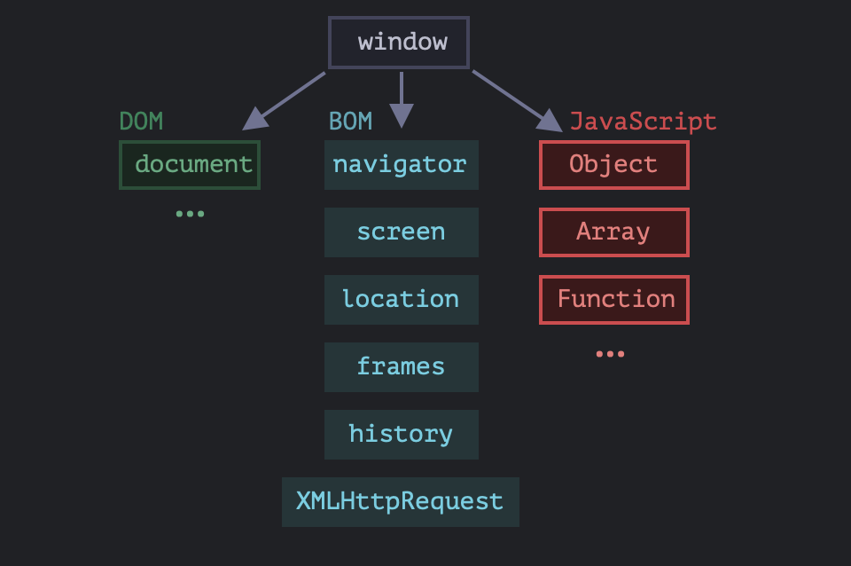

# All About DOM

## 1. What is DOM ? 
## Explanation :-
* Programming Interface for web documents.
* But NOT a Programming Langauge.
* DOM is a tree-like Representation of the web page that gets loaded into the browser.
* DOM represents the document as Nodes and Objects.
* Not a feature of JS , But a Web Api for building Websites
* The Document Object Model, or DOM for short, represents all page content as objects that can be modified.
* The document object is the main “entry point” to the page. 
* We can change or create anything on the page using it.
* DOM is not only for browsers.

## 2. Why DOM ? 
## Explanation :-
* JavaScript makes the HTML page Active and Dynamic via the DOM.

## 3. What are DOM APIs ? 
## Explanation :-
* Interfaces for interacting with HTML and XML documents.
* Examples include document.getElementById(), element.addEventListener().

## 4. What is DOM Tree ? 
## Explanation :-
* DOM is structured as a tree, where each Node represents an Object in the document.
* When a web browser parses an HTML document, it builds a DOM tree and then uses it to display the document.
* The backbone of an HTML document is tags.
* According to the Document Object Model (DOM), every HTML tag is an object.
* Nested tags are “children” of the enclosing one.
* The text inside a tag is an object as well.
* Every tree node is an object.
* Tags are element nodes (or just elements) and form the tree structure.
* `<html>` is at the root, then `<head>` and `<body>` are its children, etc.
* The text inside elements forms text nodes, labelled as #text.
* A text node contains only a string.
* It may not have children and is always a leaf of the tree.
* Please note the special characters in text nodes:
    a newline : ↵ (in JavaScript known as \n)
    a space : ␣
* Spaces and newlines are totally valid characters, like letters and digits.
* They form text nodes and become a part of the DOM.
* So, for instance, in the example above the `<head>` tag contains some spaces before `<title>`, and that text becomes a #text node (it contains a newline and some spaces only).
* There are only two top-level exclusions :
    Spaces and newlines before `<head>` are ignored for historical reasons.
    If we put something after `</body>`, then that is automatically moved inside the body, at the end, as the HTML spec requires that all content must be inside `<body>`. So there can’t be any spaces after `</body>`.
* Spaces at string start/end and space-only text nodes are usually hidden in tools.

## 5. What is the Bird’s Eye View of How JS runs in the Browser ? 
## Explanation :-

* **window** :
    * **DOM**
    * **BOM**
    * **JS**
* There’s a `root` object called `window`. 
* **It has two roles** :
    * First, it is a global object for JavaScript code, as described in the chapter Global object.
    * Second, it represents the “browser window” and provides methods to control it.

## 6. What is DOM ? 
## Explanation :-
* The Document Object Model, or DOM for short, represents all page content as objects that can be modified.
* The document object is the main “entry point” to the page. 
* We can change or create anything on the page using it.
* DOM is not only for browsers.

## 7. What is BOM ? 
## Explanation :-
* The Browser Object Model (BOM) represents additional objects provided by the browser (host environment) for working with everything except the document.
* **Provides** :
    * navigator
    * screen
    * location
    * frames
    * history
    * XMLHttpRequest
* **The functions | alert | confirm | prompt | are also a part of the BOM** - 
    * They are not directly related to the document, but represent pure browser methods for communicating with the user.
* The BOM is a part of the general HTML specification.

## 8. What is Auto-Correction in DOM ? 
## Explanation :-
* If the browser encounters malformed HTML, it automatically corrects it when making the DOM.
* For instance, the top tag is always `<html>`. 
* Even if it doesn’t exist in the document, it will exist in the DOM, because the browser will create it. 
* The same goes for `<body>`.
* While generating the DOM, browsers automatically process errors in the document, close tags and so on.
* A document with unclosed tags will become a normal DOM as the browser reads tags and restores the missing parts.
* An interesting “special case” is tables. 
* By DOM specification they must have `<tbody>` tag, but HTML text may omit it. 
* Then the browser creates `<tbody>` in the DOM automatically.

## 9. What are some Other Node Types ?
## Explanation :-
* Why is a comment added to the DOM when It doesn’t affect the visual representation in any way. 
* **But there’s a rule** -
    * If something’s in HTML, then it also must be in the DOM tree.
* Everything in HTML, even comments, becomes a part of the DOM.
* Even the `<!DOCTYPE...>` directive at the very beginning of HTML is also a DOM node. 
* It’s in the DOM tree right before `<html>`. 
* Few people know about that. 
* We are not going to touch that node, we even don’t draw it on diagrams, but it’s there.
* The document object that represents the whole document is, formally, a DOM node as well.
* There are 12 node types. 
* **In practice we usually work with 4 of them** :
    * **document** – the “entry point” into DOM.
    * **element nodes** – HTML-tags, the tree building blocks.
    * **text nodes** – contain text.
    * **comments** – sometimes we can put information there, it won’t be shown, but JS can read it from the DOM.

## 10. What is the Document Object ? 
## Explanation :-
* Top most Object in the DOM.
* Represents the entire document.
* It has properties and methods which you can use to get information about the document using a rule known as Dot Notation.

## 11. What is On Top of the DOM ? 
## Explanation :-
* The topmost tree nodes are available directly as document properties :
    * `<html>` = `document.documentElement`
        * The topmost document node is document.documentElement. 
        * That’s the DOM node of the `<html>` tag.
    * `<body>` = `document.body`
        * Another widely used DOM node is the `<body>` element – `document.body`.
    * `<head>` = `document.head`
        * The `<head>` tag is available as `document.head`.
* **There’s a catch - `document.body` can be `null`**.
    * A script cannot access an element that doesn’t exist at the moment of running.
    * In particular, if a script is inside `<head>`, then document.body is unavailable, because the browser did not read it yet.
    * In the DOM world `null` means “doesn’t exist”.
    * In the DOM, the `null` value means “doesn’t exist” or “no such node”.

## 12. What is Children in DOM , like childNodes, firstChild, lastChild ?
## Explanation :-
* **There are two terms that we’ll use from now on** :
    * Child nodes (or children)
    * Descendants
* **Child nodes (or children)** - 
    * Elements that are direct children. 
    * In other words, they are nested exactly in the given one. 
    * For instance, `<head>` and `<body>` are children of `<html>` element.
* **Descendants** - 
    * All elements that are nested in the given one, including children, their children and so on.

## 13. What are DOM Collections ?
## Explanation :-
* As we can see, childNodes looks like an array. But actually it’s not an array, but rather a collection – a special array-like iterable object.
* **There are two important consequences** :
    * We can use for..of to iterate over it.
        ```javascript
        for (let node of document.body.childNodes) {
            alert(node); // shows all nodes from the collection
        }
        ```
        * That’s because it’s iterable (provides the Symbol.iterator property, as required).
    * Array methods won’t work, because it’s not an array.
        ```javascript
        alert(document.body.childNodes.filter); // undefined (there's no filter method!)
        ```
        * The first thing is nice. 
        * The second is tolerable, because we can use Array.from to create a “real” array from the collection, if we want array methods.
        ```javascript
        alert( Array.from(document.body.childNodes).filter ); // function
        ```
* **DOM collections are read-only.**
    * DOM collections, and even more – all navigation properties listed in this chapter are read-only.
    * We can’t replace a child by something else by assigning childNodes[i] = ....
    * Changing DOM needs other methods. We will see them in the next chapter.
* **DOM collections are live.**
    * Almost all DOM collections with minor exceptions are live. In other words, they reflect the current state of DOM.
    * If we keep a reference to elem.childNodes, and add/remove nodes into DOM, then they appear in the collection automatically.
* **Don’t use for..in to loop over collections.**
    * Collections are iterable using for..of. Sometimes people try to use for..in for that.
    * Please, don’t. The for..in loop iterates over all enumerable properties. And collections have some “extra” rarely used properties that we usually do not want to get.

## 14. What is the Difference Between HTML Collection & Node List ? 
## Explanation :-
* **HTML Collection** :
    * `getElementsByClassName()` and `getElementsByTagName()` methods return a live HTMLCollection.
    * Collection of document elements.
    * Items can be accessed by their name, id, or index number.
    * It is always a live collection. 
    * **Example** - If you add a `<li>` element to a list in the DOM, the list in the HTMLCollection will also change.
* **Node List** :
    * `querySelector()` and `querySelectorAll()` method returns a static NodeList.
    * Collection of document nodes (element nodes, attribute nodes, and text nodes).
    * Items can only be accessed by their index number.
    * Most often a static collection. 
    * **Example** - If you add a `<li>` element to a list in the DOM, the list in NodeList will not change.

## 15. What are Siblings and Parent in DOM ?
## Explanation :-
* Siblings are nodes that are children of the same parent.
* For instance, here `<head>` and `<body>` are siblings.
* `<body>` is said to be the “next” or “right” sibling of `<head>`,
* `<head>` is said to be the “previous” or “left” sibling of `<body>`.
* The next sibling is in nextSibling property, and the previous one – in previousSibling.
* The parent is available as parentNode.

## 16. How to Search in a DOM ? 
## Explanation :-
* There are 6 main methods to search for nodes in DOM.
    * `querySelector` :
        * **Searches By** - CSS-selector
        * **Can call on an element ?** Yes
        * **Live ?** No
    * `querySelectorAll` :
        * **Searches By** - CSS-selector
        * **Can call on an element ?** Yes
        * **Live ?** No
    * `getElementById` :
        * **Searches By** - id
        * **Can call on an element ?** No
        * **Live ?** No
    * `getElementsByName` :
        * **Searches By** - name
        * **Can call on an element ?** No
        * **Live ?** Yes
    * `getElementsByTagName` :
        * **Searches By** - tag or *
        * **Can call on an element ?** Yes
        * **Live ?** Yes
    * `getElementsByClassName` :
        * **Searches By** - class
        * **Can call on an element ?** Yes
        * **Live ?** Yes

## 17. How to Modify the Document in DOM ?
## Explanation :-
* DOM modification is the key to creating “live” pages.
* **Creating an element.**
    * **To create DOM nodes, there are two methods** :
        * `document.createElement(tag)` - Creates a new element node with the given tag.
        * `document.createTextNode(text)` - Creates a new text node with the given text.
* **Insertion methods.**
    * To make the div show up, we need to insert it somewhere into document. 
    * For instance, into `<body>` element, referenced by document.body.
    * There’s a special method append for that - `document.body.append(div)`.
    * Here are more insertion methods, they specify different places where to insert :
        * `node.append(...nodes or strings)` – append nodes or strings at the end of node.
        * `node.prepend(...nodes or strings)` – insert nodes or strings at the beginning of node.
        * `node.before(...nodes or strings)` – insert nodes or strings before node.
        * `node.after(...nodes or strings)` – insert nodes or strings after node.
        * `node.replaceWith(...nodes or strings)` - replaces node with the given nodes or strings.

## 18. How to Access the DOM ? 
## Explanation :-
* `document.getElementById(id)` - Selects an element by its ID.
* `document.getElementsByClassName(class)` - Selects all elements with the specified class.
* `document.getElementsByTagName(tag)` - Selects all elements with the specified tag name.
* `document.querySelector(selector)` - Selects the first element that matches the CSS selector.
* `document.querySelectorAll(selector)` - Selects all elements that match the CSS selector.

## 19. How to Manipulate the DOM ?
## Explanation :-
* **Changing Content** :
	* `element.innerHTML` - Gets or sets the HTML content of an element.
	* `element.textContent` - Gets or sets the text content of an element.
* **Changing Attributes** :
	* `element.setAttribute(attribute, value)` - Sets the value of an attribute.
	* `element.getAttribute(attribute)` - Gets the value of an attribute.
* **Changing Styles** :
	* `element.style.property` - Sets a CSS property of an element, e.g., `element.style.color = 'red';`.

## 20. How to Create and Insert Elements ? 
## Explanation :-
* `document.createElement(tag)` - Creates a new element.
* `parent.appendChild(element)` - Adds a child element to the end of a parent element.
* `parent.insertBefore(newElement, existingElement)` - Inserts a new element before an existing element.
* `parent.removeChild(element)` - Removes a child element from the parent.

## 21. What is Event Handeling ? 
## Explanation :-
* Event Handling ek important concept hai web development mein, jo user interactions ko handle karne ke liye use hota hai.
* JavaScript mein, events woh actions hote hain jo user ya browser ke through trigger hote hain, jaise button click, mouse hover, keyboard press, etc.
* Event handling ka matlab hai in events ko detect karna aur unpe respond karna.

## 22. What is an Event ? 
## Explanation :-
* Event ek signal hai jo browser ya user ke action ke baad trigger hota hai. 
* Yeh koi bhi action ho sakta hai jaise :
	* User ne ek button click kiya
	* Mouse ne kisi element pe hover kiya
	* User ne ek key press ki
	* Page load complete hua
	* Form submit kiya gaya

## 23. How to Handle Events ? 
## Explanation :-
* Event handling ke liye aapko ek function define karna padta hai jo event trigger hone par execute hota hai.
* Is function ko event handler ya event listener kehte hain.

## 24. What are Event Listeners / Event Handlers ? 
## Explanation :-
* JavaScript mein events ko handle karne ke liye aapko event listeners set karne hote hain.
* Event listener ek function hota hai jo event trigger hone par call hota hai.
* Event listener ko attach karne ke liye aap addEventListener() method ka use kar sakte ho.
* **Syntax** :
    * `element.addEventListener(event, handler);`
        * `element` - Yeh wo DOM element hai jisme aap event listener attach kar rahe ho.
	    * `event` - Yeh wo event type hai jisme aap listen kar rahe ho (jaise “click”, “mouseover”, “keydown”, etc.).
	    * `handler` - Yeh function hai jo event trigger hone par execute hota hai.
* **Common Events** :
	* `click` - Triggered when an element is clicked.
	* `input` - Triggered when the value of an `<input>` or `<textarea>` element changes.
	* `submit` - Triggered when a form is submitted.

## 25. How to Remove Event Listeners ? 
## Explanation :-
* Kabhi-kabhi aapko event listeners ko remove bhi karna padta hai. Iske liye removeEventListener() method ka use hota hai.
* **Syntax** :
    `element.removeEventListener(event, handler);`

## 26. What are some Common Event Types ? 
## Explanation :-
* **Mouse Events** :
	* `click` - Jab element par click hota hai.
	* `dblclick` - Jab element par double-click hota hai.
	* `mouseover` - Jab mouse cursor element ke upar aata hai.
	* `mouseout` - Jab mouse cursor element se bahar jata hai.
* **Keyboard Events** :
	* `keydown` - Jab key press hota hai.
	* `keyup` - Jab key release hota hai.
	* `keypress` - Jab key press hota hai (lekin yeh ab deprecated hai).
* **Form Events** :
	* `submit` - Jab form submit hota hai.
	* `change` - Jab form field ka value change hota hai.
	* `focus` - Jab element focus hota hai.
	* `blur` - Jab element se focus remove hota hai.
* **Document/Window Events** :
	* `load` - Jab page load hota hai.
	* `resize` - Jab window resize hota hai.
	* `scroll` - Jab user page scroll karta hai.

## 27. What is an Event Object ? 
## Explanation :-
* Jab event trigger hota hai, tab browser ek event object pass karta hai jo event ke baare mein information hold karta hai.
* Yeh object automatically event handler function ko pass hota hai.
* **Example** :
```javascript
    button.addEventListener('click', function(event) {
        console.log('Button clicked at coordinates:', event.clientX, event.clientY);
    });
```
* event object ke through aap event ke baare mein detailed information le sakte ho, jaise click hone ka coordinates (clientX, clientY), kaunsa key press hua (event.key), etc.

## 28. What is preventDefault() Method ? 
## Explanation :-
* `preventDefault()` method ka use kisi event ke default behavior ko rokne ke liye kiya jata hai.
* **Default behavior woh action hai jo browser automatically perform karta hai, jaise** :
	* Form submit hone par page reload hona
	* Anchor (`<a>`) tag pe click karne par naya page open hona
	* Right-click karne par context menu dikhna
* **Note** - 
    * `preventDefault()` method in default behaviors ko rok sakta hai, taaki aap custom behavior define kar sako.
* Ex :
    ```javascript
    <a href="https://example.com" id="myLink">Click Me!</a>
    <script>
        const link = document.getElementById('myLink');
        link.addEventListener('click', (event) => {
            event.preventDefault(); // Prevents the link from navigating to the URL
            alert('Link clicked, but navigation prevented!');
        });
    </script>
    ```
* Is example mein, anchor tag pe click karne se usually browser us URL pe navigate karega. 
* Lekin preventDefault() use karne se navigation nahi hoga, aur aapka custom alert message dikhega.

## 29. What exactly is preventDefault() ? 
## Explanation :-
* Jab bhi form submit hota hai ya koi link click hota hai, browser ka default behavior hota hai ki form ko submit kare ya link ko follow kare.
* `preventDefault()` ek method hai jo browser ke iss default behavior ko rokta hai. 
* For example, agar tum form submit kar rahe ho aur tum preventDefault() use karte ho, toh form submit nahi hoga, instead tum apna custom logic execute kar sakte ho.
* **Example** :
    ```javascript
    form.addEventListener('submit', (eventObj) => {
        eventObj.preventDefault(); // Form submit hone se rokta hai
        console.log("Custom form handling...");
    });
    ```

## 30. What exactly this mean eventObj.target.value ? 
## Explanation :-
* eventObj jo object tumhe milta hai event trigger hone par, usme event ki sari details hoti hain.
* target us element ko refer karta hai jisme event trigger hua hai.
* value us element ke current value ko refer karta hai. 
* Jaise agar tum input field me kuch type kar rahe ho, toh eventObj.target.value tumhe input field ka current value dega.
* **Example** :
```javascript
    nameFeild.addEventListener('change', (eventObj) => {
        console.log(eventObj.target.value); // Input field ka current value print karta hai
    });
```

## 31. Why change is used on form submission ? 
## Explanation :-
* change event tab trigger hota hai jab input field ka value change hota hai, aur user input se bahar click karta hai ya submit karta hai.
* Form submission ke case me, agar tum change event use karte ho, toh tum input field me kiye gaye changes ko detect kar sakte ho aur unke according actions le sakte ho.
* **Example** :
```javascript
    emailFeild.addEventListener('change', (eventObj) => {
        console.log("Email changed: ", eventObj.target.value); // Detects value change before submission
    });
```

## 32. Why focus is used for input feilds ?
## Explanation :-
* focus event tab trigger hota hai jab input field par user click karta hai ya keyboard se tab karte hue us field par aata hai.
* Yeh event useful hai agar tumhe kuch specific actions perform karne hai jab user kisi field par focus kare. 
* Jaise ki tum placeholder change kar sakte ho, ya field ko highlight kar sakte ho.
* **Example** :
```javascript
    nameFeild.addEventListener('focus', (eventObj) => {
        console.log("Name field is focused");
        eventObj.target.style.backgroundColor = "yellow"; // Field ko highlight karna
    });
```

## 33. Why blur is used for input feilds ? 
## Explanation :-
* blur event tab trigger hota hai jab user input field se bahar click karta hai ya tab kar ke next field me chala jata hai.
* Yeh event useful hai jab tumhe validation karni hai ya input field ko reset karna hai jab user us field se bahar jaye.
* **Example** :
```javascript
    passwordFeild.addEventListener('blur', (eventObj) => {
        console.log("Password field lost focus");
        eventObj.target.style.backgroundColor = ""; // Field ko reset karna
    });
```

## 34. What exactly does eventObj contain ? 
## Explanation :-
* eventObj ek object hai jo event trigger hone par generate hota hai. 
* Yeh object me event se related sari details hoti hain, jaise :
    * `type` - Event ka type, jaise click, keyup, submit, etc.
    * `target` - Element jisme event trigger hua hai.
    * `timeStamp` - Event kab trigger hua.
    * `key` - Agar keyboard event hai toh key jo press hui hai.
    * **Example** :
    ```javascript
    button.addEventListener('click', (eventObj) => {
        console.log(eventObj); // Prints all event details
    });
    ```

## 35. How to play with this eventObj ? 
## Explanation :-
* Tum eventObj ka use kar ke event se related bahut sari information access kar sakte ho aur custom behavior implement kar sakte ho.
* Tum specific properties access kar sakte ho, jaise target, type, key, etc., aur unke according custom actions perform kar sakte ho.
* **Example** :
```javascript
    input.addEventListener('keydown', (eventObj) => {
        if (eventObj.key === 'Enter') {
            console.log("Enter key pressed");
        }
    });
```

## 36. How can I take use of eventObj ?
## Explanation :-
* eventObj tumhe event ke context me kaafi flexibility deta hai. Tum real-time data access kar sakte ho jaise input values, event types, etc., aur uske basis par custom functionality bana sakte ho.
* For example, tum form validation kar sakte ho, button clicks track kar sakte ho, ya dynamically UI ko update kar sakte ho based on user interactions.
* **Example** :
```javascript
    window.addEventListener('resize', (eventObj) => {
        console.log("Window size: ", window.innerWidth, "x", window.innerHeight);
    });
```

## 37. What is Event Propogation ? 
## Explanation :-
* Event propagation se yeh decide hota hai ki events DOM tree mein kaise travel karte hain.
* **Isme 3 stages hoti hain** :
	* **Capturing Phase** - Event root se start hota hai aur target element tak travel karta hai.
	* **Target Phase** - Event target element tak pahuchta hai aur execute hota hai.
	* **Bubbling Phase** - Event target element se root tak bubble back karta hai.
* **Note** - 
    * Aap event propagation ko control karne ke liye `stopPropagation()` ya `preventDefault()` methods ka use kar sakte ho.

## 38. What is stopPropagation() Method ? 
## Explanation :-
* `stopPropagation()` method ko event propagation ko control karne ke liye use kiya jata hai. 
* Event propagation mein do phases hote hain :
    * **Capturing Phase** - Event root se shuru hota hai aur target element tak pahuchta hai.
	* **Bubbling Phase** - Event target element se root tak wapas jata hai.
* Jab aap `stopPropagation()` method ka use karte ho, to aap event ko next phase mein propagate hone se rok dete ho. 
* Matlab, agar event capturing phase mein hai to yeh target tak nahi jayega, aur agar bubbling phase mein hai to yeh parent elements tak bubble nahi karega.
* **Example** :
```javascript
    <div id="parent">
        <button id="child">Click Me!</button>
    </div>
    <script>
        const parent = document.getElementById('parent');
        const child = document.getElementById('child');
        parent.addEventListener('click', () => {
            alert('Parent Div Clicked');
        });
        child.addEventListener('click', (event) => {
            alert('Button Clicked');
            event.stopPropagation(); // Stops event from propagating to the parent
        });
    </script>
```
* Is example mein, agar aap button (child) pe click karte ho aur `stopPropagation()` use nahi karte ho, to parent div ka event bhi trigger hoga. 
* Lekin `stopPropagation()` use karne se event parent tak propagate nahi karega, sirf button ka event trigger hoga.

## 39. Are stopPropagation() and preventDefault() Both Same ? 
## Explanation :-
* No, `stopPropagation()` aur `preventDefault()` dono methods same nahi hain.
	* `stopPropagation()` event ke propagation ko rokta hai, yaani event capturing ya bubbling ko stop karta hai.
	* `preventDefault()` event ke default behavior ko rokta hai, yaani browser jo default action perform karne wala hota hai, usko prevent karta hai.