# Master Javascript

## Introduction to JS

### 1. What is JS ?
### Explanation :-
* JavaScript (JS) is a high-level, "interpreted scripting language" used to create interactive effects within web browsers.

### 2. What is the History of JS ?
### Explanation :-
* Created by Brendan Eich in 1995 for Netscape Navigator.
* Initially called Mocha, then renamed to LiveScript, and finally JavaScript.

### 3. How many versions of JS is there ?
### Explanation :-
* ECMAScript (ES) versions: ES1 (1997), ES2 (1998), ES3 (1999), ES5 (2009), ES6/ES2015, ES2016, ES2017, ES2018, ES2019, ES2020, ES2021, ES2022, and ES2023.

### 4. How to run JS ?
### Explanation :-
* When you want to run JS in Browsers - Use `<script>` Tag.
* When you want to run JS in Server Environments - Use NodeJS.
* Also, use online JS playgrounds like JSFiddle or CodePen.

## All about Variables

### 1. What is var | let | const in JS ?
### Explanation :-
* var - "Function-scoped", can be re-declared and updated.
* let - "Block-scoped", can be updated but not re-declared within the same scope.
* const - "Block-scoped", cannot be updated or re-declared. The value is immutable

### 2. What is Variable Declarations ?
### Explanation :-
* The act of defining a variable using var, let, or const.

### 3. What is Variable Naming Rules ?
### Explanation :-
* Must start with a letter, underscore (_), or dollar sign ($).
* Subsequent characters can be letters, numbers, underscores, or dollar signs.

### 4. What is Global | Function | Block Variable Scopes ?
### Explanation :-
* Scope -
    * Refers to the visibility of a variable or how it can be used after it is declared.
    * Scope of a variable depends on the keyword that was used to declare it.
* Note -
    * Before ES6 (2015), JavaScript had only "Global Scope" and "Function Scope" with the "var" keyword.
    * ES6 introduced "let" and "const" which allow "Block Scope" in JavaScript.
	    * Block Scope - Variables declared with let or const inside a {} block.
	    * Function Scope - Variables declared with var inside a function.
	    * Global Scope - Variables declared outside any function or block.

### 5. What is Hoisting ? 
### Explanation :-
* JavaScript’s behavior of moving variable and function declarations to the top of their containing scope during compilation.
* JavaScript mein hoisting ka matlab hai ki variables aur function declarations ko unki scope ke top pe move kar diya jaata hai execution ke time pe, chahe wo physically code ke bottom mein declare kiye gaye ho.
* Lekin, hoisting ke time pe variables ko unka value assign nahi hota hai (initialization nahi hota hai).
* Hoisting in var : | Declarations are Hoisted and Initialized with Undefined | No Temporal Dead Zone |
* Hoisting in let : | Declarations are Hoisted but not Initialized | Variables are in the Temporal Dead Zone until their Declaration is Encountered |
* Hoisting in const : | Declarations are Hoisted but not Initialized | Variables are in the Temporal Dead Zone until their Declaration is Encountered |
* Jab let aur const keywords use hote hain, to unki declarations hoist hoti hain, matlab unhe unki scope ke top pe move kar diya jaata hai, lekin unhe initialize nahi kiya jaata hai jab tak unki actual declaration line nahi aati.
* Isliye, unhe use karne se pehle ek “Temporal Dead Zone” (TDZ) mein hoti hain.
* TDZ wo period hai jahan variable hoisted hai lekin initialized nahi hai.
* Refer to Namaste JS Ep-3 for Detail Explanation.

## Memory : Stack Vs Heap

### 1. What is Stack Memory ?
### Explanation :-
* Stack memory is a region of memory used for `Static Memory Allocation`. 
* It stores information about function calls, such as local variables, function parameters, and return addresses. 
* Each time a function is called, a new “frame” is pushed onto the call stack, and when the function returns, that frame is popped off.
	* **Key Characteristics** :
	    * **LIFO (Last-In, First-Out)** - Frames are managed in a strict order.
	    * **Automatic Allocation** - Memory is allocated and deallocated automatically as functions are called and return.
	    * **Size Limitation** - The stack has a fixed size, making it suitable for small, short-lived data.
	* **Example in JavaScript Context** :
        * Consider the following pseudo-code for a recursive function.
        ```javascript
        function factorial(n) {
            if (n === 0) return 1;
            return n * factorial(n - 1);
        }
        ```
        * Every call to factorial adds a new frame (with its own copy of n) onto the call stack. 
        * Once the base case is reached, frames are removed (popped) as the function returns.
        * **Diagram** :
        ```javascript
        +-------------------+
        |   Main Frame      | <-- Global context (e.g., script start)
        +-------------------+
        |  factorial(3)     | <-- Local variables: n = 3
        +-------------------+
        |  factorial(2)     | <-- Local variables: n = 2
        +-------------------+
        |  factorial(1)     | <-- Local variables: n = 1
        +-------------------+
        |  factorial(0)     | <-- Base case: n = 0
        +-------------------+
        ```

### 2. Why is Stack Memory Called Static?
### Explanation :-
* **Static Allocation** -
    * The term “static” here means that the memory allocation for function calls (local variables, parameters, etc.) is determined at compile time rather than at runtime.
* **Pre-determined Structure** -
    * Each function call gets a fixed-size frame based on its declaration, so the system knows exactly how much memory to reserve before the function executes.
* **Predictability** -
    * Because the size and layout are determined before execution, the stack behaves in a predictable manner (LIFO order) without the overhead of finding and allocating memory dynamically.
* In essence, “static” refers to the fact that the structure and size of each allocation are known and fixed ahead of time, not that the stack memory itself is immutable.

### 3. Why is Memory Allocated and Deallocated Automatically in the Stack?
### Explanation :-
* **Automatic Management by the System** :
    * When a function is called, the system automatically:
    * **Pushes a new frame onto the stack** -
        * This frame includes the function’s parameters, local variables, and return address.
    * **Pops the frame off the stack upon function return** -
        * Once the function execution is complete, its memory is reclaimed without any manual intervention.
* **LIFO (Last In, First Out) Order** -
    * The stack operates on this principle, which makes the process of allocation (pushing) and deallocation (popping) straightforward and efficient.
* **Reduced Overhead** -
    * This automatic mechanism minimizes the need for explicit memory management by the programmer, reducing the chance of errors such as memory leaks or manual deallocation mistakes.
* The automatic allocation/deallocation is built into the function call mechanism and runtime, ensuring that memory for local data is managed efficiently and without extra code from the developer.

### 4. What is the Exact Size of the Stack and Is It Language Specific?
### Explanation :-
* **Fixed but Variable** :
	* **Fixed Size** -
        * The stack has a predetermined size limit. Once this limit is reached, further allocations (like deep recursion) can cause a stack overflow.
	* **Variable Across Environments** -
        * The actual size isn’t universal—it depends on:
	* **Programming Language/Runtime** -
        * For instance, in C/C++ you might set the stack size at compile time or via OS settings. In languages like JavaScript, the engine (e.g., V8) and its configuration determine the stack size.
	* **Operating System Settings** -
        * Default thread stack sizes can vary. For example, many systems might use a default of 1 MB to 8 MB per thread.
	* **Hardware and Compiler Configurations** -
        * Some environments allow you to adjust the stack size based on the needs of your application.
* So yes, the stack size is language- and environment-specific, and while it’s fixed at runtime for a given configuration, that size can differ from one system or language to another.

### 5. What is Heap Memory ?
### Explanation :-
* Heap memory is a region used for `Dynamic Memory Allocation`. 
* Unlike the stack, it doesn’t follow a strict order, instead, it allows for allocating memory blocks as needed at runtime. 
* In JavaScript, objects, arrays, and functions (which are first-class objects) are allocated in the heap.
	* **Key Characteristics** :
	    * **Dynamic Allocation** - Memory can be allocated and deallocated at any time.
	    * **Larger and Flexible** - The heap is generally larger than the stack, but managing it is more complex.
	    * **Garbage Collection** - JavaScript uses a garbage collector to reclaim memory that is no longer in use.
	* **Example in JavaScript Context** :
        * When you create an object or an array.
        ```javascript
        let person = { name: 'Sahil', age: 25 };
        let numbers = [1, 2, 3, 4, 5];
        ```
        * The actual data for person and numbers is stored in the heap, while the variable references might reside in the stack.
        * **Diagram** :
        ```javascript
        +----------------------+
        |       Heap         |
        +----------------------+
        |  Object: {         |  <-- Dynamically allocated object
        |    name: 'Sahil',  |
        |    age: 25        |
        |  }                 |
        |                    |
        |  Array: [1,2,3,4,5] |
        +----------------------+
        ```

### 6. Why is Heap Memory Called Dynamic?
### Explanation :-
* **Dynamic Allocation** -
    * Heap memory allows for memory to be allocated as needed during the execution of a program. 
    * Unlike the stack, where the size and allocation of memory are fixed based on function calls, the heap is designed for data whose size might not be known until runtime.
* **Flexibility** -
    * This dynamic nature is ideal for complex data structures (like objects, arrays, linked lists, etc.) that may need to grow or shrink during the program’s execution.

### 7. When Is Memory Allocated in the Heap – Compile Time or Runtime? And Why?
### Explanation :-
* **Runtime Allocation** :
	* **Unknown at Compile Time** -
        * The amount of memory required for data structures on the heap often depends on user input or runtime conditions, which cannot be determined during compile time.
	* **On-Demand Allocation** -
        * Memory is allocated when the program explicitly requests it (for example, when you create an object or array in JavaScript), ensuring that resources are used only when needed.
* This runtime allocation provides the flexibility needed for dynamic applications and helps optimize resource usage.

### 8. How Does the Heap’s Variable Size Work?
### Explanation :-
* **Initial Allocation & Expansion** :
	* The heap typically starts with an initial allocation determined by the operating system or runtime environment.
	* As the program runs and requires more memory, the operating system or memory manager can allocate additional memory to the heap if available.
* **Dynamic Memory Management** :
	* **Allocation Requests** -
        * When you request memory (using, for instance, the new operator in JavaScript), the runtime looks for a suitable free block in the heap.
	* **Deallocation & Garbage Collection** -
        * Memory can be freed (either manually in some languages or automatically through garbage collection in languages like JavaScript), allowing that space to be reused.
* **Fragmentation and Non-Contiguous Growth** :
	* The heap may not grow as one contiguous block. Instead, it can consist of various segments.
	* This can lead to fragmentation, where free memory is scattered in small blocks, potentially making it challenging to allocate large contiguous memory blocks later.
* The variable and expandable nature of the heap makes it ideal for managing dynamic data, despite the added complexity of potential fragmentation and slower access compared to the stack.

### 9. What is the difference betweeen Stack and Heap Memory ?
### Explanation :-
| **Aspect**             | **Stack Memory**                                                       | **Heap Memory**                                                                              |
|------------------------|------------------------------------------------------------------------|----------------------------------------------------------------------------------------------|
| **Allocation**         | Static (automatic allocation during function calls)                  | Dynamic (allocated as needed during runtime)                                                 |
| **Management**         | Managed by the system (LIFO order)                                     | Managed by the developer/runtime (via garbage collection)                                    |
| **Access Speed**       | Very fast (contiguous memory)                                          | Relatively slower (due to dynamic allocation and fragmentation)                              |
| **Lifetime of Data**   | Limited to the function scope                                          | Can persist as long as needed until explicitly deallocated or garbage collected              |
| **Size**               | Limited, small size                                                    | Larger, more flexible in size                                                                |
| **Use Cases**          | Function call management, local variables, control flow                | Storing objects, arrays, and other dynamically allocated data                                |
| **Memory Deallocation**| Automatic when function call ends                                      | Non-deterministic; relies on garbage collection in languages like JavaScript                 |


### 10. What are being stored in Stack Memory ?
### Explanation :-
* **Stored Items** :
	* **Function Call Information** -
        * Each function call adds a frame to the stack, which includes the return address (where to continue after the function returns) and the function’s execution context.
	* **Local Variables** -
        * Variables declared within functions (including primitive types like numbers, booleans, etc.) are stored in the stack.
	* **Function Parameters** -
        * The arguments passed to functions are also stored on the stack.
	* **Relating to Development** -
        * Understanding stack memory helps you write functions that are efficient and avoid issues like stack overflow, especially when dealing with recursion or deep call stacks.

### 11. What are being stored in Heap Memory ?
### Explanation :-
* **Stored Items** :
	* **Objects and Arrays** -
        * In JavaScript, when you create objects, arrays, or functions, the actual data is stored in the heap.
	* **Dynamic Data** -
        * Data that needs to persist beyond the execution of a single function (or whose size cannot be determined at compile-time) is allocated on the heap.
	* **Complex Structures** -
        * Structures that require flexible memory allocation (like linked lists, trees, etc.) are typically managed in the heap.
	* **Relating to Development** -
        * For a pro developer, knowing that objects and large data structures are stored in the heap informs decisions about performance and memory usage. 
        * This awareness can help optimize applications to prevent memory leaks and improve garbage collection efficiency.

### 12. Why cant we store everythign in Heap Memory if Heap is Dynamic ?
### Explanation :-
* **Performance Considerations** :
	* **Speed** -
        * Accessing stack memory is much faster because it is contiguous and has a simple LIFO structure. 
        * In contrast, heap memory involves dynamic allocation, which introduces overhead.
	* **Memory Management Overhead** -
        * **Automatic vs. Manual** -
            * The stack automatically handles memory allocation and deallocation as functions are called and return. 
            * Relying solely on the heap would require manual management or garbage collection, which can lead to inefficiencies, fragmentation, and potential memory leaks if not handled correctly.
	* **Predictability and Structure** -
        * **Order and Scope** -
            * The stack’s strict ordering and limited lifetime of data make it predictable and easier to manage for short-lived variables. 
            * The heap’s dynamic nature, while flexible, lacks this built-in structure, making it less ideal for small, short-term allocations.
	* **Relating to Development** -
        * Efficient memory management is crucial for building high-performance applications. 
        * By understanding why the stack is preferred for certain operations, you can design your programs to take advantage of fast, automatic memory management and avoid common pitfalls associated with dynamic memory allocation.


## Data Types

### 1. What is Primitive DTs ?
### Explanation :-
* Basic types that are Immutable(Unchangeable).
* **Example** - string, number, boolean etc.
* **Why Immutable(Unchangeable)** `IMP`-   
    * Because when you perform operations on primitives (like strings or numbers), a new value is created rather than modifying the existing value.
        ```javascript
        let str = "hello";
        str = str.toUpperCase(); // "HELLO"
        ```
        * The original "hello" string is not changed; a new string "HELLO" is created.
* **Memory Efficiency** `IMP`-
    * Stored directly in memory, the immutability helps optimize performance and memory usage, as creating new primitives is usually lightweight.

### 2. What is Non-Primitive DTs ?
### Explanation :-
* Also known as Reference DTs.
* Complex types that are Mutable(Changeable).
* **Example** - object, array etc.
* **Why Reference DTs** `IMP`-       
    * Because they store a reference (memory address) to the actual data rather than storing the data itself.
    * When you create an object or an array, the variable doesn’t store the actual value.
    * Instead, it stores a reference (memory address) pointing to the location in memory where the data is stored.
* **Why Mutable(Changeable)** `IMP`- 
    * Because changes to their elements or properties directly modify the original data stored in memory, without creating new copies.
        ```javascript
        let arr = [1, 2, 3];
        arr[0] = 10;
        ```
        * The original array [1, 2, 3] is changed to [10, 2, 3]
* **Memory Efficiency** `IMP`- Stored as references, mutable structures are more flexible for complex data management.

### 3. What are these in Primitive DT ?
* String
* Number
* Boolean
* Undefined
* BigInt
* Null
* Symbol
### Explanation :-
* **String** -
    * Represents text.
    * Example: "Hello".
* **Number** -
    * Represents numeric values.
    * Example: 42.
* **Boolean** -
    * Represents true or false.
* **Undefined** `IMP` -  
    * A variable that has been declared but not yet assigned a value.
    * You can assign undefined in a Variable , but Never Do That.
    * Jab aap variable declare kar dete ho lekin usme koi value assign nahi karte, toh JavaScript automatically us variable ki value ko undefined set kar deta hai.
    ```javascript
    let a;
    console.log(a); // Output: undefined
    ```
    * Ye default value hoti hai, yani agar aap value nahi dete, toh engine bolega “ye variable abhi tak koi value hold nahi karta”.
    * typeof `undefined` returns `undefined`.
* **Null** `IMP` - 
    * Represents the intentional absence of any object value.
    * null ek explicitly assigned value hai. Matlab, jab aap chaahte ho ke variable intentionally khali ho, tab aap usko null set karte ho.
    ```javascript
    let b = null;
    console.log(b); // Output: null
    ```
    * Ye batata hai ke aapne consciously decide kiya hai ki is variable mein koi value nahi hogi.
    * typeof `null` returns `object` (ye ek JavaScript ka historical quirk hai).
    * But Why `null` returns `object` :
        * `null` primitive hai, lekin ye ek implementation quirk hai jiske chalte `typeof null object` return karta hai. 
        * Ye ek historical mistake hai jise aaj bhi maintain kiya gaya hai taaki existing code break na ho.
* **Symbol** `IMP` - 
    * A unique and immutable value used as an identifier.
    * Example: Symbol('id').
* **BigInt** `IMP` - 
    * Represents integers with arbitrary precision.
    * Example: 9007199254740991n.

### 4. What are these in Non-Primitive DT ?
* Function
* Array
* Object
### Explanation :-
* There are generally 3 main types of Non-Primitive DT :
    * Function
    * Array
    * Object
* **Function** -
    * A function is a reusable block of code designed to perform a specific task.
    * Functions help you organize your code, avoid repetition, and make your code modular and testable.
    * **Function Declarations** :
	    * Defined using the function keyword followed by a name.
        * Jab aap function declaration likhte ho (jaise function print() { ... }), poora function definition memory mein hoisted ho jata hai.
	    * **Key Point** - 
            * They are hoisted, meaning you can call them before they are defined in your code ---> But How is this happening ?
        * **Note** :
            * Function declarations are fully hoisted, which means you can call the function even before its actual definition in the code.
	* **Function Expressions** :
	    * Functions can be stored in variables.
        * Jab aap function expression likhte ho (jaise const num = function getNum() { ... }), toh sirf variable ka naam hoisted hota hai, not the assignment.
        * Variables declared with const or let are in the Temporal Dead Zone (TDZ) until they are initialized.
	    * **Key Point** -
            * They are not hoisted like declarations.
        * **Note** :
            * Function expressions are not fully hoisted. Only the variable declaration is hoisted (and if declared with const/let, it remains in the TDZ until initialization). Hence, accessing them before initialization results in a ReferenceError.
    * **Arrow Functions** : 
        * Introduced in ES6, arrow functions provide a shorter syntax.
        * They do not have their own this binding; they inherit this from the surrounding context, which can simplify code especially in callbacks.
    * **Parameters, Arguments, and Return Values** : 
        * **Parameters vs. Arguments** :
	        * **Parameters** - Placeholders in the function definition.
	        * **Arguments** - The actual values passed to the function.
	    * **Return Values** :
	        * A function can return a value using the return keyword.
	        * If no return is specified, the function returns undefined.
    * **Scope and Closures** :
	    * **Scope** :
	        * **Local Scope** - Variables defined inside a function are not accessible outside it.
	        * **Global Scope** - Variables defined outside any function.
	    * **Closures** :
	        * A closure happens when a function “remembers” its lexical scope even when the function is executed outside that scope.
	        * **Why It Matters** - Closures are key in creating private variables and functions.
    * **Higher-Order Functions** :
	    * Functions that can take other functions as arguments or return them.
    * **Asynchronous Functions and Callbacks** :
        * **Callbacks** - Functions passed as arguments to be executed later, often after some asynchronous operation.
	    * **Async/Await** - Modern syntax that simplifies working with asynchronous code.
    * **IIFE (Immediately Invoked Function Expressions)** :
	    * Functions that run as soon as they are defined.
	    * **Use Case** - Often used to create a new scope and avoid polluting the global namespace.
    * **Pure Function** :
        * A pure function is one that, given the same inputs, will always return the same output and does not cause any observable side effects.
        * **Key Characteristics** :
	        * **Deterministic** - Always produces the same result for the same inputs.
	        * **No Side Effects** - It doesn’t modify external state, perform I/O operations (like logging, network calls, or modifying a global variable), or alter the input arguments.
* **Arrays** -
    * Arrays are ordered collections that let you store multiple values in a single variable.
    * They are zero-indexed.
	* They can hold any type of data (numbers, strings, objects, etc.).
	* They are dynamic in size and have many built-in methods.
    * **Dynamic Nature of Arrays** :
        * JavaScript arrays are dynamic. 
        * Unlike fixed-size arrays in some other languages, JavaScript arrays are essentially objects with numbered properties. 
        * This means you can add elements at any index, even if it creates gaps.
	* **Sparse Arrays** :
        * Initially, arr has elements at indices 0, 1, and 2. When you set `arr[5] = 6`, you are assigning a value to index 5. 
        * Indices 3 and 4 remain “empty” (they are not explicitly set). 
        * This creates a sparse array where some indices are missing values.
	* **Length Property Behavior** :
        * The length property of an array is not necessarily the count of defined elements, but rather one more than the highest numeric index in the array. 
        * Since you assigned a value to index 5, the highest index is now 5, so the length becomes `5 + 1`, which is 6.
        * This dynamic update mechanism allows for flexibility but also means that the array may have unexpected “holes” if you add elements at non-contiguous indexes.
    * **Creation Methods** :
    	* **Literal Syntax** - `const myArray = [1, 'hello', true];`
	    * **Constructor Syntax** - `const myArray = new Array(1, 'hello', true);`
    * **Accessing Elements** :
        * Use indexes (e.g., myArray[0] to access the first element).
	    * Use the `.length` property to determine the size of the array.
    * **Imp Methods** : 
        * `push()` :
            * **Purpose** - Adds one or more elements to the end of an array.
	        * **Return Value** - The new length of the array.
	        * **Time Complexity** - Typically O(1) (amortized).
        * `pop()` :
            * **Purpose** - Removes the last element from an array.
	        * **Return Value** - The removed element.
	        * **Time Complexity** - O(1).
        * `shift()` :
            * **Purpose** - Removes the first element from an array and shifts the remaining elements to lower indexes.
	        * **Return Value** - The removed element.
	        * **Time Complexity** - O(n) due to the re-indexing of the array.
    * **Iterating Over Arrays** : 
	    * Traditional for loops (with index counters).
	    * The `for...of` loop for cleaner syntax.
	    * The `forEach()` method for applying a function to each element.
    * **When to Use Which** :
	    * Use loops when you need index control.
	    * Use higher-order functions (map, filter, etc.) when you want to transform data without side effects.
    * **Advanced Array Concepts** :
        * **Destructuring** -
    	    * Learn how to extract array elements into variables with concise syntax.
        * **Copying Array Elements** -
            * There are two ways you can copy elements :
                * **Shallow Copy** - 
                    * A shallow copy duplicates only the top-level elements. 
                    * If an element is a reference (like an array or object), the copy holds the same reference rather than a new independent object.
                    * Agar array ya object ke andar nested objects/arrays hain, to unke references copy hote hain, actual nested objects nahi.
                    * Agar nested array ya object modify hota hai, toh original aur copy dono me change dikh sakta hai.
                    * **Methods** - Spread Operator `[...arr]` , `{...obj}`.
                * **Deep Copy** -
                    * A deep copy duplicates not only the top-level elements but also every nested object or array. 
                    * The new copy is completely independent.    
                    * Entire object ya array ke har nested level ko recursively copy karta hai.
                    * Har nested object ka naya independent copy banta hai, jo original se bilkul alag hota hai.
                    * Nested array ya object me koi bhi change karne par original object unaffected rehta hai.
                    * **Methods** - `JSON.parse(JSON.stringify(object))` 
            * **Note** - Understanding this distinction is crucial in scenarios where you need to modify data without affecting the original structure. For instance, if you’re managing state in a front-end application (like in React) and want to update a nested object without mutating the existing state, a deep copy is necessary to avoid unintended side effects.
	    * **Spread Syntax** -
	        * Use the spread operator (...) to copy arrays, merge arrays, or pass array elements as arguments.
	    * **Chaining Methods** -
	        * Combine multiple array methods to write cleaner, more expressive code.
    * **Understanding Mutability and Performance Considerations** : 
        * **Mutability** -
    	    * Arrays in JavaScript are mutable, this means methods like push() modify the original array.
	        * Consider functional programming principles by using methods (like map) that return new arrays.
	    * **Performance** -
	        * Recognize that although JavaScript arrays are objects, they are optimized for ordered data.
	        * Understand when to use arrays vs. other data structures (e.g., objects, sets) depending on your use case.
    * **Important Points** :
        * When you assign a value at index 3, the array’s length becomes 4—even if some positions are empty.
        ```javascript
        let arr = [];
        arr[3] = 'hello';
        console.log(arr.length); // Output - 4
        ```
        * Using delete removes the element but leaves a hole, so the length remains unchanged while the deleted slot is undefined.
        ```javascript
        let arr = [1, 2, 3];
        delete arr[1];
        console.log(arr.length, arr[1]); // 3 undefined
        ```
        * Non‑numeric keys behave like object properties; they don’t affect the array’s length.
        ```javascript
        let arr = [1, 2, 3];
        delete arr[1];
        console.log(arr.length, arr[1]); // 3 undefined
        ```
        * Creating an array with a single numeric argument produces a sparse array with that length but no defined elements.
        ```javascript
        let arr = new Array(5);
        console.log(arr.length, arr[0]); // 5 undefined
        ```
        * The for...in loop iterates over both numeric indices and any non‑numeric properties added to the array.
        ```javascript
        let arr = [10, 20, 30];
        arr.custom = 'hello';
        for (let key in arr) {
            console.log(key); // 0 1 2 custom
        }
        ```
        * The for...of loop skips over holes in a sparse array, so only the defined values are iterated.
        ```javascript
        let arr = [1, , 3];
        for (let value of arr) {
            console.log(value); // 1 undefined 3 undefined
        }
        ```
* **Object** -
    * Objects in JavaScript are a fundamental data structure used to store key-value pairs. 
    * The fundamental non-primitive data type in JavaScript, used to store collections of key-value pairs.
    * They are dynamic, flexible, and widely used in real-world applications. 
    * An object in JavaScript is a non-primitive data type that stores data in the form of key-value pairs.
    * Let’s break this down step by step from scratch.
    * **Key Features** :
        * **Keys (Properties)** - 
            * Can be a `string` or a `symbol`.
            * **Example** - name, age.
        * **Values** - 
            * Can be any data type (string, number, array, function, another object, etc.).
    * **Ways to Create Objects in JavaScript** : 
        * **Using Object Literal (Most Common)** : 
            ```javascript
            const car = {
                brand: "Toyota",
                model: "Camry",
                year: 2022
            };
            ```
        * **Using new Object() (Less Preferred)** : 
        ```javascript
        const user = new Object();
            user.name = "Sahil";
            user.age = 22;
            console.log(user);
        ```
        * **Using Object Constructor Function** : 
        ```javascript
        function Person(name, age) {
            this.name = name;
            this.age = age;
        }
        const person1 = new Person("Sahil", 22);
        console.log(person1);
        ```
        * **Using Object.create() (Prototype-Based)** : 
        ```javascript
        const prototypeUser = {
            greet: function() {
                console.log("Hello from prototype!");
            }
        };
        const user1 = Object.create(prototypeUser);
        user1.greet();
        ```
    * **Accessing Object Properties** :
        * **Dot Notation** -
            * **Example** - person.name
        * **Bracket Notation** -
            * **Example** - person["age"]
    * **Object Methods** : 
        * Objects can also contain functions as their values, called methods.
        ```javascript
        const user = {
            name: "Sahil",
            greet: function() {
                console.log(`Hello, my name is ${this.name}`);
            }
        };
        user.greet(); // "Hello, my name is Sahil"
        ```
        * **Why use this?**
            * `this` refers to the current object (user in this case).
    * **Iterating Over Objects** : 
        * **for...in Loop** -
            ```javascript
                for (let key in person) {
                    console.log(key, person[key]);
                }
            ```
        * **Object.keys()** -
            ```javascript
                console.log(Object.keys(person)); // ["name", "age", "city"]
            ```
        * **Object.values()** -
            ```javascript
                console.log(Object.values(person)); // ["Sahil", 23, "Mumbai"]
            ```
        * **Object.entries()** -
            ```javascript
                console.log(Object.entries(person)); // [["name", "Sahil"], ["age", 23], ["city", "Mumbai"]]
            ```
    * **Checking Property Existence** : 
        * **Using in Operator** - 
            ```javascript
                console.log("name" in person); // true
                console.log("salary" in person); // false
            ```
        * **Using hasOwnProperty()** - 
            ```javascript
                console.log(person.hasOwnProperty("age")); // true
            ```
    * **Cloning (Copying) Objects** : 
        * **Using Object.assign()** -
            ```javascript
                const newPerson = Object.assign({}, person);
            ```
        * **Using Spread Operator (Shallow Copy)** `IMP` -
            ```javascript
                const newPerson = { ...person };
            ```
        * **Using JSON.parse(JSON.stringify()) (Deep Copy)** `IMP` -
            ```javascript
                const deepCopy = JSON.parse(JSON.stringify(person));
            ```
    * **Merging Objects** `IMP` : 
        ```javascript
            const obj1 = { a: 1, b: 2 };
            const obj2 = { c: 3, d: 4 };
            const merged = { ...obj1, ...obj2 };
            console.log(merged); // {a: 1, b: 2, c: 3, d: 4}
        ```
    * **Nested Objects** -
        * You can have objects within objects, creating a hierarchical structure.
        ```javascript
        const student = {
            name: "Sahil",
            marks: {
                math: 95,
                science: 90
            }
        };
        console.log(student.marks.math);
        ```
    * **Object Destructuring** `IMP` : 
        ```javascript
            const { name, age } = person;
            console.log(name, age);
        ```
    * **Important Points** :
        * In object literals, later duplicate keys overwrite earlier ones.
        ```javascript
            const obj = { a: 1, a: 2 };
            console.log(obj.a); // Output - 2
        ```
        * Computed property names allow you to dynamically assign keys in an object.
        ```javascript
            const key = 'dynamic';
            const obj = { [key]: 'value' };
            console.log(obj.dynamic); // Output - value
        ```
        * Numeric keys are iterated in ascending order, regardless of their order in the literal.
        ```javascript
            const obj = { 2: 'two', 1: 'one', 3: 'three' };
            for (let key in obj) {
                console.log(key);
            } // Output - 1 , 2 , 3
        ```
        * When an object is used as a key, it is converted to a string ("[object Object]"), which is then used as the property name.
        ```javascript
            const keyObj = { id: 1 };
            const obj = {};
            obj[keyObj] = 'value';
            console.log(obj["[object Object]"]); // Output - value
        ```

## 5. What are these ?
* Prototype
* Prototype Chain
* Prototypal Inheritance
* Polyfills 
* Built-In Objects
* typeof Operator
### Explanation :-
* **The Story of JavaScript Objects, Prototypes & Inheritance :**
    * **🌍 Scene 1: The World of JavaScript - Everything is an Object!** -
        * Imagine JavaScript ek kingdom hai jisme har cheez ek citizen (object) hai.
        * 💡 JavaScript me sab kuch ek object hai (except primitive types like numbers, strings, booleans).
        * 👑 King JavaScript ne decide kiya ki har naye citizen (object) ke paas kuch basic powers (properties & methods) honi chahiye. 
        * Par usne yeh bhi socha ki ek hi cheez baar-baar har citizen ko na deni pade, warna har ek ko individually equip karna mushkil ho jayega.
        * **🛠 Solution?** 
            * Ek common ancestor banaya jaye jisse sab kuch inherit ho sake.
        * 🔹 Aur yahi se shuru hoti hai Prototype ki kahani! 🔥
    * **🎭 Scene 2: Prototype - The Blueprint of Every Object** -
        * **Ek din JavaScript ke engineer ne socha** –
            * “Agar mujhe har object ko ek special property de duni pade, toh bohot zyada memory lagegi!” 🤯
        * **Toh usne decide kiya** -
            * “Aisa ek system banaya jaye jisme ek object doosre object se automatically powers (properties & methods) le sake.”
        * 👨‍👩‍👦 Prototype ek parent ki tarah hai jo objects ko properties aur methods deta hai.
        * **Example** - 
            ```javascript
                const person = {
                    greet: function() {
                        console.log("Hello!");
                    }
                };
                const student = Object.create(person); // student inherits from person
                console.log(student.greet()); // "Hello!"
            ```
            * 🔹 Toh yaha student ke andar greet() method toh nahi hai, par kyunki uska Prototype person hai, wo waha se inherit ho gaya!
    * **🔗 Scene 3: The Prototype Chain - Generation After Generation** -
        * Ab maan lo ek bada family tree hai. 
        * Har ek parent apne bachon ko kuch knowledge pass kar raha hai.
        * JavaScript me bhi objects ka ek lineage (ancestry) hota hai – jise hum Prototype Chain kehte hain!
        * 👉 Agar ek object ke andar koi method ya property nahi milti, toh wo apne parent (Prototype) me dhoondta hai. 
        * Agar waha bhi nahi milti, toh grandparent me dhoondta hai.
        * Yeh chain tab tak chalti rehti hai jab tak ya toh property mil jaye ya fir null aajaye.
        * 💡 JavaScript me Prototype Chain bilkul ek lineage ki tarah kaam karti hai!
        * **Example** -
            ```javascript
                const ancestor = { wisdom: "Knowledge is power!" };
                const parent = Object.create(ancestor);
                const child = Object.create(parent);
                console.log(child.wisdom); // "Knowledge is power!"
            ```
            * 🔹 Toh child ke paas wisdom property nahi thi, par wo apne parent ke [[Prototype]] me gaya, waha bhi nahi mili toh ancestor me mil gayi!
    * **🏆 Scene 4: Prototypal Inheritance - Passing Down Knowledge** -
        * 💡 Ab jab ek object apne parent ke properties/methods ko access kar leta hai, is process ko hum “Prototypal Inheritance” kehte hain.
        * **👉 Why Prototypal Inheritance?**
            * JavaScript ek dynamic language hai. Classes ki jagah, Objects ek doosre se directly inherit kar sakte hain!
        * **Example** -
        ```javascript
            const animal = {
                canEat: true
            };
            const dog = Object.create(animal);
            dog.bark = function() {
            console.log("Woof!");
            };
            console.log(dog.canEat); // true (Inherited from animal)
            console.log(dog.bark()); // "Woof!" (Own property)
        ```
        * 🔹 Yaha dog object ne animal se canEat property inherit kar li, bina uske andar directly define kare!
    * **🔧 Scene 5: Polyfills - Backward Compatibility ka Solution!** -
        * 🎭 Imagine ek pura gaon hai jisme naye naye log naye naye powers seekh rahe hain, par kuch buddhe log purani technologies use kar rahe hain.
        * Ab maan lo ek naye JavaScript feature aaya, par purane browsers me wo available nahi hai.
        * **👉 Solution?** 
            * Hum ek “Polyfill” likh sakte hain jo wo feature manually implement kar de!
        * 💡 Polyfills wahi features add karte hain jo purane browsers me nahi hote.
        * **Example** - 
            ```javascript
            if (!Array.prototype.includes) {
                Array.prototype.includes = function(element) {
                    return this.indexOf(element) !== -1;
                };
            }
            ```
            * 🔹 Agar includes method available nahi hai, toh hum usko manually define kar dete hain.
    * **Notes** - 
        * ✅ JavaScript me har object ka ek `[[Prototype]]` hota hai jo usko ek doosre object se jodta hai.
        * ✅ Agar ek object me koi property nahi milti, toh wo apne `[[Prototype]]` me check karega – isko Prototype Chain kehte hain.
        * ✅ Prototypal Inheritance ka matlab hai ek object doosre object ke behavior ko reuse kare, bina duplicate code likhe!
        * ✅ Polyfills naye features ko purane browsers me enable karne ka tareeka hai!
    * **💡 Q1: JS me sab kuch object kyu hota hai?**
        * 👉 Taaki hum sab kuch dynamically extend kar sakein, aur har entity ko behaviors inherit karne ka option mile.
    * **💡 Q2: Prototype Chain ka end kaha hota hai?**
        * 👉 Jab `null` milta hai, tab Prototype Chain ruk jati hai.
    * **💡 Q3: Prototypal Inheritance vs Classical Inheritance?**
        * 👉 Classical Inheritance (Java, C++) me classes hoti hain, JS me objects directly inherit kar sakte hain (flexible & dynamic).
    * **💡 Q4: Koi ek use-case batao jisme Prototypal Inheritance zaroori ho?**
        * 👉 Agar ek User object hai aur uske multiple types ke users (Admin, Customer, Vendor) hain, toh hum parent User object ka behavior sabko inherit kara sakte hain bina har baar naya code likhe!
* **Final Summary (Everything is Linked!)** -

| **Concept**               | **Meaning**                                   | **Why It Exists?**                              | **Example**                               |
|---------------------------|----------------------------------------------|------------------------------------------------|-------------------------------------------|
| **Prototype**             | Hidden parent object                         | Taaki objects redundant properties store na karein | `Object.create(proto)`                     |
| **Prototype Chain**       | Parent ke parent tak search hoti hai         | JavaScript haar nahi maanta!                   | `obj.toString()`                          |
| **Prototypal Inheritance**| Ek object doosre object se properties inherit kar sakta hai | Code reuse aur efficiency ke liye            | `const dog = Object.create(animal);`       |
| **Polyfills**             | Naye features ko purane browsers me enable karna | Backward compatibility ke liye              | `Array.prototype.includes polyfill`       |

* **Prototype** `IMP` :
    * Every JavaScript object has an internal property called [[Prototype]], which refers to another object.
    * This is where prototypal inheritance comes in.
    * Base object from which other objects inherit properties.
    * JavaScript originally designed hua tha as a lightweight scripting language. 
    * Classical inheritance (jaise Java, C++) mein classes ke through hi inheritance hota hai. 
    * Lekin JavaScript mein flexibility ke liye, designers ne `prototypes` ka concept introduce kiya. 
    * Is se objects ke beech dynamic property sharing aur method reuse possible ho gaya. 
    * Matlab, instead of copying methods into every object, ek central blueprint (prototype) create karke sab objects usko refer karte hain.
    * **What it is :**
        * Har JavaScript object (except those created with `Object.create(null)`) ke paas ek hidden property hoti hai jise hum prototype kehte hain. 
        * Ye ek reference hota hai jo object ko link karta hai ek dusre object se, jisme shared properties/methods stored hoti hain.
    * **Why needed :**
        * Ye mechanism memory efficient hai aur code reuse ko enhance karta hai. 
        * Agar aap ek method prototype mein define kar dete ho, toh us method ko sabhi objects share kar sakte hain bina har baar us method ka copy create kiye.
    * **Practical Experiment in Browser Console :**
        * Browser console open karo (usually F12 ya right-click → Inspect → Console).
        * Ek simple object create karo :
            ```javascript
                const myObj = {};
                console.log(myObj);
            ```
        * Ab check karo uska prototype :
            ```javascript
                console.log(myObj.__proto__);
            ```
        * Isse aap dekhoge ki myObj ka prototype Object.prototype hai. 
        * Ye wahi common blueprint hai jismein sab basic methods jaise .toString(), .hasOwnProperty(), etc. defined hote hain.
        * **Experiment karo aur dekho :**
            * Agar aap myObj.toString() call karte ho, toh browser pehle myObj ke apne properties check karta hai, phir prototype (Object.prototype) mein jaake toString method use karta hai.
* **Prototype Chain** `IMP` :
    * When accessing a property, JavaScript first looks for it in the object itself.
    * If it doesn’t find it, it moves up the prototype chain to look for the property in the prototype.
    * **What it is :**
        * Prototype chain wo mechanism hai jismein agar aap kisi object ke andar koi property ya method directly nahi milti, toh JavaScript automatically us object ke prototype se, phir us prototype ke prototype se… ye chain follow karta hai jab tak property milti hai ya chain null tak pahunchti hai.
    * **Why needed :**
        * Is mechanism se aap ek central object se common functionality share kar sakte ho bina har object mein baar-baar copy paste kiye. 
        * Ye inheritance ka dynamic version hai, jo flexibility aur memory efficiency dono provide karta hai.
    * **How Prototype Chain works :**
        * **Property Lookup** -
            * Jab aap kisi object se koi property access karte ho, pehle wo object khud us property ko dekhta hai. 
            * Agar nahi milti, toh wo object ke prototype `__proto__` mein dekhta hai. 
            * Ye process tab tak chalti hai jab tak ya property mil jati hai ya prototype chain ka end `null` mil jata hai.
	    * **Shadowing** -
            * Agar kisi property ka naam dono parent aur child object mein same hai, toh child object ki property shadow karti hai (override karti hai) parent wali property ko.
        * **Practical Experiment in Browser Console :**
            * Ek simple object create karo aur usme koi property define karo :
                ```javascript
                    const person = { name: "Amit" };
                    console.log(person);
                ```
            * Browser console mein `person.__proto__` ya `Object.getPrototypeOf(person)` likho. 
            * Isse pata chalega ki person object ka prototype `Object.prototype` hai.
            * Ab dekho, person object mein agar aap `toString()` call karte ho :
                ```javascript
                    console.log(person.toString());
                ```
            * Yahan, toString method person object mein directly defined nahi hai, lekin prototype chain mein `Object.prototype` se mil jati hai.
            * Apne experiments se yeh observe karo ki kaise property lookup prototype chain se hoti hai aur kaise ek object ke andar ki properties search nahi hone par wo automatically parent prototype mein check ho jati hain.
   * **Prototypal Inheritance** `IMP`- 
        * Objects inherit from other objects through prototypes.
        * This allows reusing methods and properties across multiple objects.
        * Mechanism by which objects inherit properties from other objects.
        * JavaScript mein inheritance classical OOP jaisa nahi hota. 
        * Classical languages (jaise Java, C++) mein classes se inheritance hoti hai, lekin JavaScript mein objects directly dusre objects se properties aur methods inherit kar sakte hain. 
        * Ye approach zyada dynamic aur flexible hai. 
        * Prototypal inheritance se aap bina classes ke bhi objects ko ek dusre se link kar sakte ho, jisse memory efficient aur runtime modifications aasaan ho jate hain.
        * **What it is :**
            * Prototypal inheritance ka matlab hai ek object ko as a prototype use karke, dusre objects uske properties aur methods inherit karte hain. 
            * Aap `Object.create()` function use karke koi bhi object ko prototype bana sakte ho.
        * **Why needed :**
            * Isse aap code reuse ko maximize kar sakte ho, dynamic behavior add kar sakte ho aur objects ko runtime pe modify kar sakte ho without rigid class structures.
        * **Practical Example & Experiment :**
            * Browser console open karo.
            * Ek base object animal banao jismein kuch common properties aur methods ho :
            ```javascript
                const animal = {
                    eats: true,
                    walk() {
                        console.log("Animal walking");
                    }
                };
            ```
            * Ab Object.create() se ek naya object dog banao, jiska prototype animal hai :
            ```javascript
                const dog = Object.create(animal);
                dog.barks = true;
            ```
            * Ab dog object se properties aur methods access karo :
            ```javascript
                console.log(dog.eats); // Inherited from animal: true
                dog.walk(); // Inherited method: "Animal walking"
                console.log(dog.barks); // Own property: true
            ```
            * Dekho, dog ne animal ke properties aur methods inherit kar liye, isse pata chalta hai ke prototypal inheritance kaise kaam karti hai.
        * **Key Points & Advantages :**
            * **Dynamic Linking** -
                * Objects runtime pe link ho sakte hain, matlab agar prototype update hota hai toh uske saare inheriting objects mein change reflect hota hai (agar wo property override na hui ho).
            * **Simplicity** -
                * Is approach se aap bina complex class hierarchies ke, simple aur flexible object composition achieve kar sakte ho.
            * **Memory Efficiency** -
                * Shared methods prototype mein hone se har object mein unka duplicate nahi banta, jis se memory efficient code likha jata hai.
        * **Experiment & Observation :**
        	* **Try modifying the prototype** -
                * Agar aap animal.walk method ko update karte ho, phir `dog.walk()` call karo, to updated behavior dikhega.
                ```javascript
                animal.walk = function() {
                    console.log("Animal running now");
                    };
                    dog.walk(); // Output: "Animal running now"
                ```
            * **Shadowing** -
                * Agar dog mein same method redefine karte ho, to wo prototype ke method ko override kar deta hai.
                ```javascript
                dog.walk = function() {
                    console.log("Dog walking");
                };
                dog.walk(); // Output: "Dog walking"
                ```
* **Polyfills** `IMP` -
    * Polyfill ek code snippet hota hai jo detect karta hai ki browser mein koi specific feature available hai ya nahi. 
    * Agar feature missing hai, polyfill us functionality ko implement karta hai.
    * **Example** - 
        * Maan lo aap `Array.prototype.includes` use karna chahte ho, lekin purane browsers mein yeh method available nahi hai. 
        * Polyfill check karega agar yeh method na ho, tab manually is feature ko add kar dega.
    * **What it is :**
        * JavaScript evolve hota raha hai aur naye features aate gaye. 
        * Lekin browsers sabhi naye features ko ek saath support nahi karte. 
        * Polyfills tab zaroori hue jab developers ne naye functionalities use karni shuru kari aur kuch users ke browsers purane the. 
        * Is se ensure hota hai ki code har browser mein same tarah se kaam kare.
    * **Why needed :**
        * Polyfills aapko allow karte hain ke aap naye JavaScript features ka use karo bina browser compatibility ki tension liye. 
        * Agar browser mein koi feature missing hai, polyfill us feature ko “fill” karta hai – matlab us functionality ka substitute provide karta hai.
    * **Practical Experiment in Browser Console :**
        * Browser console open karo.
        * Check karo ke koi feature exist karta hai ya nahi, for example :
        ```javascript
            console.log(Array.prototype.includes);
        ```
        * Agar output undefined ya null ho, to browser mein yeh feature missing hai.
        * Experiment ke liye ek simple polyfill likhne ki koshish karo.
        * **Task** -
            * Use feature detection :
            ```javascript
            if (!Array.prototype.includes) {
                // Yahan polyfill likho jo 'includes' functionality implement kare.
                Array.prototype.includes = function(searchElement, fromIndex) {
                    // Simple implementation: Loop through array and check equality.
                    // Aap khud experiment karke isko refine kar sakte ho.
                };
            }
            ```
            * Ab dobara `console.log(Array.prototype.includes);` run karo. 
            * Agar polyfill sahi implement hua ho to aapko ek function ka reference milna chahiye.
        * Apne experiment se samjho ki kaise polyfill feature detection aur implementation ka combination hai.
        * **Explore karo** -
	        * Polyfill likhne ka logic samjho, jismein aap iteration, condition checking aur proper return value implement karte ho.
            * Is experiment se aapko idea lagega ki naye features ko backward compatible kaise banaya jata hai.
        * **Key Points & Advantages** -
            * **Backward Compatibility** -
                * Polyfills ensure karte hain ke aapka code purane browsers mein bhi sahi se chal sake.
            * **Feature Detection** -
                * Polyfills hamesha pehle check karte hain ke browser mein feature available hai ya nahi, taaki agar available ho to native implementation use ho aur agar missing ho to polyfill.
            * **Learning Opportunity** -
                * Polyfill likhne se aap samajh sakte ho ki ek feature ka under-the-hood behavior kya hota hai, jo aapko deeper understanding provide karega.
* **Refer to these images** :
    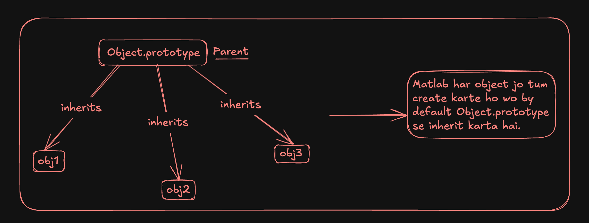 
    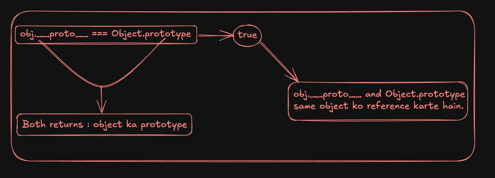 
    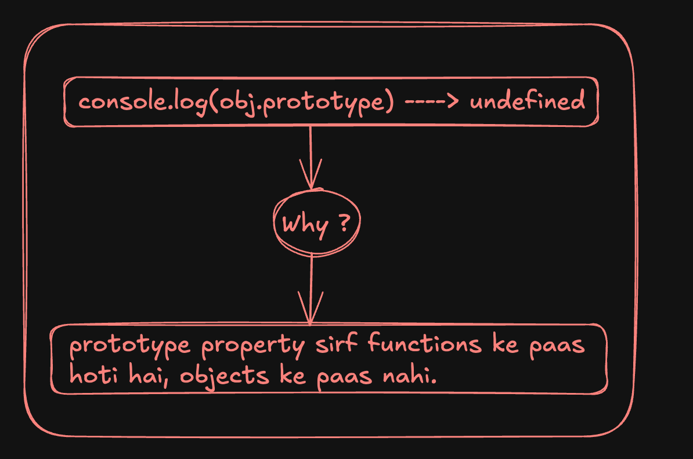 
    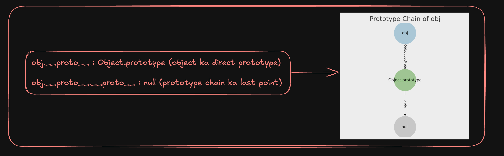 
    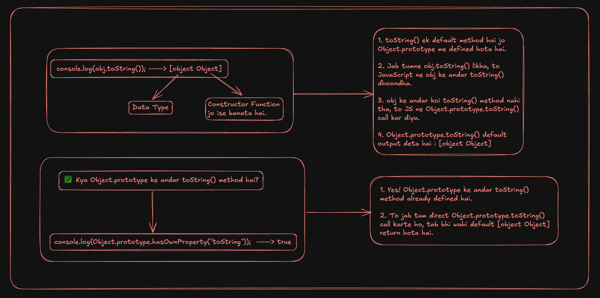 
    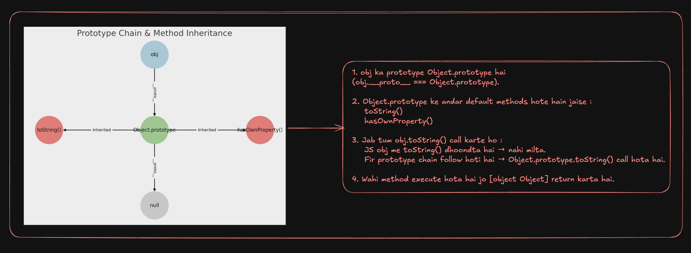 
    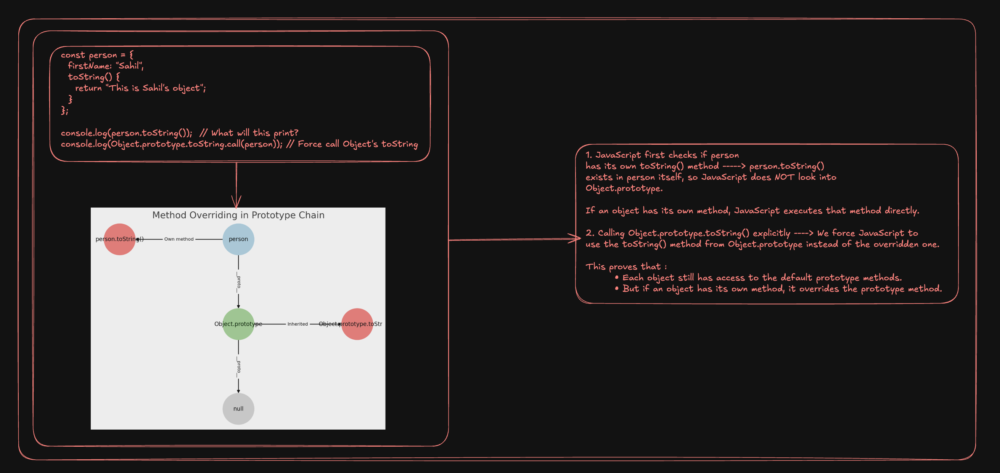 
    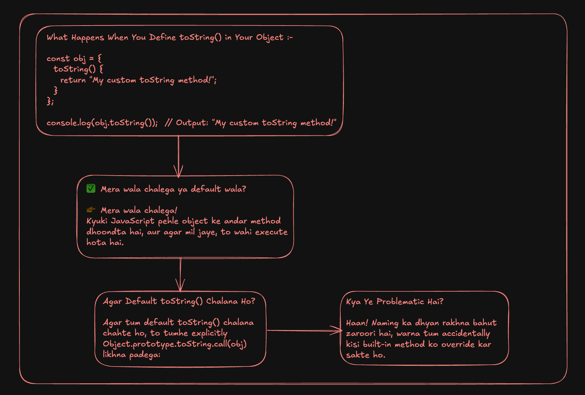 
    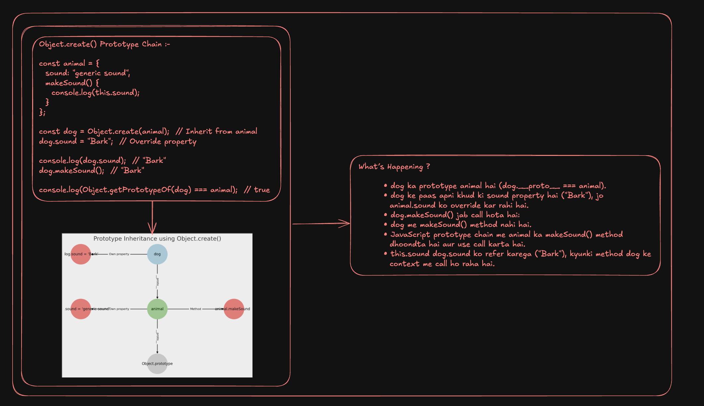 
    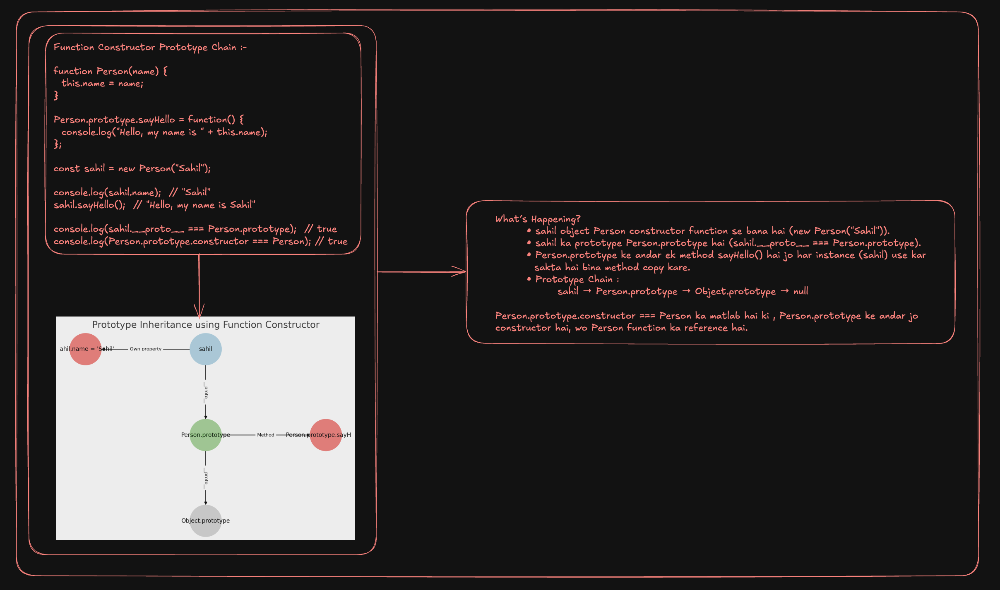 
    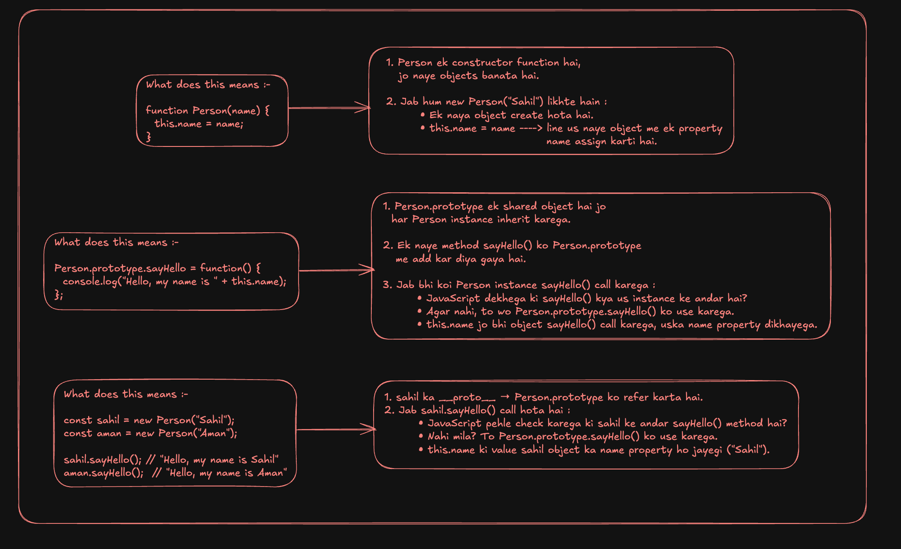
* **Notes** : 
    * Har object ka ek prototype hota hai jo `Object.prototype` hota hai, jab tak tum explicitly kuch aur set na karo.
    * `Object.getPrototypeOf(obj)` aur `obj.__proto__` same hote hain , which means `Object.getPrototypeOf(obj) === obj.__proto__`.
    * `obj.prototype` `undefined` hota hai, kyunki sirf functions ke paas prototype hota hai, objects ke paas nahi.
    * `toString()` default method hai jo `Object.prototype` me defined hota hai.
    * Jab tum `obj.toString()` likhte ho, to JS prototype chain me `Object.prototype.toString()` tak pahuchta hai aur wahi method call hota hai.
    * `Object.prototype.toString()` ka default output `[object Object]` hota hai, jo ek generic representation hai kisi bhi object ka.
    * `Object.getPrototypeOf(obj) === Object.prototype` means obj directly inherit kar raha hai `Object.prototype` se.
    * JavaScript first looks for a method inside the object itself.
    * If the object doesn’t have that method, JavaScript follows the prototype chain and checks in `Object.prototype`.
    * You can override any inherited method inside your object.
    * You can still access the original prototype method using `Object.prototype.method.call(object)`.
    * Agar tumne apne object me `toString()` define kar diya, to wahi chalega, JavaScript default wala nahi dekhega.
    * Agar tum default `toString()` use karna chahte ho, to `Object.prototype.toString.call(obj)` likhna padega.
    * Built-in methods ko accidentally overwrite mat karo, warna JavaScript ke default behavior me problems ho sakti hain.
    * Method naming carefully karo taaki built-in functions overwrite na ho.
    * `Object.create()` se ek object doosre object se inherit kar sakta hai.
    * Agar koi property dog me nahi mile, to JavaScript animal ke andar dhoondta hai.
    * Method inheritance bhi possible hai → dog ka `makeSound()` method animal se aa raha hai.
    * Function constructors ek shared prototype use karte hain, jisme methods store hote hain.
    * Prototype chain allow karti hai ki instances inherited methods use karein.
    * Instances (sahil) ka `__proto__` `Person.prototype` hota hai.
    * Prototype ek shared space hai jisme hum methods add karte hain, jo sab instances reuse kar sakte hain.
    * Jab `sayHello()` call hota hai, to method prototype se milta hai, aur `this` call karne wale object ko refer karta hai.
    * Is approach ka fayda ye hai ki har instance ke andar alag se function copy nahi hota, memory efficient hota hai!
* **Built-In Objects** :
    * **JavaScript provides several built-in objects, such as** -
        * Object
        * Array
        * Date
        * Math
        * JSON
        * Number
        * String
    * These objects come with pre-defined methods and properties.
    * JavaScript objects provided by the language, like Math or Date.
* **typeof Operator** :
    * The typeof operator helps determine the type of a variable.

## Truthy Vs Falsy

## 1. What are Truthy and Falsy Values ?
### Explanation :-
* In JavaScript, every value has an inherent Boolean equivalent:
	* Truthy values evaluate to true when converted to a boolean.
	* Falsy values evaluate to false when converted to a boolean.

## 2. What are the List of Falsy Values ?
### Explanation :-
* There are only 7 falsy values in JavaScript :

| Falsy Value | Explanation |
|-------------|------------|
| `false`     | The boolean `false` itself |
| `0`         | Number zero |
| `-0`        | Negative zero |
| `0n`        | BigInt zero (`BigInt(0)`) |
| `""` or `''` | Empty strings (both single and double quotes) |
| `null`      | Represents "nothing" |
| `undefined` | Value not assigned |
| `NaN`       | Not a Number |


## 3. What are the List of Truthy Values ?
### Explanation :-
* Everything except the falsy values is truthy. 
* Some common examples :
    * Numbers
    ```javascript
        if (100) console.log("Truthy!"); // ✅ This runs
        if (-10) console.log("Truthy!"); // ✅ Negative numbers are also truthy
    ```
    * Non-empty Strings
    ```javascript
        if ("Hello") console.log("Truthy!"); // ✅ Any non-empty string is truthy
    ```
    * Objects & Arrays
    ```javascript
        if ({}) console.log("Truthy!"); // ✅ Empty object is truthy
        if ([]) console.log("Truthy!"); // ✅ Empty array is truthy
    ```
    * Functions
    ```javascript
        if (function () {}) console.log("Truthy!"); // ✅ Functions are truthy
    ```
    * Special Cases
    ```javascript
        if (Infinity) console.log("Truthy!"); // ✅ Infinity is truthy
        if (new Date()) console.log("Truthy!"); // ✅ Date object is truthy
    ```

## 4. How to Use Truthy and Falsy Values in Conditions ?
### Explanation :-
* Since JavaScript automatically converts values to Boolean in conditions, we can simplify code :
    * **Example 1** - Using Falsy values in conditions
    ```javascript
        let username = "";
        if (!username) {
            console.log("Username is empty!"); // ✅ Runs because an empty string is falsy
        }
    ```
    * **Example 2** - Using Truthy values in conditions
    ```javascript
        let age = 21;
        if (age) {
            console.log("Age is defined!"); // ✅ Runs because 21 is truthy
        }
    ```

## 5. How to do Short-circuiting with && and || ?
### Explanation :-
* JavaScript allows short-circuit evaluation, which makes use of truthy and falsy values.
    * **Using || (OR) for Default Values -** 
    ```javascript
        let name = "" || "Guest"; // Since "" is falsy, "Guest" is assigned
        console.log(name); // Output: Guest
    ```
    * **Using && (AND) for Conditional Execution -**
    ```javascript
        let isLoggedIn = true;
        isLoggedIn && console.log("Welcome!"); // ✅ Runs because `isLoggedIn` is truthy
    ```

## 6. How to Convert Values to Boolean Explicitly ?
### Explanation :-
* If you ever need to explicitly convert a value to true or false, Use :
    * **Using Boolean() Function -**
    ```javascript
        console.log(Boolean("Hello")); // ✅ true
        console.log(Boolean(0)); // ✅ false
    ```
    * **Using !! (Double NOT Operator) -**
    ```javascript
        console.log(!!"Hello"); // ✅ true
        console.log(!!0); // ✅ false
    ```

## Type Conversion

### 1. What is Type Conversion ? `IMP`
### Explanation :-
* To convert from one datatype to another, whether explicitly or implicitly.
* Two types :
    Type Coersion(Implicit Type Conversion) -
        "Apne Aap Conversion".
        Implicit conversion of values by JavaScript.
        Ex -  "5" + 1 = "51"
    Type Casting(Explicit Type Conversion) -
        "Jabardasti Conversion"
        Explicit conversion of values.
        Ex -
            let str = "123";
            let num = Number(str);
            console.log(num);

## Data Structures

### 1. What is Structured Data and What is the below type ?
* JSON
### Explanation :-
* Structured Data - Data organized in a specific format.
	* JSON (JavaScript Object Notation) - Lightweight data interchange format.

### 2. What is Keyed Collections and What is the below type ? `IMP`
* Map
* Weak Map
* Set
* Weak Set
### Explanation :-
* Map - Collection of key-value pairs with keys of any type.
* WeakMap - Similar to Map, but keys must be objects and are weakly referenced.
* Set - Collection of unique values.
* WeakSet - Similar to Set, but values must be objects and are weakly referenced.

### 3. What is Indexed Collections and What is the below type ? `IMP`
* Typed Arrays
* Arrays
### Explanation :-
* Indexed Collections are collections that have numeric indices i.e. the collections of data that are ordered by an index value.
	* Typed Arrays - Array-like objects for handling binary data (e.g., Uint8Array).
	* Arrays - Ordered collections of items.

## Equality Comparisons

### 1. What are Value Comparison Operators ? `IMP`
* ==
* ===
* Object.is
### Explanation :-
* `==` -> Loose equality (performs type conversion).
* `===` -> Strict equality (no type conversion).
* `Object.is` -> Determines if two values are the same.

### 2. What are Equality Algorithms ? `IMP`
* isLooselyEqual
* isStrictlyEqual
* SameValueZero
* SameValue
### Explanation :-
* `isLooselyEqual` - Equivalent to ==.
* `isStrictlyEqual` - Equivalent to ===.
* `SameValueZero` - === with -0 and +0 considered equal.
* `SameValue` - Similar to Object.is.

## Loops and Iterations

### 1. What are Loops ?
### Explanation :-
* Constructs to execute a block of code repeatedly (e.g., for, while).

### 2. What are Iterations ?
### Explanation :-
* The process of executing code repeatedly with changes in the loop variable.

### 3. What are these and What do they mean ?
* for
* while
* do-while
* break
* continue
* for-of
* for-in
### Explanation :-
* for - Basic loop with initialization, condition, and increment.
* while - Loop that executes while a condition is true.
* do-while - Loop that executes at least once and then continues while a condition is true.
* break - Exits the loop prematurely.
* continue - Skips the current iteration and proceeds with the next iteration.
* for-of `IMP` - Iterates over iterable objects (e.g., arrays). 
* for-in `IMP` - Iterates over enumerable properties of an object.

## Control Flow

### 1. What are Conditional Statements ?
* if-else
* Switch
### Explanation :-
* if-else - Executes code based on a condition.
* Switch - Selects one of many blocks of code to execute.

### 2. What are Exception Handeling ? `IMP`
* throw Statement
* try | catch | finally
* Error Objects
### Explanation :-
* In JavaScript, all exceptions are simply objects.
* While the majority of exceptions are implementations of the global Error class, any old object can be thrown.
* There are two ways to throw an exception - "Directly via an Error object" or "Through a custom object".
	* throw Statement - Raises a custom error.
	* try | catch | finally - Blocks to handle exceptions.
	* Error Objects - Objects representing errors.

## Expressions and Operators

### 1. What are these ?
* Conditional Operators
* Comma Operators
* Unary Operators
* Relational Operators
* Assignment Operators
* Comparison Operators
* Arithmetic Operators
* Bitwise Operators
* Logical Operators
* BigInt Operators
* String Operators
### Explanation :-
* Expressions - 
    * An expression in JavaScript is any valid unit of code that resolves to a value. 
    * Expressions can include variables, literals, and operators.
* Operators - Operators are symbols used in expressions to perform operations on operands (values and variables).
	* Conditional Operators `IMP` : Ternary (? :). 
	* Comma Operators `IMP` : Evaluates each of its operands (from left to right) and returns the value of the last operand. 
	* Unary Operators : +, -, !, etc.
	* Relational Operators : <, >, <=, >=.
	* Assignment Operators : =, +=, -=, etc.
	* Comparison Operators : ==, ===, !=, !==.
	* Arithmetic Operators : +, -, *, /, %.
	* Bitwise Operators `IMP` : &, |, ^, ~. 
	* Logical Operators : &&, ||, !.
	* BigInt Operators `IMP` : Used with BigInt type. 
	* String Operators `IMP` : Concatenation using +. 

## Functions

### 1. What are Function Parameters ? `IMP`
* Default Params
* Rest
Explanation :-
* Default Params - Parameters with default values. Default function parameters allow named parameters to be initialized with default values if no value or undefined is passed.
* Rest - Collects remaining parameters into an array.

### 2. What are Arrow Function ? `IMP`
Explanation :-
* Shorter syntax for writing functions, with lexical this binding.

### 3. What are IIFEs ? `IMP`
Explanation :-
* Immediately Invoked Function Expressions - Functions executed immediately after their creation.

### 4. What is Argument Object ? `IMP`
Explanation :-
* An array-like object containing the arguments passed to a function.

### 5. What is Scope and Function Stack(Call Stack) ? `IMP`
Explanation :-
* Scope :
    * The visibility of variables.
    * Space or environment in which a particular variable or function can be accessed or used.
    * Accessibility of this variable or function depends on where it is defined.
    * JavaScript has the following kinds of scopes :
        * Global scope - The default scope for all code running in script mode.
        * Module scope - The scope for code running in module mode.
        * Function scope - The scope created with a function.
        * Block scope - The scope created with a pair of curly braces (a block).
* Function Stack(Call Stack) -
    * The call stack of function executions.
    * The function stack is how the interpreter keeps track of its place in a script that calls multiple functions, like which function is currently executing and which functions within that function are being called.

### 6. What is Recursion ? `IMP`
Explanation :-
* Function calling itself.

### 7. What is Lexical Scoping ? `IMP`
Explanation :-
* Scoping rules where inner functions have access to variables in their outer function.

### 8. What is Closures ? `IMP`
Explanation :-
* Functions that retain access to their lexical scope even when executed outside that scope.

### 9. What are Built-in Functions ? `IMP`
Explanation :-
* Functions provided by JavaScript (e.g., parseInt(), Math.max()).

## Strict Mode

### 1. What is Strict Mode in JS ? `IMP`
### Explanation :-
* A stricter version of JavaScript that helps catch common coding errors and prevents the use of some features.
* Enabled by adding "use strict"; at the beginning of a script or function.

## Using this Keyword

### 1. How to use "this" Keyword in a Method ? `IMP`
### Explanation :-
* Refers to the object that owns the method.
* **Example** - this inside a method refers to the object that the method is a property of.

### 2. How to use "this" Keyword in a Function ? `IMP`
### Explanation :-
* In a regular function, this refers to the global object (window in browsers) or undefined in strict mode.

### 3. How to use "this" Keyword alone ? `IMP`
### Explanation :-
* When used alone, this refers to the global object in non-strict mode or is undefined in strict mode.

### 4. How to use "this" Keyword in event handlers ? `IMP`
### Explanation :-
* Refers to the element that triggered the event.

### 5. How to use "this" Keyword in arrow Functions ? `IMP`
### Explanation :-
* this in arrow functions is lexically bound to the context in which the arrow function was created.

### 6. What is Function Borrowing ? `IMP`
### Explanation :-
* Calling a method of one object in the context of another object using call or apply.

### 7. What is Explicit Binding and What are these ? `IMP`
* call
* apply
* bind
### Explanation :-
* **call** - Invokes a function with a specified this value and arguments.
* **apply** - Similar to call, but arguments are passed as an array.
* **bind** - Creates a new function that, when called, has its this keyword set to a specific value.

## Asynchronous JS

### 1. What is Event Loop ? `IMP`
### Explanation :-
* The mechanism that handles asynchronous operations by executing code, handling events, and executing messages in a queue.
* Refer to Asynchronous Part-1 EventLoop.js File.

### 2. What are Callbacks ? `IMP`
### Explanation :-
* Functions passed as arguments to other functions that are executed after the completion of some operation.
* Refer to Asynchronous Part-1 Callbacks.js File.

### 3. What is Callback Hell ? `IMP`
### Explanation :-
* The phenomenon where callbacks are nested within other callbacks, making code hard to read and maintain.
* Refer to Asynchronous Part-1 Callback-Hell.js File.

### 4. What are Promises ? `IMP`
### Explanation :-
* Objects representing the eventual completion (or failure) of an asynchronous operation and its resulting value.
* Refer to Asynchronous Part-2 Promises.js File.

### 5. What is async/await ? `IMP`
### Explanation :-
* Syntax for working with asynchronous code that makes it look and behave like synchronous code.
* Refer to Asynchronous Part-2 Async-Await.js File.

### 6. What is setTimeout ? `IMP`
### Explanation :-
* Function that executes a callback after a specified delay.
* Refer to Asynchronous Part-2 SetTimeout.js File.

### 7. What is setInterval ? `IMP`
### Explanation :-
* Function that repeatedly executes a callback with a fixed time delay between each call.
* Refer to Asynchronous Part-2 SetTimeout.js File.

## Working with APIs

### 1. What is Fetch in JS ? `IMP`
### Explanation :-
* `fetch()` is a modern method for making HTTP requests, returning a Promise that resolves to the Response object.

### 2. What is XMLHTTPRequest in JS ? `IMP`
### Explanation :-
* The older method for making HTTP requests, used for asynchronous data fetching and updating web pages without reloading.

## Classes

### 1. What are Classes in JS ? `IMP`
### Explanation :-
* Blueprints for creating objects with shared properties and methods.
* Introduced in ES6, providing a clearer syntax for constructor functions and prototypes.

## Itertors and Generators

### 1. What are Iterators in JS ? `IMP`
### Explanation :-
* Objects that define a sequence and potentially a return value upon completion.
* Implement the Iterator protocol with methods like next().

### 2. What are Generators in JS ? `IMP`
### Explanation :-
* Special functions that can pause and resume their execution using yield.
* Defined with function* syntax and return an iterator object.

## Modules in JS

### 1. What are Modules ?
### Explanation :-
* Modules encapsulate all sorts of code like functions and variables and expose all this to other files.
* Generally, we use it to break our code into separate files to make it more maintainable.
* They were introduced into JavaScript with ECMAScript 6.

### 2. What is CommonJS Module in JS ? `IMP`
### Explanation :-
* Module system used in Node.js.
* Modules are loaded synchronously and use require() and module.exports.

### 3. What is ESM Module in JS ? `IMP`
### Explanation :-
* ECMAScript Modules (ESM), Standard module system for JavaScript, allowing asynchronous loading with import and export.

## Memory Management

### 1. How does Memory Management happen in JS ? `IMP`
### Explanation :-
* Managed automatically by JavaScript’s garbage collector, which reclaims memory used by objects no longer reachable.

### 2. What is Memory Lifecycle ? `IMP`
### Explanation :-
* The process of allocating and deallocating memory for objects during the runtime of a program.

### 3. What is Garbage Collection ? `IMP`
### Explanation :-
* The automatic process of identifying and removing objects that are no longer in use to free up memory.

## Using Browser DevTools

### 1. What are some Debugging issues in JS ?
### Explanation :-
* **Using console.log()** :
	* **Purpose** - Quickly log variable values and check the flow of execution.
	* **Output** - Shows up in the Console panel of browser DevTools with references to the code location.
	* **Limitations** - Can clutter code and may not handle complex debugging scenarios effectively.
* **Breakpoints and Sources Panel** :
	* **Breakpoints** - Set these in the Sources panel to pause code execution at specific lines, allowing inspection of variable states and the call stack.
	* **Sources Panel** - Use it to navigate through your code and manage breakpoints for more controlled and effective debugging.

### 2. What are Debugging Memory Leaks in JS ? `IMP`
### Explanation :-
* **Common Causes** :
	* **Short-lived Objects** - Objects that are temporary but are still referenced by long-lived objects.
	* **Garbage Collector** - Struggles to de-allocate memory because these objects are still accessible from the global scope or other persistent references.
* **Detecting Leaks** :
	* Use the Memory panel in browser DevTools to take heap snapshots and analyze memory usage.
	* Look for detached DOM trees or large objects that aren’t being cleaned up.

### 3. What are Debugging Performance in JS ? `IMP`
### Explanation :-
* **Using Lighthouse** :
	* **Purpose** - Analyze your website’s performance, page speed, accessibility, and more.
    * **Process** -
	    * Open DevTools and go to the Lighthouse tab.
	    * Run tests by clicking “Analyze Page Load.”
	    * For accurate results, use an incognito tab to avoid interference from browser extensions.
* **Interpreting Results** :
	* Review the performance metrics and suggestions provided.
	* Refer to linked resources for deeper insights into each test result to understand how to improve performance.

## JS In-Depth

### 1. How JS Works ? `IMP`
### Explanation :-
* Before understanding How JS really works , we need to understand few terms.
    * **Execution Context** :
        * Execution Context ek environment hota hai jahan JavaScript code execute hota hai. 
        * Isme code ka execution kaise ho raha hai, uski scope, aur variables ka reference maintain hota hai. 
        * Jab bhi ek function call hota hai, ek naya execution context create hota hai.
        * **Example** - 
            * Agar aap ek function call karte hain, to ek execution context create hota hai jahan function ka code execute hota hai. 
            * Ye context function ke execution ke dauran variables, function arguments, aur function ke andar ke local variables ko track karta hai.
    * **Variable Envrionment** :
        * Variable Environment ek part hota hai execution context ka jahan variables aur functions declare kiye jaate hain. 
        * Yeh basically ek mapping hai jo variable names ko unke values se link karti hai. 
        * Jab ek function execute hota hai, iska variable environment us function ke local variables aur parameters ko track karta hai.
        * **Example** - 
            * Agar aap function ke andar let a = 10; likhte hain, to a variable ka value 10 ho jayega aur variable environment me store ho jayega.
    * **Thread of Execution** :
        * Thread of Execution wo sequence hai jisme JavaScript code line by line execute hota hai. 
        * JavaScript ek single-threaded language hai, isliye ek waqt me sirf ek hi thread hi code execute kar sakta hai.
        * **Example** - 
            * Agar aapke paas ek function hai jo asynchronous code ko handle karta hai, to JavaScript thread asynchronous task ko queue me daal dega aur pehle se running synchronous code ko continue karega.
    * **Synchronous** :
        * Synchronous code ka matlab hai ki code sequentially execute hota hai, line by line, bina kisi interruption ke. 
        * Jab ek synchronous task execute hota hai, tab tak dusra task wait karta hai.
        * Synchronous refers to the execution model of code where operations are executed one after the other without interruption.
        * **Example** - 
            * Agar aap console.log("Hello"); aur console.log("World"); likhte hain, to pehle “Hello” print hoga aur uske baad “World” print hoga, bina kisi delay ke.
    * **Single Threaded** :
        * Single Threaded ka matlab hai ki JavaScript ek waqt me sirf ek hi operation ko execute kar sakta hai. 
        * JavaScript ka ek hi thread hota hai jo code ko line by line execute karta hai, aur asynchronous operations ke liye event loop ka use hota hai.
        * Single Threaded refers to the fact that the JavaScript runtime uses only one thread to execute code, handle events, and manage asynchronous tasks.
        * **Example** - 
            * Jab aap ek asynchronous operation (jaise setTimeout) perform karte hain, JavaScript thread asynchronous task ko event queue me daal deta hai aur synchronous code ko pehle execute karta hai.
* Refer to Namaste JS Ep-1 for Detailed Explanation.

### 2. How JS Code is Executed ? `IMP`
### Explanation :-
* Before understanding How JS Code is Executed , we need to understand few terms.
    * **Call Stack** :
        * Call Stack ek mechanism hai jo function calls ko track karta hai. 
        * Jab bhi ek function call hota hai, wo stack me push hota hai aur jab function return karta hai, to wo stack se pop hota hai. 
        * Yeh stack LIFO (Last In, First Out) principle follow karta hai.
        * **Example** - 
            * Is example mein, jab second function call hota hai, to wo stack me push hota hai, phir first function call hota hai to wo bhi stack me push hota hai. 
            * Jab first execute ho jata hai, to wo stack se pop hota hai aur phir second continue hota hai.
                ```javascript
                function first() {
                    console.log("First");
                }
                function second() {
                    first();
                    console.log("Second");
                }
                second();
                ```
    * **Global Execution Context** :
        * Global Execution Context sabse pehla context hota hai jo JavaScript engine create karta hai jab script run hoti hai. 
        * Is context mein global scope aur global variables included hote hain. 
        * Global Execution Context script ke initial code ko execute karta hai.
        * **Example** - 
            * Jab yeh script run hoti hai, to Global Execution Context create hota hai jo "a" variable aur "greet function" ko memory mein allocate karta hai aur phir "greet function" ko call karta hai.
                ```javascript
                let a = 10;
                function greet() {
                    console.log("Hello");
                }
                greet();
                ```
    * **Execution Context vs Global Execution Context** :
        * **Execution Context** - 
            * Yeh broader term hai jo kisi bhi function ya global code ke execution environment ko refer karta hai. 
            * Jab bhi ek function call hota hai, ek naya execution context create hota hai.
        * **Global Execution Context** - 
            * Yeh specific type ka execution context hai jo tab create hota hai jab script sabse pehli baar run hoti hai. 
            * Isme global variables aur global scope included hote hain. 
            * Yeh sabse pehla context hota hai jo JavaScript engine create karti hai.
* Refer to Namaste JS Ep-2 for Detailed Explanation.

### 3. How Functions work in JS ? `IMP`
### Explanation :-
* Refer to Namaste JS Ep-4 for Detailed Explanation.

### 4. What is the Shortest JS Program ? `IMP`
### Explanation :-
* Before understanding the Shortest JS Code , we need to understand few terms.
* **window** :
    * In a browser environment, window is a global object that represents the window in which the script is running.
    * It provides access to the browser’s features, such as the DOM, location, and history.
    * window ek global object hai jo browser ke window ko represent karta hai.
* **this** :
    * this is a special keyword in JavaScript that refers to the context in which the current code is executing.
    * The value of this depends on how a function is called.
    * this ek special keyword hai jo context ke hisaab se refer karta hai.
* **How it works in Global Scope** :
    * When you run JavaScript code directly in the browser’s global scope (like in a script tag in an HTML file), this points to the window object.
* **How it works in Inside Function** :
    * In a function, the value of this depends on how the function is called.
    * **Regular Function Call** - In non-strict mode, this still refers to the window object.
    * **Method Call** - When a function is a method of an object, this refers to the object.
    * **Constructor Call** - When a function is used as a constructor (with new), this refers to the newly created object.
* **Why this === window is true** :
    * In a browser environment, when you’re executing code in the global scope (outside any function or object), this refers to the window object. 
    * Therefore, this === window is true.
* Jab tum global scope mein code likhte ho, this window object ko refer karta hai, isliye this === window true hai.
* Functions ke context mein this ka value call ke method pe depend karta hai. Strict mode mein this global scope mein undefined hota hai.

### 5. What is Undefined vs Not Defined ? `IMP`
### Explanation :-
* **Undefined** -
    * When it has been declared but not assigned a value.
    * It means the variable exists, but its value is absent or unknown.
    * A variable is declared but not initialized, so it has a default value of undefined.
    * Common Scenarios when we get undefined -
        * A variable declared but not initialized.
        * Function parameters that are not provided when the function is called.
        * Accessing an object property that doesn’t exist.
* **Not Defined** -
    * If it has not been declared at all in the current scope.
    * Trying to access such a variable results in a ReferenceError because it does not exist in the code.
    * A variable that has not been declared at all, leading to a ReferenceError when accessed.
    * Common Scenarios when we get Not Defined -
        * Typographical errors in variable names.
        * Using a variable before declaring it (in non-hoisted contexts).

### 6. What is Scope | Scope Chain | Lexical Environment in JS ? `IMP`
### Explanation :-
* **Scope** -
    * Scope ka matlab hota hai ki aapke variables aur functions kaha se accessible hain, yaani kaha se unko access kiya jaa sakta hai. 
    * JavaScript mein 3 tarah ke scopes hote hain.
* **Scope Chain** -
    * Jab aap kisi variable ko access karte ho, toh JavaScript pehle current scope mein search karta hai.
    * Agar waha nahi milta, toh wo parent scope mein search karta hai, aur yeh process tab tak chalta hai jab tak global scope tak nahi pahunch jata.
    * Is process ko hi scope chain kehte hain.
* **Lexical Environment** -
    * Jab aapka code execute hota hai, JavaScript engine har function ke liye ek lexical environment create karta hai.
    * Yeh environment define karta hai ki variables aur functions kis scope mein available hain.
    * Lexical environment mein do cheezein hoti hain :
        * **Environment Record** - Yeh record karta hai saare variables aur functions jo is environment mein available hain.
        * **Reference to the outer environment** - Yeh reference hai outer lexical environment ka, jo scope chain create karta hai.
* **Working with Call Stack** -
    * Jab JavaScript mein koi function call hota hai, toh wo call stack mein push ho jata hai.
    * Har function ka apna lexical environment hota hai, jo call stack ke saath associated hota hai.
    * Jab function execute hota hai, toh JavaScript us function ke lexical environment mein variables aur functions ko search karta hai.
    * Agar nahi milta, toh outer environment ko refer karta hai, yaani scope chain follow karta hai.
    * **Example** :
        ```javascript
        function outerFunction() {
            var outerVar = "I am outer";
            function innerFunction() {
                var innerVar = "I am inner";
                console.log(outerVar); // Scope chain ke through outerVar accessible hai
            }
            innerFunction();
        }
        outerFunction();
        ```
    * outerFunction call hota hai, toh call stack mein push hota hai.
    * outerFunction ke execution se pehle uska lexical environment create hota hai, jisme outerVar hota hai.
    * Phir innerFunction call hota hai, uska lexical environment create hota hai, jisme innerVar hota hai aur reference hota hai outerFunction ke environment ka.
    * Jab innerFunction mein outerVar ko access karte hain, toh wo pehle apne environment mein search karta hai, waha nahi milta toh outer environment mein search karta hai, aur mil jata hai.

### 7. What is Temporal Dead Zone ? `IMP`
### Explanation :-
* Temporal Dead Zone ek aisi state hoti hai jab aapne let ya const se declare kiye gaye variable ko use karne ki koshish ki ho, lekin uska initialization abhi tak nahi hua hota. 
* Jab tak variable initialize nahi hota, tab tak us variable ko access karna Temporal Dead Zone ke andar hota hai, aur isse error throw hota hai.
* **Example** :
    ```javascript
    console.log(myVar); // ReferenceError: Cannot access 'myVar' before initialization
    let myVar = "Hello!";
    ```
    * Jab code execute hota hai, JavaScript engine pehle hoisting karta hai. 
    * Matlab, let aur const se declare kiye gaye variables ko memory mein reserve kar leta hai, lekin unko initialize nahi karta.
    * Jab tak myVar ka initialization nahi hota, tab tak wo Temporal Dead Zone mein rahega. 
    * Is time ke andar agar aap usko access karne ki koshish karte ho, toh ReferenceError milega.

### 8. What is the difference between Syntax Error, Type Error, aur Reference Error ? `IMP`
### Explanation :-
* **Syntax Error** -
    * Jab aapka code JavaScript ke syntax rules ke against hota hai, tab Syntax Error throw hota hai. 
    * Yeh error tab hota hai jab aap code ko likhne mein kuch galti karte ho, jaise ki missing brackets, semicolons, etc.
    * **Example** :
    ```javascript
    if (true) {
        console.log("This will cause Syntax Error"); // Missing closing bracket
    }
    ```
* **Type Error** -
    * Jab aap kisi value ko ek aise tareeke se use karte ho jo uske type ke according valid nahi hai, tab Type Error hota hai. 
    * Yeh mostly tab hota hai jab aap kisi method ko us type ki value ke upar call karte ho jo allowed nahi hai.
    * **Example** :
        ```javascript
        let num = 42;
        num.toUpperCase(); // TypeError: num.toUpperCase is not a function
        ```
* **Reference Error** -
    * Jab aap kisi aise variable ko access karne ki koshish karte ho jo defined ya declared nahi hai, tab Reference Error hota hai.
    * **Example** :
        ```javascript
        console.log(nonExistentVar); // ReferenceError: nonExistentVar is not defined
        ```

### 9. How to avoid Temporal Dead Zone ? `IMP`
### Explanation :-
* Temporal Dead Zone ko avoid karne ke liye aapko yeh ensure karna hoga ki aap variables ko declare aur initialize pehle kar lo, aur unko use baad mein karo.
* **Example** :
    ```javascript
    // Temporal Dead Zone avoid kiya by initializing first
    let myVar = "Hello!";
    console.log(myVar); // "Hello!"
    ```
* **Initialization early karo** - Variables ko declare karte hi initialize kar do, taaki wo Temporal Dead Zone mein na jaye.
* **Use var for hoisting** - Agar aapko kisi variable ko hoisting ke saath use karna hai, toh var use kar sakte ho. Lekin, var se scoping issues aa sakte hain, so use it carefully.
* **Note** - TDZ sirf let aur const ke saath hota hai, var ke saath nahi. Lekin, let aur const ka use better practice hai kyunki yeh block-scoping follow karte hain.

### 10. What is Block | Shadowing | Illegal Shadowing | Lexical Block Scope ? `IMP`
### Explanation :-
* **Block** -
    * Block JavaScript mein code ka ek group hota hai jo curly braces `{}` ke andar likha hota hai.
    * Yeh mostly if, for, while, aur functions ke saath use hota hai.
    * JavaScript mein let, const aur var ko block ke andar declare kiya ja sakta hai, lekin let aur const block scope follow karte hain, jabki var function scope follow karta hai.
    * **Example** :
        ```javascript
        {
            let x = 10; // Block ke andar hai, sirf is block mein accessible
            console.log(x); // 10
        }
        console.log(x); // Error: x is not defined
        ```
    * Is example mein, let se declare kiya gaya variable x sirf us block ke andar hi accessible hai. Block ke bahar aap x ko access nahi kar sakte.
* **Shadowing** -
    * Shadowing tab hota hai jab aap ek variable ko usi naam se declare karte ho jo pehle se parent scope mein exist karta hai.
    * Matlab, aapka local variable parent scope ke variable ko shadow kar deta hai, yaani uski visibility ko overwrite kar deta hai.
    * **Example** :
        ```javascript
        let x = 20; // Global Scope
        function shadowingExample() {
            let x = 10; // Local Scope, shadows the global x
            console.log(x); // 10
        }
        shadowingExample();
        console.log(x); // 20, Global x is not affected
        ```
    * Is example mein, function ke andar x ko dobara declare kiya gaya hai, jo global x ko shadow kar raha hai. 
    * Function ke andar local x print hoga, lekin function ke bahar global x as it is rahega.
* **Illegal Shadowing** -
    * Illegal Shadowing tab hota hai jab aap kisi block scope variable ko shadow karne ki koshish karte ho using var, jo ki allowed nahi hai.
    * let aur const se declare kiye gaye variables ko var ke saath shadow nahi kar sakte, kyunki var function scope follow karta hai aur let/const block scope follow karte hain.
    * **Example** :
        ```javascript
        let x = 10;
        function illegalShadowing() {
            var x = 20; // Error: Identifier 'x' has already been declared
        }
        illegalShadowing();
        ```
    * Is case mein, let se declared x ko aap var se shadow nahi kar sakte function ke andar, kyunki yeh illegal shadowing hai. 
    * Yeh error throw karega.
    * **Note** - Lekin agar aap reverse karte ho, yaani var ko let ya const se shadow karte ho, toh wo allowed hota hai.
* **Lexical Block Scope** -
    * Lexical Block Scope ka matlab hai ki JavaScript mein variables aur functions un blocks ke according scope mein locked hote hain jinme unhe declare kiya gaya hai.
    * Jab aap kisi variable ko block ke andar declare karte ho, toh wo sirf us block ke andar hi accessible hota hai, us block ke bahar nahi.
    * Yeh lexical scoping ke through achieve hota hai, jisme variables apne parent scopes ko refer kar sakte hain, lekin parent scope ke variables ko overwrite nahi kar sakte.
    * **Example** :
        ```javascript
        let a = "global";
        {
            let a = "block scoped";
            console.log(a); // "block scoped"
        }
        console.log(a); // "global"
        ```
    * Is example mein, let se declare kiya gaya variable a block ke andar lexical block scope follow kar raha hai, matlab wo sirf us block ke andar hi accessible hai. 
    * Block ke bahar, global a ko access kiya ja sakta hai.


### 11. What are Closures in JS ? `IMP`
### Explanation :-
* Closure JavaScript ka ek powerful feature hai.
* Jab ek function apne surrounding (lexical) environment ke variables ko yaad rakhta hai, chahe us function ko us environment ke bahar execute kiya jaye, tab usko Closure kehte hain.
* Matlab, closure ek aisa function hota hai jo apne creation ke time ke lexical scope ko “close” kar leta hai, aur uske variables ko access kar sakta hai.
* **Example** :
    ```javascript
    function outerFunction() {
        let outerVar = "I am outer";
        function innerFunction() {
            console.log(outerVar); // Closure, outerVar accessible hai
        }
        return innerFunction;
    }
    const myClosure = outerFunction();
    myClosure(); // Output: "I am outer"
    ```
    * Yaha outerFunction ke andar ek innerFunction hai. Jab outerFunction call hoti hai, toh wo innerFunction ko return karti hai.
    * innerFunction, even after being executed outside its original environment, still remembers the outerVar variable due to closure. 
    * Jab aap myClosure() call karte ho, toh outerVar ki value print hoti hai, jo innerFunction ke scope ke bahar nahi hai, but closure ki wajah se accessible hai.
    * **Note** - Closure ka use tab hota hai jab aapko functions ke andar state maintain karni hoti hai ya private variables banane hote hain.

### 12. What are First Class Functions ? `IMP`
### Explanation :-
* Function Statement -
    * Function Statement ko hi commonly Function Declaration bhi kehte hain.
    * Isme aap ek function ko explicitly define karte ho, jisme function ka naam aur body hota hai.
    * Yeh syntaxically ek independent statement hota hai.
    * **Example** :
        ```javascript
        function a(){
            console.log("This way of creating Function is called Function Statement.");
        }
        ```
    * **Note** - Function statements hoisting ko follow karte hain, yaani aap function ko declare karne se pehle bhi call kar sakte ho.
* Function Expression -
    * Function Expression mein aap ek function ko variable ke andar assign karte ho. 
    * Yeh ek expression hota hai jisme function ko define kiya jata hai, aur us function ka naam optional hota hai.
    * **Example** :
        ```javascript
        var b = function (){
            console.log("This way of creating Function is called Function Expression.")
        }
        ```
    * **Note** - Function expressions hoisting ko follow nahi karte, yaani unko define karne se pehle call nahi kar sakte.
* **Named Function Expression** -
    * Named Function Expression ek function expression hota hai jisme function ka apna naam hota hai, jo sirf us function ke andar hi accessible hota hai.
    * Yeh tab useful hota hai jab aap recursion karna chahte ho ya debug karna chahte ho.
    * **Example** :
        ```javascript
        var c = function xyz(){
            console.log("This way of creating Function is called Function Expression.")
        }
        ```
* **Function Declaration** -
    * Function Declaration aur Function Statement ek hi cheezein hain.
    * Jaise maine pehle bataya, yeh ek function ko declare karne ka tarika hai jisme function ka naam aur body hoti hai.
    * **Example** :
        ```javascript
        function a(){
            console.log("This way of creating Function is also called Function Declaration.");
        }
        ```
* **Anonymous Function** -
    * Anonymous Function ek aisa function hota hai jiska koi naam nahi hota.
    * Yeh mostly function expressions mein ya callbacks ke roop mein use hota hai.
    * **Example** :
        ```javascript
        const greet = function() {
            console.log("Hello, Anonymous!");
        };
        greet(); // "Hello, Anonymous!"
        ```
    * Yaha jo function greet ke andar assign hai, uska koi naam nahi hai, isliye yeh anonymous function hai. Isko directly use nahi kar sakte bina kisi variable ya callback ke.
* **First-Class Functions** -
    * JavaScript mein First-Class Functions ka matlab hai ki functions ko bhi waise hi treat kiya jata hai jaise kisi aur value ya object ko.
    * Matlab aap functions ko variables mein store kar sakte ho, unko as arguments pass kar sakte ho, aur as return value wapas kar sakte ho.
    * **Example** :
        ```javascript
        function greet() {
            return "Hello!";
        }
        function logGreeting(fn) {
            console.log(fn());
        }
        logGreeting(greet); // "Hello!"
        ```
    * Yaha greet function ko logGreeting function mein argument ke roop mein pass kiya gaya hai, aur usko waha se execute kiya gaya. 
    * Yeh possible hai kyunki JavaScript mein functions first-class citizens hain.
* **Arrow Function** -
    * Arrow Functions JavaScript ES6 mein introduce hui thi.
    * Yeh concise syntax provide karti hain functions ko define karne ke liye, aur yeh lexical this binding follow karti hain, yaani yeh apne surrounding context ka this inherit karti hain.
    * **Example** :
        ```javascript
        const greet = () => {
            console.log("Hello, Arrow Function!");
        };
        greet(); // "Hello, Arrow Function!"
        ```
    * Yaha greet ek arrow function hai. Iska syntax chhota hai aur isme this binding lexical hoti hai, jo traditional functions se different hai.
    * **Note** - Agar aapke pass sirf ek statement hai, toh aap braces {} ko omit kar sakte ho, aur agar aapke pass sirf ek parameter hai, toh aap parentheses () ko bhi omit kar sakte ho.

### 13. What is Functional Programming ? `IMP`
### Explanation :-
* Functional Programming ek programming paradigm hai jisme computation ko functions ke through solve kiya jata hai.
* Yeh declarative programming ka ek form hai, jisme aap “kya solve karna hai” pe focus karte ho, na ki “kaise solve karna hai”.
* Isme functions ko first-class citizens ki tarah treat kiya jata hai, aur pure functions, immutability, aur higher-order functions jaisi concepts ka use kiya jata hai.

### 14. What are Pure Functions ? `IMP`
### Explanation :-
* Pure functions woh functions hote hain jo sirf apne inputs par depend karte hain aur koi side effects nahi create karte.
* Har bar same inputs ke liye same output return karte hain.
* **Example** :
    ```javascript
    function add(a, b) {
        return a + b;
    }
    ```
    * add function ek pure function hai, kyunki yeh sirf apne arguments a aur b par depend karta hai aur koi external state ko modify nahi karta.

### 15. What is Immutability ? `IMP`
### Explanation :-
* Immutability ka matlab hai ki data ko modify nahi karna chahiye, balki har operation ke baad naya data structure create karna chahiye.
* Isse state management simple hota hai aur bugs ka probability kam hoti hai.
* **Example** :
    ```javascript
    const arr = [1, 2, 3];
    const newArr = arr.concat([4]); // arr ko modify nahi kiya gaya, balki naya array banaya
    ```
    * Is example mein, arr original array ko modify nahi kiya gaya, balki concat method se ek naya array newArr create kiya gaya.

### 16. What is HOF ? `IMP`
### Explanation :-
* Higher-order functions aise functions hote hain jo ya to dusre functions ko arguments ke roop mein lete hain, ya function ko return karte hain.
* **Example** :
    ```javascript
    function greet(name) {
        return function(message) {
            console.log(`${message}, ${name}!`);
        };
    }
    const greetJohn = greet("John");
    greetJohn("Hello"); // Output: "Hello, John!"
    ```
    * Is example mein, greet ek higher-order function hai kyunki yeh ek dusra function return kar raha hai.

### 17. What is First Class Function ? `IMP`
### Explanation :-
* Jaise pehle discuss kiya, first-class functions ka matlab hai functions ko variables mein store karna, as arguments pass karna, aur return karna.
* Functional programming mein yeh concept bohot important hai.

### 18. What is Function Composition ? `IMP`
### Explanation :-
* Function composition ka matlab hai chhote chhote functions ko combine karke ek complex function banana.
* Yeh code ko modular aur reusable banata hai.
* **Example** :
    ```javascript
    const add = (a) => (b) => a + b;
    const double = (x) => x * 2;
    const addAndDouble = (a, b) => double(add(a)(b));
    console.log(addAndDouble(2, 3)); // Output: 10
    ```
    * Yaha add aur double functions ko combine karke addAndDouble function banaaya gaya hai.

### 19. What is map ? `IMP`
### Explanation :-
* map() ek array method hai jo ek existing array ke har element par ek function apply karta hai aur result ko ek naye array mein return karta hai.
* Yaani, map() aapko input array ke elements ko transform karne ki ability deta hai.
* **Syntax** :
    ```javascript
    let newArray = array.map(callback(element, index, array) {
        // return transformed element
    });
    ```
    * **callback** - function ko har element ke liye call kiya jata hai.
	* **element** - Current element jo process ho raha hai.
	* **index** - Current element ka index.
	* **array** - Original array jisme map() apply ho raha hai.
	* **newArray** - Yeh return karta hai transformed elements ka naya array.
* **Example** :
    ```javascript
    const numbers = [1, 2, 3, 4, 5];
    const doubled = numbers.map(num => num * 2);
    console.log(doubled); // Output: [2, 4, 6, 8, 10]
    ```
    * Is example mein, map() function numbers array ke har element par (num * 2) apply kar raha hai, aur result ko doubled array mein store kar raha hai.

### 20. What is filter ? `IMP`
### Explanation :-
* filter() ek array method hai jo ek existing array ke elements ko filter karta hai based on ek condition (jo aap callback function mein define karte ho) aur unhi elements ko naya array return karta hai jo condition satisfy karte hain.
* **Syntax** :
    ```javascript
    let newArray = array.filter(callback(element, index, array) {
        // return true or false
    });
    ```
    * **callback** - function ko har element ke liye call kiya jata hai.
	* **element** - Current element jo process ho raha hai.
	* **index** - Current element ka index.
	* **array** - Original array jisme filter() apply ho raha hai.
	* **newArray** - Yeh return karta hai sirf un elements ka array jo callback function mein true return karte hain.
* **Example** :
    ```javascript
    const numbers = [1, 2, 3, 4, 5];
    const evens = numbers.filter(num => num % 2 === 0);
    console.log(evens); // Output: [2, 4]
    ```
    * Is example mein, filter() function numbers array ke elements mein se sirf unko filter karta hai jo even hain (i.e., num % 2 === 0 condition satisfy karte hain) aur result ko evens array mein store karta hai.

### 21. What is reduce ? `IMP`
### Explanation :-
* reduce() ek array method hai jo array ke har element par ek callback function apply karta hai, aur ek single value reduce karta hai jo cumulative result hota hai.
* Yeh cumulative operation (jaise sum, product, etc.) ke liye useful hai.
* **Syntax** :
    ```javascript
    let result = array.reduce(callback(accumulator, currentValue, index, array), initialValue);
    ```
    * **callback** - Function jo har element par call kiya jata hai.
	* **accumulator** - Yeh cumulative result ko hold karta hai.
	* **currentValue** - Current element jo process ho raha hai.
	* **index** - Current element ka index.
	* **array** - Original array jisme reduce() apply ho raha hai.
	* **initialValue** - Yeh accumulator ki initial value set karta hai (optional).
	* **result** - Yeh reduce operation ke baad single value return karta hai.
* **Example** :
    ```javascript
    const numbers = [1, 2, 3, 4, 5];
    const sum = numbers.reduce((acc, curr) => acc + curr, 0);
    console.log(sum); // Output: 15
    ```
    * Is example mein, reduce() function numbers array ke har element ko ek cumulative sum mein reduce kar raha hai. 
    * Initial value 0 hai, aur function har element ko accumulator (acc) mein add karta ja raha hai. 
    * Final result 15 return hota hai.

### 22. What is the differnce when we use () and {} in map | filter | reduce ? `IMP`
### Explanation :-
* **Using () with Arrow Functions** :
    * When you use () right after the arrow =>, it implies an implicit return.
    * This is a shorthand for returning a value directly without needing to use the return keyword.
    * **Example** -
        ```javascript
        list.map((item, index) => (
            <li key={index}>{item}</li>
        ))
        ```
        * Here, the arrow function implicitly returns the `<li>` element.
	    * The parentheses () around the JSX are required if you want to use implicit return and have multiple lines of JSX.
* **Using {} with Arrow Functions** :
    * When you use {} after the arrow =>, you’re defining a function body.
    * Inside this body, you can write multiple statements. However, you need to explicitly return a value using the return keyword.
    * **Example** -
        ```javascript
        list.map((item, index) => {
            return <li key={index}>{item}</li>
        })
        ```
        * In this case, the function has a block body, so you must use return to return the `<li>` element.
* **Why Do Both Work** :
    * In both cases, the map function receives a function that returns a value (`<li key={index}>{item}</li>`).
	* Whether you use () for an implicit return or {} with an explicit return, the outcome is the same - the JSX is returned, and React uses it to render the list.
* **When to Use Which** :
    * Use () when your function’s only task is to return a value. It’s concise and makes the code look cleaner.
	* Use {} when you need to perform additional operations before returning a value, or if you prefer the explicitness of the return keyword.
