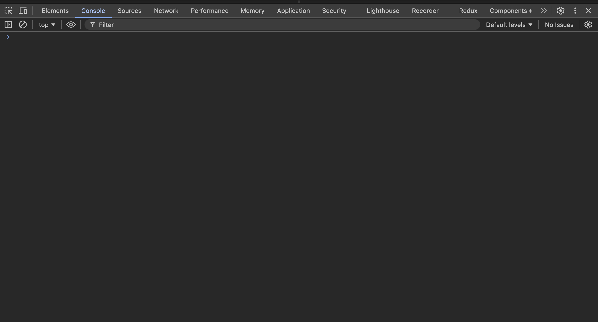
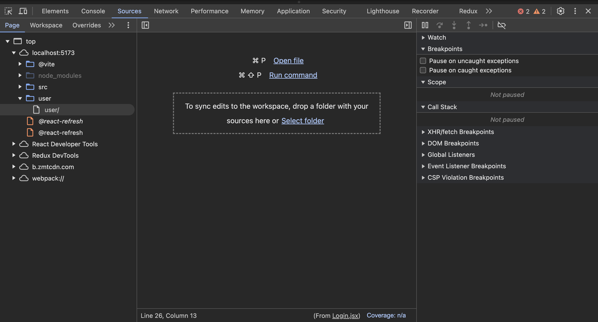
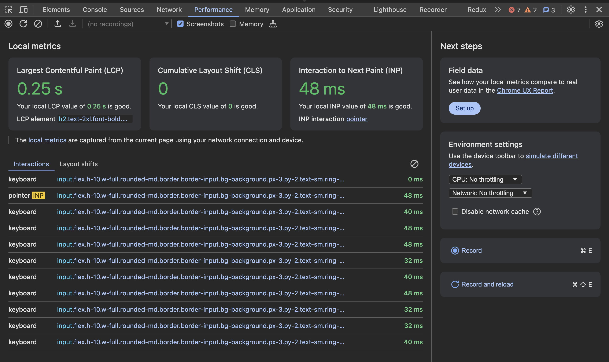
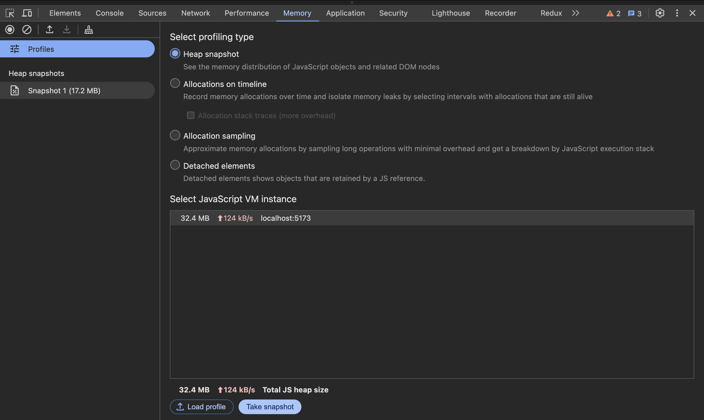
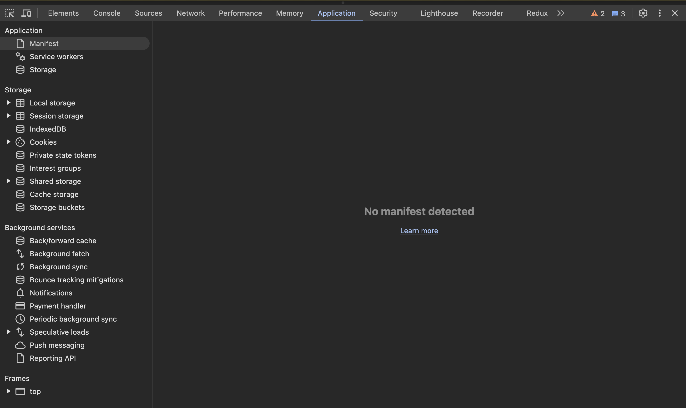
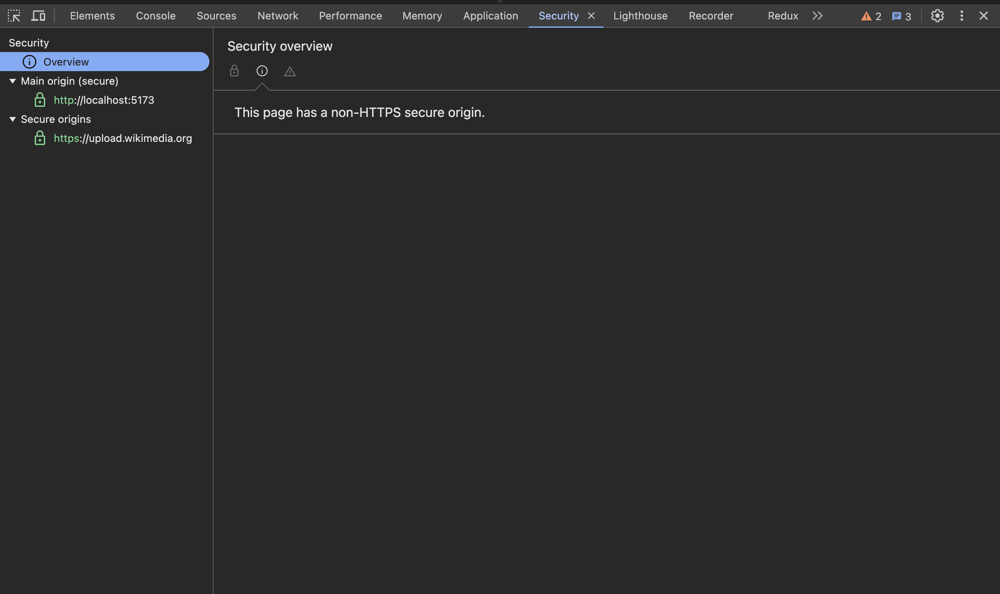

# Browser DevTools

## Important Tabs :-
- Elements
- Console
- Sources
- Network
- Performance
- Memory
- Applications
- Security

### 1. Elements
- **What it is** -  
	* The “Elements” tab allows you to inspect and manipulate the HTML and CSS structure of the webpage.
- **Why we use it** - 
    * It helps in debugging the layout, style, and structure of the page in real-time.
- **How we use it** -
	* Inspect HTML - You can navigate the DOM tree to inspect elements on the page.
	* Edit HTML - Right-click on any element and choose “Edit as HTML” to modify the DOM and see live changes.
	* Edit CSS - Select any HTML element, and its associated styles will appear on the right side. You can add, modify, or disable styles.
- **Important components** -
	* DOM Tree - Represents the structure of the HTML.
	* CSS Styles Pane - Displays the CSS rules for the selected element.
	* Event Listeners - Shows events like click, keydown attached to elements.
- **Use Case** - 
    * Quickly fix minor layout issues, test changes to HTML or CSS, or debug why a specific element isn’t rendering correctly.
- 

### 2. Console
- **What it is** -  
	* The Console tab shows logs, errors, warnings, and other information from JavaScript running in the browser.
- **Why we use it** - 
    * It’s essential for debugging JavaScript code and tracking logs and errors during development.
- **How we use it** -
	* View Logs - Console outputs console.log(), console.warn(), and console.error().
	* Evaluate JavaScript - You can write JavaScript expressions directly in the console and run them.
	* Filter Messages - Use the filter options to focus on errors, warnings, or logs.
- **Important components** -
	* Error Stack Trace - When an error occurs, a stack trace shows you where the error happened in your code.
	* Console API - Allows logging of various types of information (e.g., console.assert(), console.info(), console.dir()).
- **Use Case** - 
    * Debug JavaScript code by checking for errors, logging variable values, or testing small code snippets.
- 

### 3. Sources
- **What it is** - 
	* The “Sources” tab helps you inspect and debug JavaScript files, including setting breakpoints.
- **Why we use it** -
    * It’s vital for debugging JavaScript logic and tracking down errors in the code.
- **How we use it** -
	* View Source Files - Navigate through all the JS, HTML, and CSS files loaded in the browser.
	* Set Breakpoints - You can pause code execution at a specific line to inspect variables and flow.
	* Watch Expressions - Allows you to track specific variables’ values in real time as you step through the code.
- **Important components** -
	* Call Stack - Displays the sequence of function calls leading to the current line of execution.
	* Scopes - Shows all the local and global variables in the current scope.
	* Watch Expressions - Track specific variables or expressions as the code runs.
- **Use Case** - 
	* Debug JavaScript by pausing code at specific points, inspecting variables, and analyzing the call stack.
- 

### 4. Network
- **What it is** - 
	* The “Network” tab records all network requests made by the page, including HTTP requests and WebSocket messages.
- **Why we use it** - 
    * It’s crucial for understanding the performance and status of network requests and responses.
- **How we use it** -
	* Track HTTP Requests - You can see all requests made by the page (GET, POST, etc.).
	* Inspect Request/Response - Click on any request to view the headers, payload, and response data.
	* Filter Requests - Filter by request type (XHR, JS, Img, etc.) to narrow down results.
- **Important components** -
	* Request Headers - Information sent to the server.
	* Response Headers - Information sent back by the server.
	* Payload - Data sent in a request (e.g., form data or JSON).
- **Use Case** - 
	* Debug API requests, check the response from the server, and analyze issues with server-side communication (e.g., wrong status code, missing data).
- 

### 5. Performance
- **What it is** - 
	* The “Performance” tab helps you analyze the performance of a webpage by recording and inspecting various metrics such as page load times, script execution times, and rendering processes.
- **Why we use it** - 
    * It’s used to identify performance bottlenecks like long JavaScript execution or heavy page rendering.
- **How we use it** -
	* Record Performance - Click the record button to capture a performance snapshot while interacting with the page.
	* Analyze Timeline - View events such as script execution, rendering, and layout phases.
- **Important components** -
	* Frames - Shows the number of frames rendered per second (FPS).
	* Call Stack - View the function calls being executed during performance testing.
	* Main Thread - Tracks the activities taking place on the main thread.
- **Use Case** - 
	* Optimize page performance by identifying slow operations or resources.
- 

### 6. Memory
- **What it is** - 
	* The “Memory” tab helps you identify memory leaks by monitoring how memory is allocated during the execution of your app.
- **Why we use it** - 
	* It’s important for tracking down memory leaks and optimizing memory usage in large applications.
- **How we use it** -
	* Take Heap Snapshot - Capture a snapshot of memory allocation.
	* Record Allocation Timeline - Track the memory usage over time as actions are performed.
- **Important components** -
	* Heap Snapshot - Shows the memory distribution for objects in the app.
	* Allocation Timeline - Shows the memory usage over time.
- **Use Case** - 
	* Detect and fix memory leaks in JavaScript by tracking allocated memory during interactions.
- 

### 7. Applications
- **What it is** - 
	* The “Application” tab allows you to inspect storage, cookies, local storage, session storage, and indexed DB.
- **Why we use it** - 
	* It helps manage client-side data storage (like cookies or local storage) and inspect service workers or web manifests.
- **How we use it** -
	* View Cookies - See the cookies set for your website and modify or delete them.
	* Local & Session Storage - View data saved in the browser’s local or session storage.
	* IndexedDB - Inspect databases created by your app on the client-side.
- **Important components** -
    * Cookies - View, delete, and add cookies.
    * LocalStorage/SessionStorage - Manage key-value pairs stored in the browser.
- **Use Case** - 
	* Debug client-side storage issues, manage cookies for user sessions, or inspect data saved locally.
- 

### 8. Security
- **What it is** - 
	* The “Security” tab helps you inspect the security of the website, including SSL/TLS certificate details and any security issues.
- **Why we use it** - 
	* It’s crucial for ensuring that your website is secure, especially regarding HTTPS and certificates.
- **How we use it** -
	* Inspect SSL/TLS Certificate - View details of the website’s security certificate.
	* Check for Mixed Content - Ensure all content on the page is loaded over HTTPS.
- **Important components** -
	* Security Overview - Displays the website’s security status (e.g., secure, not secure).
	* Certificate Details - View the certificate issuer and validity dates.
- **Use Case** - 
	* Ensure your website is secure and has no mixed content or other vulnerabilities.
- 