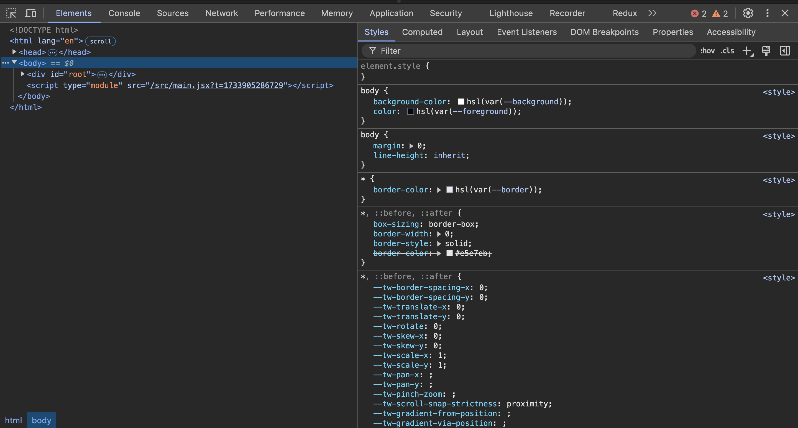
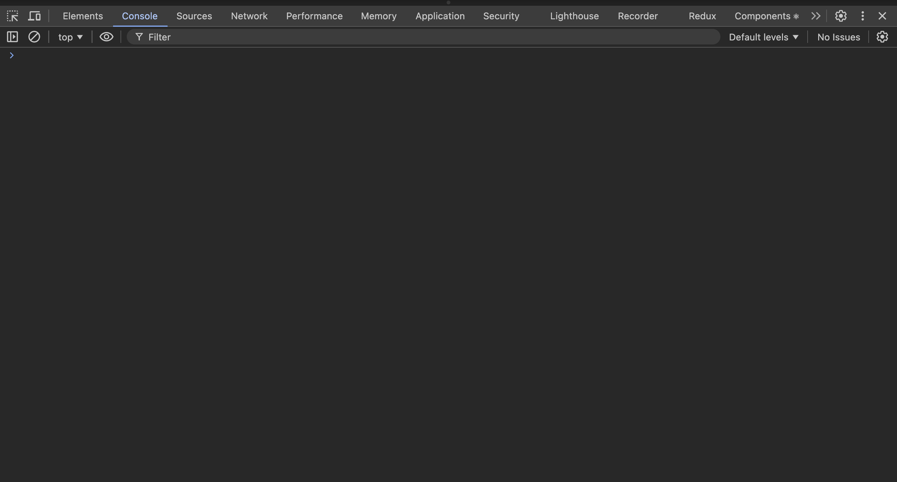
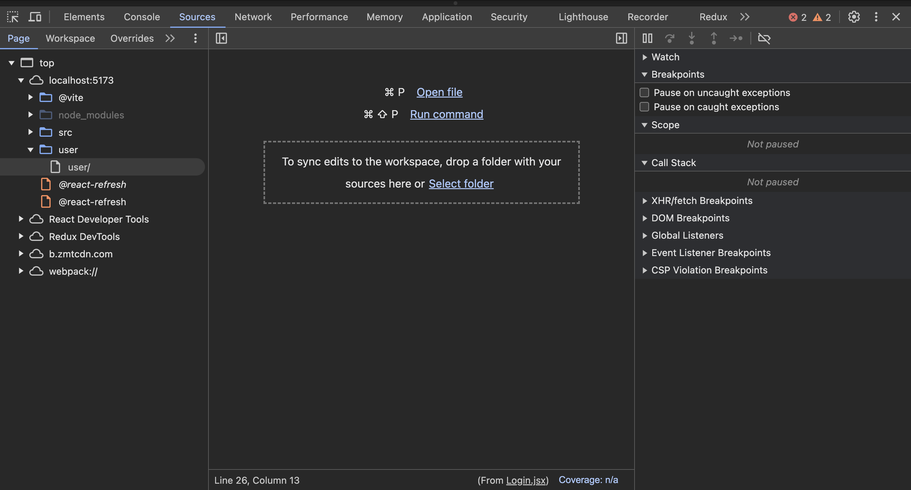
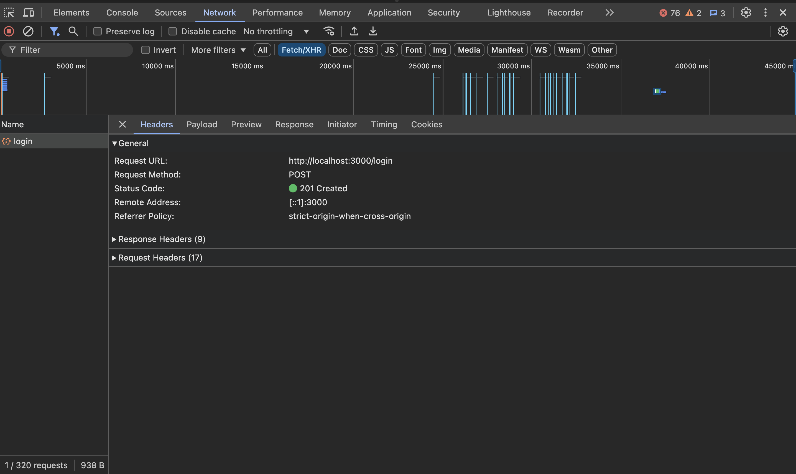
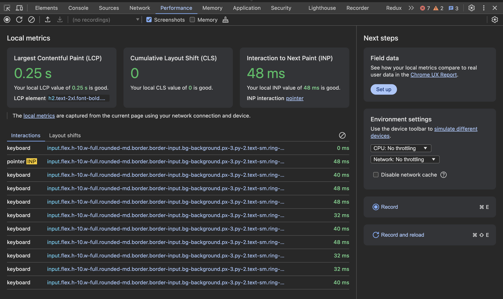
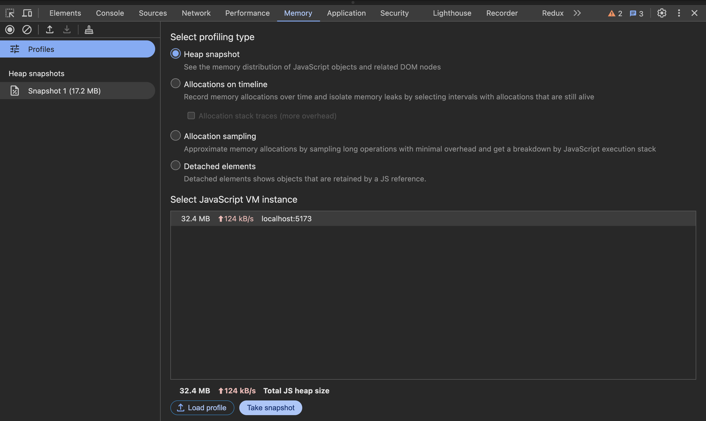
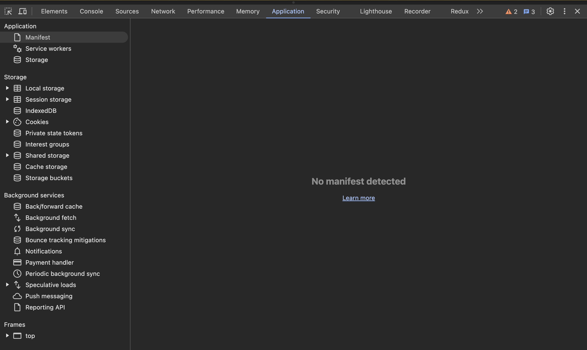
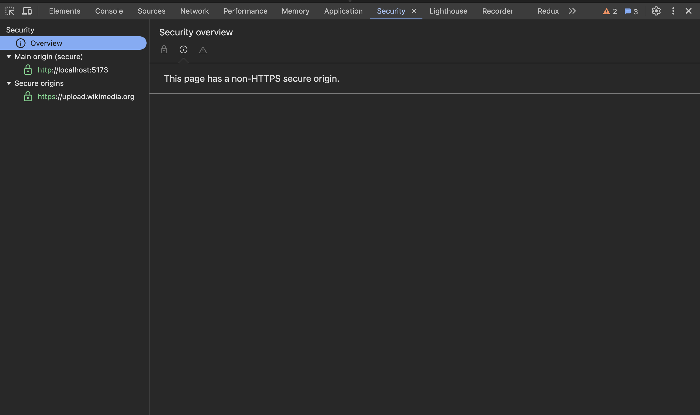

# Browser DevTools

## Important Tabs :-
- Elements
- Console
- Sources
- Network
- Performance
- Memory
- Applications
- Security

### 1. Elements
- What it is -  The “Elements” tab allows you to inspect and manipulate the HTML and CSS structure of the webpage.
- Why we use it - 
    It helps in debugging the layout, style, and structure of the page in real-time.
- How we use it -
	Inspect HTML - You can navigate the DOM tree to inspect elements on the page.
	Edit HTML - Right-click on any element and choose “Edit as HTML” to modify the DOM and see live changes.
	Edit CSS - Select any HTML element, and its associated styles will appear on the right side. You can add, modify, or disable styles.
- Important components -
	DOM Tree - Represents the structure of the HTML.
	CSS Styles Pane - Displays the CSS rules for the selected element.
	Event Listeners - Shows events like click, keydown attached to elements.
- Use Case - 
    Quickly fix minor layout issues, test changes to HTML or CSS, or debug why a specific element isn’t rendering correctly.
- 

### 2. Console
- What it is -  The Console tab shows logs, errors, warnings, and other information from JavaScript running in the browser.
- Why we use it - 
    It’s essential for debugging JavaScript code and tracking logs and errors during development.
- How we use it -
	View Logs - Console outputs console.log(), console.warn(), and console.error().
	Evaluate JavaScript - You can write JavaScript expressions directly in the console and run them.
	Filter Messages - Use the filter options to focus on errors, warnings, or logs.
- Important components -
	Error Stack Trace - When an error occurs, a stack trace shows you where the error happened in your code.
	Console API - Allows logging of various types of information (e.g., console.assert(), console.info(), console.dir()).
- Use Case - 
    Debug JavaScript code by checking for errors, logging variable values, or testing small code snippets.
- 

### 3. Sources
- What it is - The “Sources” tab helps you inspect and debug JavaScript files, including setting breakpoints.
- Why we use it -
    It’s vital for debugging JavaScript logic and tracking down errors in the code.
- How we use it -
	View Source Files - Navigate through all the JS, HTML, and CSS files loaded in the browser.
	Set Breakpoints - You can pause code execution at a specific line to inspect variables and flow.
	Watch Expressions - Allows you to track specific variables’ values in real time as you step through the code.
- Important components -
	Call Stack - Displays the sequence of function calls leading to the current line of execution.
	Scopes - Shows all the local and global variables in the current scope.
	Watch Expressions - Track specific variables or expressions as the code runs.
- Use Case - Debug JavaScript by pausing code at specific points, inspecting variables, and analyzing the call stack.
- 

### 4. Network
- What it is - The “Network” tab records all network requests made by the page, including HTTP requests and WebSocket messages.
- Why we use it - 
    It’s crucial for understanding the performance and status of network requests and responses.
- How we use it -
	Track HTTP Requests - You can see all requests made by the page (GET, POST, etc.).
	Inspect Request/Response - Click on any request to view the headers, payload, and response data.
	Filter Requests - Filter by request type (XHR, JS, Img, etc.) to narrow down results.
- Important components -
	Request Headers - Information sent to the server.
	Response Headers - Information sent back by the server.
	Payload - Data sent in a request (e.g., form data or JSON).
- Use Case - Debug API requests, check the response from the server, and analyze issues with server-side communication (e.g., wrong status code, missing data).
- 

### 5. Performance
- What it is - The “Performance” tab helps you analyze the performance of a webpage by recording and inspecting various metrics such as page load times, script execution times, and rendering processes.
- Why we use it - 
    It’s used to identify performance bottlenecks like long JavaScript execution or heavy page rendering.
- How we use it -
	Record Performance - Click the record button to capture a performance snapshot while interacting with the page.
	Analyze Timeline - View events such as script execution, rendering, and layout phases.
- Important components -
	Frames - Shows the number of frames rendered per second (FPS).
	Call Stack - View the function calls being executed during performance testing.
	Main Thread - Tracks the activities taking place on the main thread.
- Use Case - Optimize page performance by identifying slow operations or resources.
- 

### 6. Memory
- What it is - The “Memory” tab helps you identify memory leaks by monitoring how memory is allocated during the execution of your app.
- Why we use it - It’s important for tracking down memory leaks and optimizing memory usage in large applications.
- How we use it -
	Take Heap Snapshot - Capture a snapshot of memory allocation.
	Record Allocation Timeline - Track the memory usage over time as actions are performed.
- Important components -
	Heap Snapshot - Shows the memory distribution for objects in the app.
	Allocation Timeline - Shows the memory usage over time.
- Use Case - Detect and fix memory leaks in JavaScript by tracking allocated memory during interactions.
- 

### 7. Applications
- What it is - The “Application” tab allows you to inspect storage, cookies, local storage, session storage, and indexed DB.
- Why we use it - It helps manage client-side data storage (like cookies or local storage) and inspect service workers or web manifests.
- How we use it -
	View Cookies - See the cookies set for your website and modify or delete them.
	Local & Session Storage - View data saved in the browser’s local or session storage.
	IndexedDB - Inspect databases created by your app on the client-side.
- Important components -
    Cookies - View, delete, and add cookies.
    LocalStorage/SessionStorage - Manage key-value pairs stored in the browser.
- Use Case - Debug client-side storage issues, manage cookies for user sessions, or inspect data saved locally.
- 

### 8. Security
- What it is - The “Security” tab helps you inspect the security of the website, including SSL/TLS certificate details and any security issues.
- Why we use it - It’s crucial for ensuring that your website is secure, especially regarding HTTPS and certificates.
- How we use it -
	Inspect SSL/TLS Certificate - View details of the website’s security certificate.
	Check for Mixed Content - Ensure all content on the page is loaded over HTTPS.
- Important components -
	Security Overview - Displays the website’s security status (e.g., secure, not secure).
	Certificate Details - View the certificate issuer and validity dates.
- Use Case - Ensure your website is secure and has no mixed content or other vulnerabilities.
- 