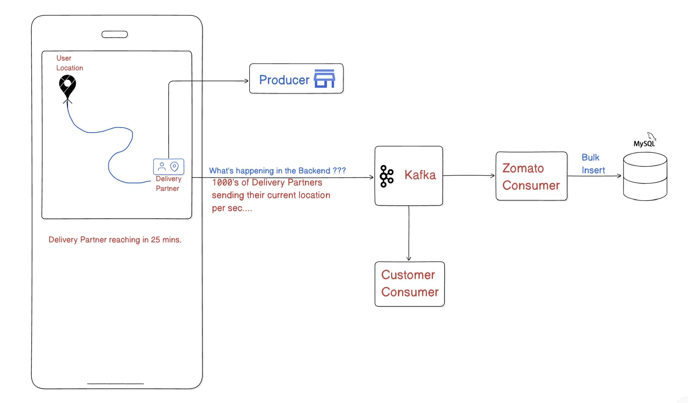
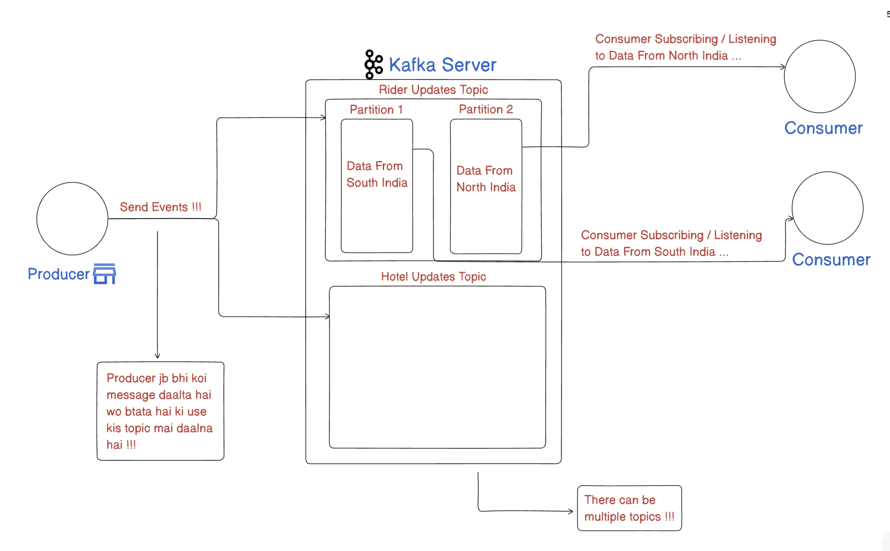

# Master Kafka

## Problem Statement

## Problem Solution

## Then Why cant we simply use Kafka rather than using a DB

## Kafka Usage Example

## Kafka Architecture Problem Example

## Kafka Architecture Solution Example

## Kafka With 1 Consumer Example

## Kafka With 2 Consumer Example

## Kafka With 3 Consumer Example

## Kafka Partitions and Consumer Rule 1

## Kafka Partitions and Consumer Rule 2

## Kafka Partitions and Consumer Rule 2 Solution - Use Consumer Groups

## 2 Main Architecture : Queues & Pub-Sub

## 1. Kafka kya hai?
## Explanation :-
* Apache Kafka ek distributed event-streaming platform hai.
* Simple shabdon mein, yeh ek messaging system jaisa hai jahan producers (jo data bhejte hain) aur consumers (jo data padhte hain) beech mein directly connect nahi hote, balki sab data topics mein publish hota hai.
* Internally, Kafka apne data ko append-only logs (commit logs) ke form mein store karta hai. 
* Har topic ke andar multiple partitions hote hain, jisse data ko parallelism aur scalability milti hai.
* **Example** -
	* Maan lo tumhare paas ek e-commerce website hai. Jab bhi koi user order place karta hai, toh ek event generate hota hai : `{ orderId: 123, userId: 456, total: 999 }`. 
    * Yeh event tum Kafka ke “orders” topic mein push kar doge. 
    * Baad mein alag-alag services (jaise billing, inventory, analytics) ye events consume kar sakte hain.

⸻

## 2. Kafka ka ek main problem jo solve karta hai?
## Explanation :-
* **Decoupling of Systems** - 
    * Sabse pehla aur bada issue jo Kafka solve karta hai, vo hai producer-consumer decoupling. 
    * Matlab agar tumhare paas multiple services hain jo data produce kar rahi hain aur multiple services data consume kar rahi hain, toh unhe direct connect karne ki jagah, sab log Kafka ke madhyam se communicate karte hain. 
    * Isse services independent rehti hain.
* **High-Throughput Data Pipeline** - 
    * Jab data ka volume bahut zyada ho (jaise millions of events per second), traditional message brokers slow ya unable ho jate hain. 
    * Kafka disk-backed, append-only, sequential writes ka use karke bahut high throughput achieve karta hai.
* **Data Persistence & Replayability** - 
    * Kafka messages ko kuch configured time tak (ya size tak) disk par store karke rakhta hai. 
    * Iska fayda yeh hai ki agar koi consumer crash ho jaye ya naya consumer add ho, toh purane events ko dubara offset se replay kiya ja sakta hai.
* **Example** -
	* Tumne analytics team ke liye 7 din tak user click-stream data store kiya hua hai. 
    * Agar unhe kisi din pichle 3 din ka data dobara process karna ho, toh woh topic ke start offset se read karke kar sakte hain.

⸻

## 3. Kafka kyun use karte hain?
## Explanation :-
* **Scalability** - 
    * Kafka topics ko multiple partitions mein split karke, alag machines (brokers) par distribute kar sakte ho. 
    * Jab load badhe, new brokers add karke easily scale kar sakte ho.
* **Fault-Tolerance** - 
    * Har partition ke liye multiple replicas ban sakte hain. 
    * Agar ek broker down ho jata hai, dusra replica leader banta hai, data loss nahi hota (agar replication properly configured ho).
* **Low Latency & High Throughput** - 
    * Kafka sequential disk writes aur zero-copy send mechanism use karke bahut kam latency mein millions of messages process kar sakta hai.
* **Ordering Guarantees** - 
    * Ek partition ke andar message order guaranteed hoti hai. 
    * Agar tumhe order maintain karna hai (jaise user ke events order wise process karna), toh woh partition-level logic se possible hota hai.
* **Durability** - 
    * Messages disk par persist hote hain, in memory par nahi. 
    * Agar broker restart ho jaye, data safe rehta hai.
* **Flexible Consumption** - 
    * Consumers apna offset khud manage karte hain. 
    * Isse tum snapshot-like processing kar sakte ho: ek batch process kariye, agar fail ho gaye toh wahi offset se repeat kariye.
* **Example** -
	* **Log Aggregation** - 
        * Sab servers apne application logs ko Kafka topic mein push karte hain. 
        * Phir log-processing service ya monitoring dashboard cheezon ko consume karke alerting ya BI reports banata hai.
	* **Real-Time Analytics** - 
        * Stock trading platform real-time price updates ko Kafka ke through aage services tak pahunchata hai, jo phir dashboard ya alert engines ko feed deta hai.

⸻

## 4. Kya aur tools/software hain jo Kafka jaise problems solve karte hain?
## Explanation :-
* **Haan, market mein kuch alternatives hain, lekin har ek ki apni pros-cons hoti hain** -
	1.	**RabbitMQ** -
	    * **Type** - Traditional message broker (AMQP protocol)
	    * **Use-case** - Batch work queues, RPC, light messaging
	    * **Difference vs Kafka** -
            * Kafka me data disk pe persist hota hai aur high throughput, partitioned log storage deta hai. 
            * RabbitMQ me message queue pe jaake remove ho jata hai (FIFO by default), aur ordering ya replay minimal hota hai.
	2.	**ActiveMQ, Apache Pulsar** -
	    * **ActiveMQ** - JMS-based broker, familiar world for Java shops. Pulsar: “next-gen Kafka” bolte hain, built-in multi-tenancy, geo-replication, tiered storage.
        * **Difference vs Kafka** - 
            * Pulsar me segment storage aur broker–bookie architecture, Kafka jaisa commit-log nahi, par similar event-streaming features laata hai.
	3.	**AWS Kinesis** -
	    * Cloud-native data streaming service, similar commit log concept.
	    * **Difference vs Kafka** - 
            * Fully managed AWS service, auto-scale, par vendor lock-in. 
            * Kafka open source, on-prem ya cloud managed clusters (Confluent, MSK) mein deploy ho sakta hai.
	4.	**Google Pub/Sub, Azure Event Hubs** -
	    * Cloud messaging & streaming platforms. 
        * Conceptually Kafka jaisa hi hain—distributed, partitioned streaming.
	5.	**Redis Streams** -
        * Redis ka ek feature jo message streams handle karta hai. 
        * Kafka jaisa high throughput and persistence nahi but simpler lightweight cases ke liye theek hai.
* **Example Comparison** -
	* Agar tumhe exactly once processing chahiye, Kafka Streams ya Flink integrate karke achieve hota hai. RabbitMQ me complex hoga.
	* Agar tum already AWS stack heavy use kar rahe ho, toh Kinesis convenient high-level choice hogi.

⸻

## 5. Kafka kaun-ka situation mein use karte hain?
## Explanation :-
* **Microservices Communication** -
	* Jab tumhara system bahut saare microservices ka dhaarhot ho, aur tumhe asynchronous event delivery chahiye (sync REST ke compare me loosely coupled).
	* **Example** - 
        * User registration event generate hote hi, welcome-email service, analytics service, recommendation service sab asynchronously consume kar sakte hain.
* **Real-Time Data Pipelines & ETL** -
	* Data sources (DB changes, logs, IoT sensors) se data nikaalte ho, Kafka pe daalte ho, phir downstream systems (Hadoop, Spark, ElasticSearch) consume karke analytics ya dashboards update karte hain.
* **Event Sourcing / CQRS Patterns** -
	* Business events ko commit log ki tarah store karna, phir state derived karna. 
    * Kafka me stored events se pura state rebuild ho sakta hai.
* **Log Aggregation** -
	* Bahut saare servers, applications ke logs centrally collect karne ke liye. 
    * Phir Splunk/ELK ko feed kar sakte ho.
* **Metrics & Monitoring** -
	* System ya business metrics ko ek centralized topic pe push karna, phir real-time processing ke liye use karna.
* **Stream Processing** -
	* Kafka Streams ya Apache Flink jaisa stream-processing framework ke saath integrate karke complex transformations, windowing, joins, aggregations karte hain.
* **High-Volume Messaging**
	* Jahan par thousands–lakhs events per second generate ho rahe ho (e.g., Click-stream data, Sensor data), FTP ya traditional queue systems handle nahi kar paate. 
    * Kafka efficiently handle karta hai.
* **Example Scenario** -
	* **E-commerce Flash Sale** - 
        * 1 million users simultaneously add items to cart, order events generate ho rahe hain. 
        * Agar tum direct database writes pe bharosa karoge, bohot load ban jayega. 
        * Toh tum order events Kafka mein publish karo. 
        * Downstream inventory service thoda slower pace pe consume kare, order processing service apne pace se process kare. 
        * Load peak bhi absorb ho jayega.

⸻