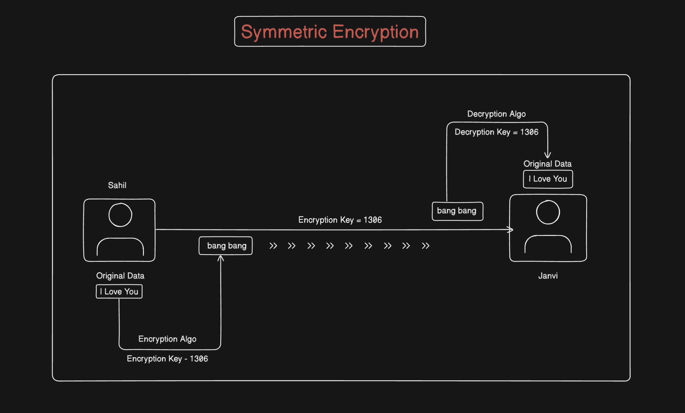
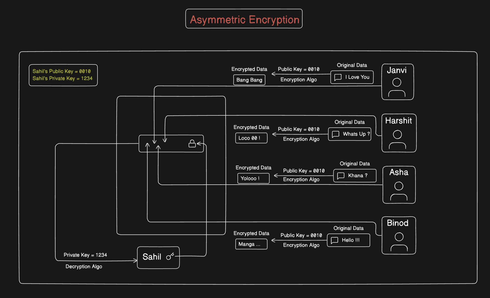

# Master Advance Auth Concepts

## ✅ PRACTICAL vs CONCEPTUAL — Advanced Auth Topics
### 🔹 A. Purely Conceptual (Understand-Only)
* These things are used under the hood (by libraries, protocols), so you don’t implement them manually, but you must understand them deeply.

| Concept                         | Why It’s Conceptual                                                                                     |
|---------------------------------|----------------------------------------------------------------------------------------------------------|
| 🔐 Symmetric Encryption         | Libraries like `crypto`, `jsonwebtoken`, etc. handle this                                               |
| 🔐 Asymmetric Encryption        | Used for token signing/verifying, but you don’t write encryption logic                                  |
| 🔑 Private & Public Keys        | You generate/use them, but signing/verifying is handled by libraries                                     |
| 🧠 JWT Claims Standards         | You structure the token content but don’t enforce standards manually                                     |
| 📄 Discovery Documents (.well-known) | Libraries fetch and use this — you just configure base URL                                         |
| 🔐 JWKS (Public Key Sets)       | You fetch and verify against them, but don’t manage them manually                                       |
| ✉️ SAML Protocol                | You’ll rarely implement it manually unless working on enterprise systems — handled by tools like Okta, ADFS, etc. |

### 🔸 B. Practical & Implementable (You Must Code/Use)
* These are hands-on things that you’ll implement in frontend/backend projects.

| Concept/Tool                             | What You’ll Implement                                                                 |
|------------------------------------------|----------------------------------------------------------------------------------------|
| 🔐 JWT Authentication                    | Sign, verify, decode tokens (using `jsonwebtoken`, `jwt-decode`, etc.)               |
| 🗄️ Access Tokens                         | Create on login, store in memory/localStorage                                         |
| 🛡️ Refresh Tokens                        | Store securely (HTTP-only cookies), use to issue new access tokens                   |
| 💡 OAuth2 Flows (Google/GitHub Login)    | Implement redirect, token exchange, and user creation                                |
| 🧬 OpenID Connect (OIDC)                 | Use `id_token` to verify identity (usually JWT)                                      |
| 🛡️ Token verification using Google’s Public Keys | Use Google’s `jwks_uri` to verify `id_token`                                 |
| 🔐 Google Auth integration               | Frontend + Backend config, token exchange, and session                               |
| ⚙️ Session/token management              | Handling login, logout, token refresh, and secure storage                            |
| 🧞 Parsing JWTs and Reading Claims       | Decode tokens to read info like `userId`, `role`, etc.                               |

## ✅ Important Flows to Understand
1. Stateful Auth (Session + Cookies)
2. Stateless Auth (JWT Auth)
3. JWT with Access + Refresh Token Flow
4. OAuth2 + OpenID Connect (Login with Google, GitHub, etc.)
5. Token Verification using Public Keys (JWKS Flow)

## ✅ Phase 1: Cryptography Fundamentals
* Symmetric Encryption
* Asymmetric Encryption
* Public Key / Private Key

### 1. Symmetric Encryption
* **🧠 Concept** -
	* Same key is used to encrypt and decrypt the data.
	* It’s fast and simple — but both parties must securely share the key beforehand.
	* Symmetric encryption ek aisa encryption method hai jismein ek hi key ka use hota hai data ko encrypt aur decrypt karne ke liye.
	* Same key for encryption & decryption
	* Agar kisi ke paas wo key hai, to wo encrypted data ko easily decrypt kar sakta hai
* **(Real-Life Analogy)** -
	* Soch le tu ek secret letter likh raha hai apne dost ko
		* Tu ek lock use karta hai (let’s say ek combination lock — 1234)
		* Us lock se letter ko band kar deta hai (this is encryption)
		* Ab wo letter tu post karta hai
		* Jab dost ke paas letter aata hai, uske paas bhi same combination (1234) hona chahiye to kholne ke liye (this is decryption)
	* Yahan 1234 = Symmetric Key
* 
* **Kaise Kaam Karta Hai (Technical Explanation)** - 
	* Data lete ho — e.g. "Hello World"
	* Use ek symmetric encryption algorithm se encrypt karte ho — like AES (Advanced Encryption Standard)
	* Usme ek secret key use hoti hai — e.g. "mysupersecretkey123"
	* Encrypted output milta hai — e.g. "89b9a3d..."
	* Jab decrypt karna hai to same key se reverse process hota hai.
* **💡 Example** -
    * Suppose you and your friend both know a secret password (key): "apple123".
	* You take a message like "Hello Sahil" → Use "apple123" to encrypt it into gibberish like "xT$5Q!k9".
	* Your friend uses the same "apple123" to decrypt it back to "Hello Sahil".
* **🔐 Real-World Use Case** -
	* Encrypting files on disk (like zip files with passwords)
	* HTTPS (TLS handshake initially uses asymmetric, then switches to symmetric for speed)
* **Limitations / Risks** : 
	* **Key Sharing Problem** - Dono parties ke paas same key honi chahiye. Agar key leak ho gayi, poora data compromise.
	* **Scalability Issue** - Agar 100 logon ke sath securely data exchange karna ho, to har user ke liye alag key maintain karni padegi.

### 2. Asymmetric Encryption
* **🧠 Concept** -
	* **Uses two keys** :
	* **🔓 Public Key** - 
		* Can be shared with anyone
		* Sabke liye available hoti hai
	* **🔐 Private Key** - 
		* Must be kept secret
		* Secret hoti hai, sirf owner ke paas hoti hai
	* Whatever is encrypted with Public Key can be decrypted only by Private Key, and vice versa.
	* Jo data ek key se encrypt hota hai, wo sirf dusri key se hi decrypt ho sakta hai.
* **(Real-Life Analogy)** - 
	* Soch, tu ek public suggestion box lagata hai :
		* Box open karne ki chabi (private key) sirf tere paas hai
		* Public mein koi bhi aake us box mein letter daal sakta hai (public key use karke encrypt)
		* Lekin us letter ko padhega sirf tu, kyunki sirf tere paas uski chabi hai
	* Yahi concept JWT signature verification, HTTPS handshake, aur Google Auth mein use hota hai!
* * 
* **Kaise Kaam Karta Hai (Technical Explanation)** - 
	* Generate Key Pair :
		* 1 Public Key
		* 1 Private Key
	* Use Cases ke hisaab se :
		* **For Confidentiality (Encryption/Decryption)**
			* Sender → encrypts message using Receiver’s Public Key
			* Only Receiver (jiske paas Private Key hai) → decrypt kar sakta hai
		* **For Authenticity (Digital Signature)**
			* Sender → signs message using Private Key
			* Receiver → verify karta hai using Sender’s Public Key
* **💡 Example** -
	* Suppose you’re building a Login System.
	* The server holds a Private Key.
	* You (as client/frontend) use the server’s Public Key to encrypt the user credentials like email and password.
	* Only the server (who has the matching Private Key) can decrypt and read it.
* This ensures no one in between (like a hacker sniffing the network) can read the data — even if they intercept it.
* **Pros** :
	* Secure communication without sharing secret key
	* Very useful for digital signatures, token verification, secure key exchange
* **Cons** :
	* Slower than symmetric encryption
	* Complex key management
* **Agar Asymmetric Encryption secure hai, to har jagah wahi kyun nahi use karte?**
	* Asymmetric encryption is slow.
	* To real-world systems kya karte hain :
		* Start with Asymmetric encryption to securely exchange a Symmetric key
		* Uske baad poori communication symmetric key se hoti hai (performance ke liye)

### 3. Public Key & Private Key
* **Public Key** - 
	* Sabke saath freely share ki ja sakti hai
	* Used to encrypt or verify data
* **Private Key** -
	* Secret hoti hai — sirf key owner ke paas rehti hai
	* Used to decrypt or sign data
* Ye dono keys mathematically linked hoti hain. 
* Ek se encrypt karo, to dusri se hi decrypt ho sakta hai.
* **Kya user ke paas dono keys hote hain? Ya sirf ek?**
	* Har context mein dono keys hone ki zarurat nahi hoti
* **Kya ye situation pe depend karta hai?**
	* Yes, ye situation pe depend karta hai
* **Case 1: Jab User Sirf Receiver Hai (Confidentiality)** :
	* **Example** - HTTPS Website Visit kar raha hai user
		* Tu Chrome browser kholta hai → koi website pe jaata hai (e.g. https://bank.com)
		* Bank.com ka server apna Public Key bhejta hai
		* Tera browser usse session key encrypt karta hai
		* Server usko apne Private Key se decrypt karta hai
	* Yahan user ke paas koi key nahi hoti!
	* Sirf server ke paas key-pair hota hai
* **Case 2: Jab User khud Data Sign/Encrypt kar raha ho** :
	* **Example** - SSH Login ya Digital Signature
		* Tu developer hai, tu apne laptop se SSH se GitHub pe push kar raha hai
		* Tere system ke paas -
			* Tera Private Key hota hai
			* GitHub ke paas tera Public Key hota hai
	* Yahan user ke paas dono keys hote hain
	* Private apne pass hota hai (signing ke liye), Public sabko dena padta hai (verification ke liye)
* **Case 3: JWT / OAuth Login Flow** :
	* Google ya OAuth sign karta hai JWT Token
		* Google ke paas -
			* Private Key (wo JWT sign karta hai)
		* Tu ek user hai -
			* Tu uska Public Key use karta hai token verify karne ke liye
	* Yahan user ke paas sirf Public Key hota hai
	* Wo verify karta hai, sign nahi
* **NOTE** - 
	* Public key sabko diya ja sakta hai
	* Private key kabhi share nahi hoti
	* So koi bhi system mein tumhare paas Public Key ho sakti hai, lekin tumhara Private Key hamesha tumhare paas secure hona chahiye
* **Working Ka Flow (2 Scenarios ke Saath)** :
	* **Use-Case #1: Confidentiality (Encrypt → Decrypt)** - 
		* **Goal** - Koi message bhejna securely, sirf receiver hi padh sake.
			* **Sender** - Encrypt karta hai message with Receiver’s Public Key
			* **Receiver** - Decrypt karta hai with his Private Key
		* Sender ko Receiver ki public key chahiye hoti hai, private key nahi.
		* **Example** -
			* Tu client hai → Server ka public key leke message encrypt karega → Server hi apne private key se decrypt karega
	* **Use-Case #2: Authenticity (Sign → Verify)** -
		* **Goal** - Check karna ki message sach mein trusted source se aaya hai.
			* **Sender** - Apne data ko sign karta hai with his Private Key
			* **Receiver** - Verify karta hai with Sender’s Public Key
		* Yeh JWT, Google Auth, Digital Certificates mein hota hai
		* **Example** -
			* Google ne JWT token sign kiya private key se, tu uska public key (via JWKS) use karke verify karta hai ki wo valid hai.
* **🔧 Use in JWT (Signing and Verifying)**
* **Let’s say your backend is generating JWTs** -
	* It signs the token using the Private Key.
	* Later, your frontend or another service verifies the token using the Public Key.
* This is called JWT verification via Asymmetric Signing, like RS256.
* **💡 Real-World Example (Google Auth)** -
	* When you sign in with Google, Google sends your app a JWT.
	* You verify that token using Google’s Public Key (which they expose via .well-known URL).
	* You don’t need Google’s private key — and that’s the beauty of asymmetric cryptography!
* **Kya Public key ka use sirf encrypt aur verify ke liye hota hai, aur Private key ka use sirf decrypt aur sign ke liye?**
	* Bilkul sahi! Ye hi asymmetric cryptography ka golden rule hai.
* **Public Key & Private Key — Role Based Usage**

| **Operation** | **Public Key Used?** | **Private Key Used?** | **Use-Case**                                           |
|---------------|----------------------|------------------------|--------------------------------------------------------|
| Encrypt       | ✅ Yes               | ❌ No                 | Sender encrypts data for receiver (**Confidentiality**) |
| Decrypt       | ❌ No                | ✅ Yes               | Receiver decrypts with their private key               |
| Sign          | ❌ No                | ✅ Yes               | Sender signs data to prove **authenticity**            |
| Verify        | ✅ Yes               | ❌ No                 | Receiver verifies signature using sender’s public key  |

* **Flow Recap (Real Use-Cases Ke Sath)** :
	* **1. Confidential Message (Encryption)** -
		* “Mujhe sirf Harshit hi message padh sake — uske alawa koi nahi”
			* Sahil → Encrypts using Harshit’s Public Key
			* Harshit → Decrypts using his Private Key
	* **2. Authentic Message (Signature)** - 
		* “Harshit ko proof chahiye ki message Sahil ne hi bheja, aur koi beech mein modify na kare”
			* Sahil → Signs message using his Private Key
			* Harshit → Verifies using Sahil’s Public Key
* **Toh Rule Yaad Rakhne Ka Shortcut** - 
* **👉 Public Key** -
   - Encrypt karne ke liye
   - Signature verify karne ke liye
* **👉 Private Key** -
   - Decrypt karne ke liye
   - Message sign karne ke liye
* **Note** - 
	* Encrypt → Public
	* Decrypt → Private
	* Sign → Private
	* Verify → Public
* **Summary (Cheat Sheet Style)** :

| **Concept**              | **Key Feature**                         | **Example / Use Case**           |
|--------------------------|-----------------------------------------|----------------------------------|
| Symmetric Encryption     | Same key to encrypt & decrypt           | Zip file passwords, initial HTTPS |
| Asymmetric Encryption    | Public/Private Key Pair                 | JWT, HTTPS, Google Auth          |
| Public Key               | Shared with anyone, encrypts/verifies   | Frontend can use it              |
| Private Key              | Kept secret, decrypts/signs             | Backend stores this              |

* **Security Note** -
	* Agar Private Key leak ho gayi, system ka pura trust break ho jaata hai!
	* Isliye private keys ko store karte hain securely (e.g. AWS KMS, Vault, HSMs, .env, etc.)

## ✅ Phase 2: Token-Based Auth Concepts
* JWT (structure, signature, claims)
* Access Token
* Refresh Token

### 1. What is JWT (JSON Web Token)?
* **🧠 Concept** -
    * JWT is a compact, URL-safe token format used to securely transmit information between parties.
* **✅ Use Cases** -
	* Session management (instead of cookies)
	* Authorization (access control)
	* Sharing identity across services
* **💡 Real Life Example** -
	1.	You log in with email & password.
	2.	Server verifies and gives you a JWT.
	3.	Now, when you hit protected APIs, you send the JWT in the request headers.
	4.	Server verifies the token to check your identity and role — it doesn’t need to hit the DB again.

### 2. JWT Structure & Claims
* **A JWT has 3 parts, separated by dots (.)** :
```
xxxxxx.yyyyyyyyy.zzzzz
   ↓       ↓       ↓
Header Payload Signature
```
* **Part 1: Header**
    * **Specifies** -
	    * The signing algorithm (alg)
	    * The type of token (typ)
        ```json
        {
            "alg": "HS256",
            "typ": "JWT"
        }
        ```
* **Part 2: Payload**
    * Contains the claims — these are pieces of info about the user or session.
    * **Claims = Key-value pairs**
    ```json
    {
        "sub": "1234567890",
        "name": "Sahil Ladhania",
        "role": "admin",
        "iat": 1711631416
    }
    ```
    * **Claims can be** :
	    * **Registered Claims** – like iss, sub, exp, iat
	    * **Custom Claims** – like role, permissions, etc.
* **Part 3: Signature**
    * This is used to verify the token’s integrity.
	    * If any part of the header or payload is modified → the signature will no longer match.
	    * `Signature = HMACSHA256(base64UrlEncode(header) + “.” + base64UrlEncode(payload), secret)`
    * **Example of a Full JWT** -
    `
        eyJhbGciOiJIUzI1NiIsInR5cCI6IkpXVCJ9.
        eyJ1c2VySWQiOjEyMywibmFtZSI6IlNhaGlsIiwicm9sZSI6ImFkbWluIn0.
        fvh9TyO-1VUXKM2fqZWpiSo6Yw8MeRPQuYg2pPrcFGI
    `
* **JWT is not encrypted by default** :
	* It’s signed, not encrypted. Anyone can read the payload, but only the backend can verify or change it.
	* If you need to hide the content, you must encrypt the JWT (called JWE — advanced usage).

### 3. How JWT is Signed (Symmetric vs Asymmetric)
* **🔐 Signing = Trust Building** :
    * **JWT uses signing to ensure that** :
	    * Data inside the token is not tampered
	    * Token is issued by a trusted source
    * **Two Ways to Sign a JWT** :
        * **1. Symmetric Signing (HS256)**
        	* Uses 1 shared secret key (both to sign & verify).
	        * **Algorithm** - HS256 (HMAC SHA256)
            * **Example** -
	            * Backend signs the token using "mySuperSecret".
	            * On every request, it verifies the token using the same "mySuperSecret".
            * **Used When** -
                * You have only 1 backend or internal services.
        * **2. Asymmetric Signing (RS256)**
            * **Uses a key pair** :
	            * 🔐 Private Key → to sign the token
	            * 🔓 Public Key → to verify the token
            * **Example** -
	            * Your backend (auth server) signs the JWT with its Private Key.
	            * Other services or clients verify it using the Public Key.
            * **Used When** -
                * You have microservices, 3rd-party clients, or need external verification (like Google Auth).
            * **Real World Analogy** -
	            * Symmetric → Secret handshake between two friends.
	            * Asymmetric → Signing a contract; anyone can verify your signature, but only you can produce it.

### 4. Access Token
* **🧠 What is it?**
    * Access Token is a short-lived token that:
	    * Proves you’re authenticated.
	    * Is sent with every request to protected routes.
    * It is usually a JWT (but can be opaque too).
* **✅ Example Flow** -
	1.	Sahil logs in → gets an Access Token.
	2.	It contains: userId, role, expiresAt, etc.
	3.	He sends this token in headers like -
    `
    Authorization: Bearer eyJhbGciOi...
    `
    4.	Backend verifies the signature → If valid, gives access.

### 5. Refresh Token
* **🧠 What is it?**
	* A long-lived token used to get new access tokens.
	* Not sent with every request.
	* Stored securely (e.g. HTTP-only cookie or secure storage).
* **✅ Why needed?**
    * Access Tokens should be short-lived (e.g. 15 mins).
    * To avoid logging in again and again, the Refresh Token:
	    * Sends a request to /refresh-token endpoint.
	    * Gets a new Access Token without logging in again.
* **🔐 Security Tips** -
	* Access Token → short-lived, safe to store in memory
	* Refresh Token → long-lived, store securely (cookies or backend DB)


## ✅ Phase 3: Protocols and Standards
* OAuth 2.0
* OpenID Connect
* SAML
* Google’s .well-known discovery document

### 1. OAuth 2.0 — Authorization Protocol
* **🧠 What is it?**
    * OAuth 2.0 is a delegation protocol.
    * It lets users grant limited access to their data on one service (like Google), without giving credentials to another service (like your app).
* **💡 Real-Life Analogy** -
    * You’re in a hotel and want room service to deliver food to your room.
    * Instead of giving your room key (password), you give them a temporary access card to open your door once.
* That’s OAuth — giving limited access, not full control.
* **✅ Example Flow: “Login with Google” (OAuth style)**
	1.	Sahil opens your app and clicks “Login with Google”.
	2.	Your app redirects Sahil to:
    `https://accounts.google.com/o/oauth2/v2/auth?...`
	3.	Sahil logs into Google and grants access.
	4.	Google redirects back to your app with a code.
	5.	Your backend sends this code to Google’s token endpoint to get:
	    * ✅ access_token
	    * ✅ id_token (if using OpenID Connect)
	6.	Your app uses the access_token to get Sahil’s profile from Google.
* **Important Components** -

| Term              | What it means                                 |
|-------------------|-----------------------------------------------|
| Client            | Your App                                      |
| Resource Owner    | The user (Sahil)                              |
| Authorization Server | Google (who gives tokens)                 |
| Resource Server   | Google APIs (holding profile/email info)      |
| Access Token      | Token used to access user data                |

* **OAuth2 Grant Types (Types of Flows)** - 
	1.	Authorization Code – Most secure, used in frontend/backend apps
	2.	Client Credentials – Used for machine-to-machine communication
	3.	Password Grant – Deprecated (bad practice)
	4.	Implicit Grant – Deprecated (used for SPAs in past)
* **Note** - 
    * OAuth2 only handles authorization, it says :
        `“Sahil allowed you to access their Google profile.”`
    * It does not prove who Sahil is.
    * That’s where OpenID Connect comes in → it adds identity to this system.

### 2. OpenID Connect (OIDC) — Identity Layer over OAuth2
* **🧠 What is OIDC?**
	* OIDC is an authentication layer built on top of OAuth 2.0.
	* It lets you verify the identity of the user and get their basic profile info — securely.
	* It extends OAuth2 by adding an id_token (a JWT), which proves who the user is.
* **❓Why do we need OIDC if we have OAuth2?**

| OAuth2                            | OIDC                                      |
|----------------------------------|-------------------------------------------|
| Only provides authorization      | Adds authentication                       |
| Access token gives access to data| ID token proves who the user is           |
| No standard for identity data    | Standardized claims via `id_token`        |

* **Real-Life Example: “Login with Google” using OIDC**
    * Let’s say Sahil logs into your app using Google.
    * **Behind the scenes** -
        1.	Your app redirects to Google authorization endpoint with extra openid scope.
        2.	Sahil logs into Google and grants access.
        3.	Google redirects back with a code.
        4.	Your backend exchanges the code with Google for:
            * **access_token** → to fetch profile
            * **id_token** → JWT that contains Sahil’s identity
        5.	Your backend verifies the id_token using Google’s Public Key.
        6.	You now trust this is Sahil.
* **What’s inside the id_token?**
    * It’s a JWT, and it may contain claims like :
    ```json
    {
        "iss": "https://accounts.google.com",
        "sub": "10293485709238457",   // unique user ID
        "email": "sahil@example.com",
        "name": "Sahil Ladhania",
        "iat": 1711630000,
        "exp": 1711633600
    }
    ```
    * **You can use this id_token to** :
	    * Create or login the user
	    * Store basic info in your DB
	    * Avoid asking user to fill sign-up forms manually
* **Key Components of OpenID Connect** - 

| Term                             | Meaning                                                  |
|----------------------------------|----------------------------------------------------------|
| openid scope                     | Must be added to OAuth2 request to enable OIDC           |
| id_token                         | JWT that contains the user’s identity                    |
| userinfo endpoint                | (Optional) API to get user profile                       |
| .well-known/openid-configuration| Discovery document for OIDC setup (endpoints, keys, etc.)|

### 3. SAML (Security Assertion Markup Language)
* **🧠 What is SAML?**
	* SAML is an XML-based authentication protocol.
	* It’s mainly used for Single Sign-On (SSO) in enterprise environments (corporate tools, HR portals, etc.).
	* Works between Identity Providers (IdP) and Service Providers (SP).
* **Real-Life Example: Office Login via Company Portal**
    * Let’s say you’re logging into Jira (service provider) using your company credentials from Okta (identity provider).
    * **Behind the scenes, SAML does this** -
	    1.	You visit jira.company.com
	    2.	Jira redirects you to login.okta.com (IdP)
	    3.	You login once → Okta generates a SAML Response
	    4.	Okta sends that SAML Response (via browser) back to Jira
	    5.	Jira reads the assertion (proof of identity) and logs you in
* **Key Components** -

| Term                | Meaning                                                                       |
|---------------------|-------------------------------------------------------------------------------|
| Identity Provider (IdP) | The place where you authenticate (e.g., Okta, Google Workspace)          |
| Service Provider (SP)   | The app you’re trying to use (e.g., Jira, Salesforce)                    |
| SAML Response           | XML document sent by IdP to SP containing identity details               |
| Assertion               | Section inside the SAML Response that contains user identity (email, role, etc.) |

* **Difference from OAuth2/OIDC** -

| Feature        | SAML                         | OAuth2 / OIDC                         |
|----------------|------------------------------|---------------------------------------|
| Format         | XML                          | JSON / JWT                            |
| Transport      | Browser via POST             | Redirects + API                       |
| Target Users   | Enterprises                  | Web, Mobile, APIs                     |
| Use Case       | SSO for internal apps        | Login via Google, APIs                |
| Token Type     | SAML Assertion (XML)         | JWT (`id_token` / `access_token`)     |

* **Why is it still used?**
	* Enterprises are slow to upgrade
	* Legacy systems are deeply tied to SAML
	* It’s very secure and battle-tested for internal networks

### 4. /.well-known/openid-configuration (Discovery Document)
* **🧠 What is it?**
    * It’s a standard URL endpoint exposed by identity providers (like Google, Auth0, Okta) that returns a JSON config file.
* **This config tells your app** -
    * “Hey! If you want to use me (as an Identity Provider), here are my endpoints, supported features, and keys.”
* **🔍 Why is it important?**
	* You don’t need to hardcode URLs or public keys.
	* Your app can auto-configure itself to talk to the provider.
	* Makes integration secure, dynamic, and future-proof.
* **Example URL** : 
    `https://accounts.google.com/.well-known/openid-configuration`
* **What this endpoint returns (snippet)** -
    ```json
    {
        "issuer": "https://accounts.google.com",
        "authorization_endpoint": "https://accounts.google.com/o/oauth2/v2/auth",
        "token_endpoint": "https://oauth2.googleapis.com/token",
        "userinfo_endpoint": "https://openidconnect.googleapis.com/v1/userinfo",
        "jwks_uri": "https://www.googleapis.com/oauth2/v3/certs",
        "id_token_signing_alg_values_supported": ["RS256"]
    }
    ```
* **Important Fields Breakdown** -

| Field                              | What It Means                                            |
|------------------------------------|-----------------------------------------------------------|
| issuer                             | The unique ID of the provider                            |
| authorization_endpoint             | Where to redirect the user to login                      |
| token_endpoint                     | Where your backend exchanges code for tokens             |
| userinfo_endpoint                  | (Optional) Endpoint to fetch user profile                |
| jwks_uri                           | URL to get the public keys to verify ID tokens           |
| id_token_signing_alg_values_supported | Algorithms like RS256 used to sign tokens             |

* **When You Use This** -
    * **When building apps with** -
	    * OAuth2 / OIDC libraries like passport, next-auth, auth.js, Firebase Auth, etc.
	    * **These libs fetch this .well-known URL to get** :
	        * Auth endpoints
	        * Public keys (to verify ID tokens)
	        * Supported features
* **JWKS = JSON Web Key Set** - 
    * This is a JSON file containing public keys in a format your app can use to verify ID tokens signed by the provider.
* **Summary** -

| Feature     | Purpose                                         | Used in              |
|-------------|--------------------------------------------------|-----------------------|
| .well-known | Auto-discovery of Identity Provider config      | OAuth2 / OIDC         |
| jwks_uri    | Get public keys to verify `id_token`            | OAuth2 / OIDC         |

### 5. OAuth2 vs OIDC vs SAML — Comparison Table

| Feature               | OAuth 2.0                              | OpenID Connect (OIDC)                                  | SAML                                                |
|------------------------|----------------------------------------|--------------------------------------------------------|-----------------------------------------------------|
| 🔍 Purpose             | Authorization (delegate access)        | Authentication + Authorization                         | Authentication                                      |
| 🧑‍💻 Data Format        | JSON / Tokens                          | JSON (JWT, `id_token`)                                 | XML                                                 |
| 🔐 Token Type          | Access Token (optionally Refresh Token)| Access Token + ID Token (JWT)                          | SAML Assertion (XML)                                |
| 🔑 Login Proof         | None (Auth only)                       | `id_token` (proves identity)                           | SAML Assertion (proves identity)                    |
| 🛠️ Built On            | Protocol standard                      | Built on top of OAuth2                                 | Independent protocol                                |
| 🌐 Usage Type          | Web/Mobile apps, APIs                  | Web/Mobile apps, APIs, Social Logins                   | Internal enterprise apps                            |
| 💡 Examples            | Spotify giving access to playlists     | Google/Facebook/GitHub Login                           | Jira, Salesforce SSO with Okta or Azure AD          |
| 📦 Transport Method    | Redirects + API                        | Redirects + API                                        | Browser form POST                                   |
| 📄 Discovery Document  | ❌ Not defined                         | ✅ Yes (`.well-known/openid-configuration`)            | ❌ Not applicable                                    |
| 🛡️ Complexity          | Medium                                 | Easy to Medium                                         | High                                                |

## ✅ Phase 4: Real-World Usage (Social Login)
* Google Auth
* GitHub Auth

### 1. Google Auth (Real-World Auth using OAuth2 + OIDC)
* This is the practical side of the protocols you’ve learned.
* When you hear “Login with Google” — you’re actually using:
	* OAuth2 to get access_token
	* OpenID Connect to get id_token (for authentication)
* **Use Case: Login with Google**
    * **You want users to** -
	    * Click “Sign in with Google”
	    * Login via Google
	    * Come back to your app
	    * Be recognized and authenticated ✅
* **What You Get from Google** -

| Token         | Purpose                                                       |
|---------------|---------------------------------------------------------------|
| access_token  | To access user’s Google APIs (like Gmail, Calendar)           |
| id_token      | JWT that proves identity of the user                          |
| refresh_token | (Optional) To get new tokens later                            |

* **Google Auth Essentials You Need** -
    * **Before implementation, you need to** :
        * **1. Register your app with Google**
    	    * Go to : `https://console.cloud.google.com/`
	        * Create a new OAuth Client ID
	        * Set redirect URI (e.g., `http://localhost:3000/auth/google/callback`)
        * **2. Understand Google’s OIDC Discovery URL**
            * Google provides config at : `https://accounts.google.com/.well-known/openid-configuration`
            * **It exposes** -
	            * authorization_endpoint
	            * token_endpoint
	            * jwks_uri (for verifying id_token)
	            * userinfo_endpoint
