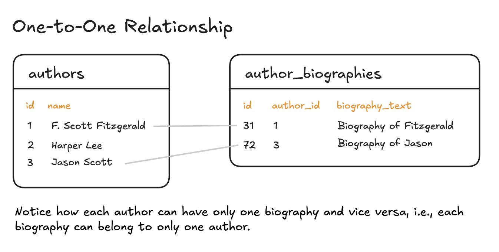
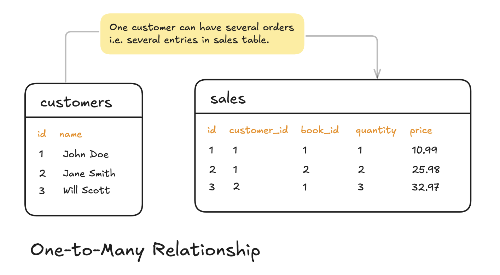
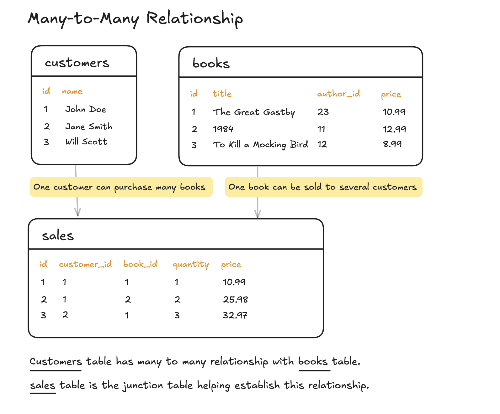

# All About MYSQL

## About SQL

### 1. What is SQL ?
### Answer :
* SQL (Structured Query Language) is a standardized programming language used to manage and manipulate relational databases. 

### 2. What is the difference between SQL and MYSQL ?
### Answer :
* SQL is just a query language, whereas MySQL is a database management system (DBMS) that uses SQL to interact with data.

### 3. Is MYSQL a DBMS ?
### Answer :
* Yes, MySQL is a Database Management System (DBMS), specifically a Relational Database Management System (RDBMS).

### 4. Why is SQL a Declarative Language ? 
### Answer :
* A Declarative Language is a type of programming language where you specify what needs to be done rather than how to do it.
* SQL is Declarative Because : ✅ You specify the Result, not the Process.

### 5. What are the types of Queries in SQL ?
### Answer :
* Data Query Language (DQL)
* Data Manipulation Language (DML)
* Data Definition Language (DDL)
* Data Control Language (DCL)
* Transaction Control Language (TCL)

### 6. What is Data Query Language (DQL) ?
### Answer :
* DQL is used to retrieve data from a database, enabling you to extract meaningful insights based on specified conditions. 
* The primary statement in DQL is `SELECT`, which allows users to fetch data from tables.
* For example, the following statement retrieves all rows from the users table :
```sql
    SELECT * FROM users;
```

### 7. What is Data Manipulation Language (DML) ?
### Answer :
* DML is used to modify data stored in a database. 
* It includes commands to insert, update, and delete records. 
* The most commonly used DML statements are `INSERT`, `UPDATE`, and `DELETE`.
* For example, the following statement inserts a new row into the users table :
```sql
    INSERT INTO users (name, email, age) 
    VALUES ('John Doe', 'john.doe@example.com', 25);
```
* The following statement updates the email address of the user with the id 1 :
```sql
    UPDATE users 
    SET email = 'john.doe@example.com' 
    WHERE id = 1;
```
* The following statement deletes the user with the id 1 :
```sql
    DELETE FROM users 
    WHERE id = 1;
```

### 8. What is Data Definition Language (DDL) ?
### Answer :
* Before we start inserting data into our database, we need to set up the database and the tables. 
* This is done using the DDL statements. 
* These statements are used to create, modify, and delete database objects such as tables, indexes, and views. 
* Most common DDL statements are `CREATE`, `ALTER`, and `DROP`.
* For example, the following statement creates a new table called users :
```sql
    CREATE TABLE users (
    id INT PRIMARY KEY,
    name VARCHAR(255),
    email VARCHAR(255),
    age INT
    );
```

### 9. What is Data Control Language (DCL) ?
### Answer :
* DCL is used to manage access permissions and security within a database. 
* It allows administrators to grant or revoke rights to specific users. 
* The most common DCL statements are GRANT and REVOKE.
* For example, the following statement grants the user john access to the users table :
```sql
    GRANT SELECT, INSERT, UPDATE, DELETE ON users TO john;
```

### 10. What is Transaction Control Language (TCL) ?
### Answer :
* TCL manages database transactions to ensure data integrity. 
* Transactions group multiple operations into a single unit, allowing them to be committed or rolled back together. 
* Example of transaction could be a bank transfer where money is deducted from one account and added to another account while updating the bank statement for both accounts. 
* If any of these steps fail, the transaction is rolled back, and the database is left in a consistent state. 
* Here is an simplified example of a transaction :
```sql
    BEGIN;
    -- Deduct money from source account
    UPDATE accounts SET balance = balance - 100 WHERE account_id = 1;
    -- Add money to destination account
    UPDATE accounts SET balance = balance + 100 WHERE account_id = 2;
    -- Update bank statement for source and destination account
    UPDATE bank_statements SET balance = balance - 100 WHERE account_id = 1;
    UPDATE bank_statements SET balance = balance + 100 WHERE account_id = 2;
    COMMIT;
```
* Most common TCL statements are COMMIT (saves the changes), ROLLBACK (undoes changes in case of an error), and SAVEPOINT (sets checkpoints within a transaction).

### 11. Few Notes about SQL.
### Answer :
* SQL is a declarative language that allows us to describe what we want to achieve rather than how to achieve it.
* SQL is case-insensitive.
* SQL statements are made up of clauses e.g. SELECT, FROM, WHERE, etc.
* SQL is a standard language based on the ISO/IEC 9075 standard.
* There are many different flavors of SQL that are based on the SQL standard.
* SQL provides a variety of query types each designed to fulfill specific tasks from retrieving data to modifying database structures and controlling access.
* DQL is used to retrieve data from a database, enabling you to extract meaningful insights based on specified conditions. Common DQL statement is `SELECT`.
* DML is used to modify data stored in a database. Common DML statements are `INSERT`, `UPDATE`, and `DELETE`.
* DDL is used to create, modify, and delete database objects such as tables, indexes, and views. Common DDL statements are `CREATE`, `ALTER`, and `DROP`.
* DCL is used to manage access permissions and security within a database. Common DCL statements are `GRANT` and `REVOKE`.
* TCL manages database transactions to ensure data integrity. Common TCL statements are `COMMIT`, `ROLLBACK`, and `SAVEPOINT`.
* In SQL different operators have different precedence. 
* Thus, if you want to ensure that a certain condition is evaluated first, you should use parentheses to group the conditions.

### 12. In Which order a SQL Query runs and What is precedence of all the major clauses like this `SELECT a FROM b WHERE c GROUP BY d HAVING e` ?
### Answer :
* The precedence is like this :
    `FROM → WHERE → GROUP BY → HAVING → SELECT → ORDER BY → LIMIT`
* `FROM` Clause
	* **What it does :**
        * Specifies the table(s) to retrieve data from.
	    * This is the very first step, where the database engine identifies the source of the data (in this case, table b).
* `WHERE` Clause
	* **What it does :**
	    * Filters rows based on the condition c.
	    * Only rows that satisfy the WHERE condition are passed along to the next stage.
* `GROUP BY` Clause
	* **What it does :**
	    * Groups the filtered rows by the column(s) specified, which is d here.
	    * This step aggregates rows into groups, allowing for aggregate functions to be applied in later stages.
* `HAVING` Clause
	* **What it does :**
	    * Filters groups created by the GROUP BY clause based on a condition (in this case, e).
	    * Unlike WHERE, which filters individual rows, HAVING filters groups, often using aggregate functions.
* `SELECT` Clause
	* **What it does :**
	    * Determines which columns or computed values to include in the final result.
        * In this step, the column a is selected for the output.
* `ORDER BY` Clause
    * **What it does :**
	    * If included, this clause would sort the final result set.
* `LIMIT` Clause
    * **What it does :**
	    * Restricts the number of rows returned by the query.

### 13. Why This Order Matters ?
### Answer :
* **Filtering Early** - 
    * The `WHERE` clause reduces the number of rows before grouping, which can improve performance.
* **Grouping and Aggregation** - 
    * The `GROUP BY` clause collects data into meaningful sets, making it possible to perform calculations like sums or averages.
* **Post-Aggregation Filtering** - 
    * The `HAVING` clause then filters these groups based on aggregate data, which wouldn’t be possible with `WHERE` since aggregation hasn’t occurred yet.
* **Final Selection** - 
    * Finally, `SELECT` picks the columns and expressions to display, often using the results of the previous steps.


## Learn The Basics 

### 1. SQL Keywords.
### Answer :
* Keywords in SQL provide instructions as to what action should be performed.
* Some of the primary SQL keywords :-
    * `SELECT` - Retrieves data from a database.
    * `FROM` - Used in conjunction with SELECT to specify the table from which to fetch data.
    * `WHERE` - Used to filter records. Incorporating a WHERE clause, you might specify conditions that must be met.
    * `INSERT INTO` - Used to insert new data into a database.
    * `UPDATE` - Updates existing data within a table.
    * `DELETE` - Removes one or more records from a table.
    * `CREATE DATABASE` - Creates a new database.


### 2. MYSQL Data Types.
### Answer :
* Define the type of data that can be stored in a database table’s column.
* Some Important Data Types :-
    * `INTEGER` - Stores whole numbers without decimal points.
    * `VARCHAR` - Variable-length string data.
    * `CHAR` - Fixed-length string data.
    * `TEXT` - Large text data.
    * `DATE` - Stores dates in YYYY-MM-DD format.
    * `TIME` - Stores time values in HH:MM:SS format.
    * `DATETIME` - Combination of date and time in YYYY-MM-DD HH:MM:SS format.
    * `DECIMAL` - Exact numeric data with decimal points.
    * `BOOLEAN` - Stores true or false values.
    * `BINARY` - Stores binary data.
    * `ENUM` - Stores one value from a predefined set of values.
    * `BLOB` - Stores large binary objects like images or files.


### 3. Operators
### Answer :
* Used to perform operations like comparisons and arithmetic calculations.
* Very crucial in forming queries.
* Operators are divided into the following types :-
    * Arithmetic Operators - Used to perform mathematical operations.
        * `+` : Addition
        * `-` : Subtraction
        * `*` : Multiplication
        * `/` : Division
        * `%` : Modulus
    * Comparison Operators - Used in the where clause to compare one expression with another.
        * `=` : Equal
        * `!= or <>` : Not equal
        * `>` : Greater than
        * `<` : Less than
        * `>=` : Greater than or equal
        * `<=` : Less than or equal
    * Logical Operators - Used to combine the result set of two different component conditions.
        * `AND`: Returns true if both components are true.
        * `OR` : Returns true if any one of the component is true.
        * `NOT` : Returns the opposite boolean value of the condition.
    * Bitwise Operators - Perform bit-level operations on the inputs. Less commonly used in SQL.
        * `&` : Bitwise AND
        * `|` : Bitwise OR
        * `^` : Bitwise XOR


### 4. SELECT
### Answer :
* Used in SQL to pick out specific data from a database.
* Used to select from the database what you would like to display.
* **Syntax of SELECT** :-
```sql
    SELECT column(s)
    FROM table
    WHERE condition;
```
* **Note** :-
    * **column(s)** - Enter the name(s) of the column(s) that you want to display.
    * **table** - The name of the table from where you want to retrieve data.
    * **WHERE** - Optional. This is a filter to display only the rows where this condition is true.


### 5. INSERT
### Answer :
* Used to add new rows of data to a table in the database.
* **Three forms of the INSERT statement** :-
    * **INSERT INTO values** - Specifies both the column names and the values to be inserted.
    * **INSERT INTO set** - Specify each column you want to insert data into, and then the data for that column.
    * **INSERT INTO select** - Used to copy data from one table and insert it into another table OR Insert data into specific columns from another table.
* **Syntax of INSERT INTO values** :-
```sql
    INSERT INTO table_name (column1, column2, column3, ...)
    VALUES (value1, value2, value3, ...);
```
* **Syntax of INSERT INTO set** :-
```sql
    INSERT INTO table_name 
    SET column1 = value1, column2 = value2, ...;
```
* **Syntax of INSERT INTO select** :-
```sql
    INSERT INTO table_name1 (column1, column2, column3, ...)
    SELECT column1, column2, column3, ...
    FROM table_name2
    WHERE condition;
```


### 6. UPDATE
### Answer :
* Used to modify the existing data in a database.
* Very useful when you need to change the values assigned to specific fields in an existing row or set of rows.
* **Syntax of UPDATE** :-
```sql
    UPDATE table_name
    SET column1 = value1, column2 = value2, ...
    WHERE condition;
```
* **Note** :-
    * **table_name** - The name of the table where an update will be performed.
    * **SET** - This clause specifies the column name and the new value that it should be updated to.
    * **column1, column2, ...** - The column names in the table.
    * **value1, value2, ...** - The new values that you want to record into the database.
    * **WHERE** - This clause specifies the conditions that identify which row(s) to update.


### 7. DELETE
### Answer :
* Used to remove existing records from a database.
* Destructive operation and may permanently erase data from your database.
* With the DELETE statement, you can perform the following :-
    * **Delete All Rows** - DELETE statement without a WHERE clause deletes all rows in a table. Operation is irreversible.
    * **Delete Specific Rows** - When combined with the WHERE clause, the DELETE SQL statement erases specific rows that meet the condition.
* **Syntax of DELETE all Rows** :-
```sql
    DELETE FROM table_name;
```
* **Syntax of DELETE specific Rows** :-
```sql
    DELETE FROM table_name WHERE condition;
```

## Data Definition Language (DDL)

### 1. DDL
### Answer :
* Data Definition Language(DDL) is a subset of SQL.
* Primary Functions - Create, Modify, and Delete Database Structures But Not Data.
* **DDL Commands** :-
    * **CREATE** - Used to create the database or its objects (like table, index, function, views, store procedure, and triggers).
    * **DROP** - Used to delete an existing database or table.
    * **ALTER** - Used to alter the structure of the database. Used to add, delete/drop or modify columns in an existing table. 
    * **TRUNCATE** - Used to remove all records from a table, including all spaces allocated for the records which are removed.
    * **RENAME** - Used to rename an object in the database.
* **Syntax of CREATE** :-
```sql
    CREATE TABLE table_name (
    column1 data_type(size),
    column2 data_type(size),
    ...
    );
```
* **Syntax of DROP** :-
```sql
    DROP TABLE table_name;
```
* **Syntax of ALTER** :-
```sql
    ALTER TABLE table_name ADD column_name datatype;
    ALTER TABLE table_name DROP COLUMN column_name;
    ALTER TABLE table_name MODIFY COLUMN column_name datatype(size);
```
* **Syntax of TRUNCATE** :-
```sql
    TRUNCATE TABLE table_name;
```
* **Syntax of RENAME** :-
```sql
    RENAME TABLE old_table_name TO new_table_name;
```


### 2. Create Table
### Answer :
* **Syntax of CREATE Table** :-
```sql
    CREATE TABLE table_name (
    column1 datatype,
    column2 datatype,
    column3 datatype,
    ....
    );
```
* **Note** :-
    table_name - Name of the table that you want to create.
    column1, column2,... - Columns in the table.
    datatype -  Data Type for the column, such as varchar, int, date, etc.


### 3. Alter Table
### Answer :
* **Syntax of Adding One Column** :-
```sql
    ALTER TABLE tableName
    ADD columnName datatype;
```
* **Syntax of Adding Multiple Column** :-
```sql
    ALTER TABLE tableName
    ADD (columnName1 datatype,
        columnName2 datatype,
        ...
        );
```
* **Syntax of Droping One Column** :-
```sql
    ALTER TABLE tableName
    DROP COLUMN columnName;
```
* **Syntax of Droping Multiple Column** :-
```sql
    ALTER TABLE tableName
    DROP (columnName1,
        columnName2,
        ...
        );
```

* **Syntax of Modifing Datatype of a Column** :-
```sql
    ALTER TABLE tableName
    ALTER COLUMN columnName TYPE newDataType;
```

* **Syntax of Adding Constraints** :-
```sql
    ALTER TABLE tableName
    ADD CONSTRAINT constraintName
    PRIMARY KEY (column1, column2, ... column_n);
```
* **Syntax of Droping Constraints** :-
```sql
    ALTER TABLE tableName
    DROP CONSTRAINT constraintName;
```

### 4. Truncate Table
### Answer :
* **Syntax of TRUNCATE table** :-
```sql
    TRUNCATE TABLE table_name;
```

## Data Manipulation Language (DML)

### 1. DML
### Answer :
* Data Manipulation Language(DML) is a subset of SQL.
* Primary Functions - Insert, Retrieve, Update and Delete data from the database.
* **DML contains four commands which are** :-
    * `INSERT INTO` - Used to insert new rows (records) into a table.
    * `SELECT` - Used to select data from a database. Data returned is stored in a result table, called the result-set.
    * `UPDATE` - Used to modify the existing rows in a table.
    * `DELETE FROM` - Used to delete existing rows (records) from a table.


### 2. SELECT
### Answer :
* Majorly used for fetching data from the database.
* **Some important SELECT Commands** :-
    * `SELECT DISTINCT` - Used to return only distinct (different) values. DISTINCT keyword eliminates duplicate records from the results.
    * `SELECT WHERE` - Gives us the ability to filter records based on a condition.
    * `SELECT ORDER BY` - Sort the result-set in ascending or descending order.
* **Syntax of SELECT DISTINCT** :-
```sql
    SELECT DISTINCT column1, column2, ...
    FROM table_name;
```
* **Syntax of SELECT WHERE** :-
```sql
    SELECT column1, column2, ...
    FROM table_name
    WHERE condition;
```
* **Syntax of SELECT ORDER BY** :-
```sql
    SELECT column1, column2, ...
    FROM table_name
    ORDER BY column ASC|DESC; -- Default sort order is ascending.
```

### 3. FROM
### Answer :
* Specifies the tables from which the retrieval should be made.
* Integral part of SELECT statements and variants of SELECT like SELECT INTO and SELECT WHERE. 
* FROM can be used to Join tables as well.
* Typically, FROM is followed by space delimited list of tables in which the SELECT operation is to be executed. If you need to pull data from multiple tables, you would separate each table with a comma.
* **Note** - 
    * Always respect the order of operations in SQL.
    * FROM clause works only after tables are identified.
    * In Complex SQL queries where you might need to pull data from multiple tables, aliases are used to temporarily rename the tables within the individual SQL statement.


### 4. HAVING
### Answer :
* Clause in SQL that allows you to filter result sets in a GROUP BY clause.
* Used to mention conditions on the groups being selected.
* HAVING is mainly used with the GROUP BY clause to filter the results that a GROUP BY returns.
* Similar to a WHERE clause, but operates on the results of a grouping. 
* WHERE clause places conditions on the selected columns, whereas the HAVING clause places conditions on groups created by the GROUP BY clause.
* **Syntax of HAVING with GROUP BY** :-
```sql
    SELECT column_name, function(column_name)
    FROM table_name
    WHERE condition
    GROUP BY column_name
    HAVING function(column_name) condition value;
```

### 5. GROUP BY
### Answer :
* Clause in SQL that is used to arrange identical data into groups.
* Clause comes under the category of Group Functions, alongside the likes of Count, Sum, Average, etc.
* **Syntax of GROUP BY** :-
```sql
    SELECT column1, column2
    FROM table_name
    GROUP BY column1, column2;
```

### 6. GROUP BY with HAVING
### Answer :
* Can also be used with the Having keyword.
* Having keyword allows you to filter the results of the group function.

### 7. JOINs
### Answer :
* Used to retrieve data from two or more data tables, based on a related column between them.
* **Key types of JOINs are** :-
    * `INNER JOIN` - Returns records with matching values in both tables.
    * `LEFT (OUTER) JOIN` - Returns all records from the left table, and matched records from the right table.
    * `RIGHT (OUTER) JOIN` - Returns all records from the right table, and matched records from the left table.
    * `FULL (OUTER) JOIN` - Returns all records when either a match is found in either left (table1) or right (table2) table records.
    * `SELF JOIN` - Join in which a table is joined with itself.
    * `CARTESIAN JOIN` - If WHERE clause is omitted, the join operation produces a Cartesian product of the tables involved in the join. Size of a Cartesian product result set is the number of rows in the first table multiplied by the number of rows in the second table.
* **Syntax of INNER JOIN** :-
```sql
    SELECT table1.column1, table2.column2...
    FROM table1
    INNER JOIN table2
    ON table1.matching_column = table2.matching_column;
```
* **Syntax of LEFT (OUTER) JOIN** :-
```sql
    SELECT table1.column1, table2.column2...
    FROM table1
    LEFT JOIN table2
    ON table1.matching_column = table2.matching_column;
```
* **Syntax of RIGHT (OUTER) JOIN** :-
```sql
    SELECT table1.column1, table2.column2...
    FROM table1
    RIGHT JOIN table2
    ON table1.matching_column = table2.matching_column;
```
* **Syntax of FULL (OUTER) JOIN** :-
```sql
    SELECT table1.column1, table2.column2...
    FROM table1
    FULL JOIN table2
    ON table1.matching_column = table2.matching_column;
```
* **Syntax of SELF JOIN** :-
```sql
    SELECT a.column_name, b.column_name...
    FROM table_name AS a, table_name AS b
    WHERE condition;
```
* **Syntax of CARTESIAN JOIN** :-
```sql
    SELECT table1.column1, table2.column2...
    FROM table1, table2;
```

### 8. INSERT
### Answer :
* Used to add new rows of data to a table in a database.
* **Two main forms of the INSERT command** :-
    * `INSERT INTO` -  If columns are not named, expects a full set of columns.
    * `INSERT INTO table_name (column1, column2, ...)` - Where only named columns will be filled with data.
* **Syntax of Insert Full Set Of Columns** :-
```sql
    INSERT INTO table_name 
    VALUES (value1, value2, ..., valueN);
```
* **Syntax of Selectively Insert Data** :-
```sql
    INSERT INTO table_name (column1, column2, ..., columnN)  
    VALUES (value1, value2, ..., valueN);
```
* **Syntax of Insert Data from another table** :-
```sql
    INSERT INTO table1 (column1, column2, ... , columnN)
    SELECT column1, column2, ... , columnN 
    FROM table2 
    WHERE condition;
```
* **Note** -
    * Crucial point is that your columns in both SELECT and INSERT INTO command must be in same order and their datatypes must be compatible.
    * Kindly ensure that database table has enough space to hold inserted data, else it will resulting in OVERFLOW error.
    * Always make sure to provide correct and compatible data types for the columns.
    * SQL engine won’t allow you to add data that doesn’t match the column’s declared data type.


### 9. UPDATE
### Answer :
* Used to modify the existing records in a table.
* Useful when you need to update existing data within a database.
* **Important points to remember before updating records in SQL** :-
    * WHERE clause in the UPDATE statement specifies which records to modify. If you omit the WHERE clause, all records in the table will be updated!
    * Be careful when updating records in SQL. If you inadvertently run an UPDATE statement without a WHERE clause, you will rewrite all the data in the table.
* **Syntax of UPDATE** :-
```sql
    UPDATE table_name
    SET column1 = value1, column2 = value2...., columnN = valueN
    WHERE [condition];
```
* **Note** - 
    * `table_name` - Specifies the table where you want to update records.
    * `SET` - This keyword is used to set the column values.
    * `column1, column2... columnN` - These are the columns of the table that you want to change.
    * `value1, value2... valueN` - These are the new values that you want to assign for your columns.
    * `WHERE` - This clause specifies which records need to be updated. It selects records based on one or more conditions.

### 10. DELETE
### Answer :
* Used to delete existing records in a table.
* Straightforward process, but care must be taken because the DELETE statement is destructive and cannot be undone by default.
* **Syntax of DELETE** :-
```sql
    DELETE FROM table_name [WHERE condition];
```

## Aggregate Queries

### 1. Aggregate Functions - 
### Answer :
* Inbuilt functions that are used to perform some calculation on the data and return a single value. 
* This is why they form the basis for “aggregate queries”. 
* These functions operate on a set of rows and return a single summarized result.
* Aggregate queries are simply a way of summarizing information in your database.
* Although they are a powerful tool, they can become complex very quickly, especially if you start nesting them together or combining multiple aggregate functions in a single query.


### 2. List of Some Aggregate Functions.
### Answer :
* `COUNT()` - Counts the number of rows.
* `SUM()` - Returns the sum of a numeric column.
* `AVG()` - Returns the average value of a numeric column.
* `MIN()` - Returns the smallest value of the selected column.
* `MAX()` - Returns the largest value of the selected column.
* `GROUP BY` - 
    * To separate the results into groups of accumulated data, you can use the GROUP BY clause.
    * "A group” is represented by ROW(s) that have the same value in the specific column(s).
    * GROUP BY clause can be used in a SELECT statement to collect data across multiple records and group by some columns.
* `HAVING` - 
    * HAVING clause is used with the GROUP BY clause, it applies to summarized group records, unlike the ‘where’ clause.
    * Added to SQL because the WHERE keyword could not be used with aggregate functions.

## Data Constraints

### 1. Data constraints - 
### Answer :
* Used to specify rules for the data in a table.
* Used to limit the type of data that can go into a table.
* Ensures the accuracy and reliability of the data in the table.


### 2. Types of SQL Data Constraints.
### Answer :
* `NOT NULL` Constraint - 
    * Ensures that a column cannot have a NULL value.
* `UNIQUE` Constraint - 
    * Ensures that all values in a column are different.
* `PRIMARY KEY` Constraint - 
    * Uniquely identifies each record in a database table. 
    * Primary keys must contain UNIQUE values.
    * Exactly the same as the UNIQUE constraint but there can be many unique constraints in a table, but only one PRIMARY KEY constraint per table.
* `FOREIGN KEY` Constraint - 
    * Prevents actions that would destroy links between tables.
    * Field (or collection of fields) in one table that refers to the PRIMARY KEY in another table.
* `CHECK` Constraint -
    * Ensures that all values in a column satisfies certain conditions.
* `DEFAULT` Constraint -
    * Provides a default value for a column when none is specified.
* `INDEX` Constraint -
    * Used to create and retrieve data from the database very quickly.
    * Indexes are not a part of the SQL standard and are not supported by all databases.


### 3. Primary Key.
### Answer :
* Special relational database table field (or combination of fields) designated to uniquely identify all table records.
* **Main features** :-
    * Must contain a unique value for each row of data.
    * Cannot contain null values.
* **Usage of Primary Key** :-
    * You define a primary key for a table using the PRIMARY KEY constraint.
    * Table can have only one primary key.
    * You can define a primary key in SQL when you create or modify a table.
* **Syntax of Create Table With Primary Key** :-
```sql
    CREATE TABLE Employees (
        ID INT PRIMARY KEY,
        NAME TEXT,
        AGE INT,
        ADDRESS CHAR(50)
    );
```
* **Modify Table to Add Primary Key** :-
```sql
    ALTER TABLE Employees
    ADD PRIMARY KEY (ID);
```
* **Composite Primary Key** :-
    * We can also use multiple columns to define a primary key. Such key is known as composite key.
    * **Syntax Of Composite Key** :-
```sql
        CREATE TABLE Customers (
            CustomerID INT,
            StoreID INT,
            CONSTRAINT pk_CustomerID_StoreID PRIMARY KEY (CustomerID,StoreID)
        );
```
* In this case, each combination of CustomerID and StoreID must be unique across the whole table.


### 4. Foreign Key.
### Answer :
* Used to link two tables together.
* Field (or collection of fields) in one table that refers to the primary key in another table.
* Table with the foreign key is called the child table, and the one with the primary key is called the referenced or parent table.
* **Basic Syntax of Foreign Key** :-
```sql
    ALTER TABLE child_table
    ADD FOREIGN KEY (fk_column)
    REFERENCES parent_table (parent_key_column);
```
* **Where** :-
    * child_table is the table where you want to add the foreign key.
    * fk_column is the field in the child table that you want to use as foreign key.
    * parent_table is the table being referenced by the foreign key.
    * parent_key_column is the column in parent_table that fk_column points to.
* **Note** :-
    * MySQL requires you to have the foreign key columns be indexed for performance reasons.
    * If they aren’t indexed already, the FOREIGN KEY constraint will implicitly index them for you.


### 5. Unique Key.
### Answer :
* Ensures that all values in a column are different; that is, each value in the column should occur only once.
* Both the UNIQUE and PRIMARY KEY constraints provide a guarantee for uniqueness for a column or set of columns.
* However, a primary key cannot contain NULL since it uniquely identifies each row, and each table can have only one primary key.
* On the other hand, a UNIQUE constraint allows for one NULL value, and a table can have multiple UNIQUE constraints.
* **Basic Syntax of Unique Key** :-
```sql
    CREATE TABLE table_name (
        column1 data_type UNIQUE,
        column2 data_type,
        column3 data_type,
        ....
    );
```
* **Syntax of Adding a Unique Constraint to an Existing Table** :-
```sql
    ALTER TABLE table_name
    ADD UNIQUE (column1, column2, ...);
```
* **Syntax of Dropping a Unique Constraint** :-
```sql
    ALTER TABLE table_name
    DROP CONSTRAINT constraint_name;
```


### 6. Not Null.
### Answer :
* Ensures that a column cannot have a NULL value.
* Every row/record must contain a value for that column.
* Way to enforce certain fields to be mandatory while inserting records or updating records in a table.
* **Syntax of Adding NOT NULL to an existing table** :-
```sql
    ALTER TABLE Employees
    MODIFY Address varchar(255) NOT NULL;
```


### 7. CHECK.
### Answer :
* Constraint that limits the value range that can be placed in a column.
* Enforces domain integrity by limiting the values in a column to meet a certain condition.
* Used in a column definition when you create or modify a table.
* **Syntax of CHECK** :-
```sql
    CREATE TABLE table_name (
        column1 datatype CONSTRAINT constraint_name CHECK (condition),
        column2 datatype,
        ...
    );
```
* **Syntax of CHECK for Multiple Columns** :-
```sql
    CREATE TABLE table_name (
        column1 datatype,
        column2 datatype,
        ...,
        CONSTRAINT constraint_name CHECK (condition)
    );
```

## Multi Table Queries

### 1. How many types of relationships are there ?
### Answer :
* **One to One (1:1)** :
    * A one-to-one relationship occurs when a single record in one table is related to a single record in another table. 
    * This type of relationship is less common but can be useful for splitting data into different tables for organizational purposes.
    * In our bookstore example, imagine we have a table for authors and another for author_biographies. 
    * Each author has exactly one biography, and each biography belongs to exactly one author.
    
    * The author_id column in the author_biographies table is a foreign key that references the author_id column in the authors table.
    * If you look closely, you'll see that we could also achieve this relationship by adding a biography_id column to the authors table instead i.e.
    
    * Here we have biography_id as a foreign key inside the authors table that references the id column in the author_biographies table.
    * Both approaches are valid, but personally, I prefer to put the foreign key in the table that depends on the principle entity i.e. the entity which does not rely on another entity for its existence. In this case, author_biographies can't exist without authors.
* **One to Many (1:M)** : 
    * A one-to-many relationship is the most common type of relationship. 
    * It occurs when a single record in one table is related to multiple records in another table.
    * In our bookstore, a single customer can purchase several books i.e. several entries in the sales table. 
    * Thus, the customers and sales tables have a one-to-many relationship.
    
* **Many to Many (M:M)** :
    * A many-to-many relationship occurs when multiple records in one table are related to multiple records in another table. 
    * This type of relationship is typically implemented using a junction table.
    * A junction table is a table that is used to store the relationship between two tables. 
    * It contains foreign keys from both tables that it is bridging.
    * In our bookstore, a book can be purchased by multiple customers, and a customer can purchase multiple books. 
    * We can represent this relationship using a sales table as a junction table.
    

## Join Queries

### 1. What are Joins ?
### Answer :
* Used to combine rows from two or more tables, based on a related column between them.

### 2. How many types of JOIN are there ?
### Answer :
* `INNER JOIN` - Returns records that have matching values in both tables.
* `LEFT(Outer) JOIN` - Returns all records from the left table, and the matched records from the right table. Also returns NULL if there is no match.
* `RIGHT(Outer) JOIN` - Returns all records from the right table, and the matched records from the left table. Also returns null if there is no match.
* `FULL(Outer) JOIN` - Returns all records when there is a match in either left (table1) or right (table2) table records. Also returns null if there is no match.
* `SELF JOIN` - Regular join, but the table is joined with itself.
* `CROSS JOIN` - Each row from 1st table joins with all the rows of another table. If table contain x rows and y rows in 2nd one the result set will be (x * y) rows.
* **Note** - JOINS can be used with SELECT, UPDATE, and DELETE statements.


### 3. INNER JOIN :-
### Answer :
* Returns the records with matching values in both tables.
* Operation compares each row of the first table with each row of the second table to find all pairs of rows that satisfy the join predicate.
* **Few things to consider in case of INNER JOIN** :-
    * It is a default join in SQL.
    * If you mention JOIN in your query without specifying the type, SQL considers it as an INNER JOIN.
    * Returns only the matching rows from both the tables.
    * If there is no match, the returned is an empty result.
* **Syntax of INNER JOIN** :-
```sql
    SELECT column_name(s)
    FROM table1
    INNER JOIN table2
    ON table1.column_name = table2.column_name;
```


### 4. LEFT(OUTER) JOIN.
### Answer :
* Combines rows from two or more tables based on a related column between them and returns all rows from the left table (table1) and the matched rows from the right table (table2).
* If there is no match, the result is `NULL` on the right side.
* **Syntax of LEFT(OUTER) JOIN** :-
```sql
    SELECT column_name(s)
    FROM table1
    LEFT JOIN table2
    ON table1.column_name = table2.column_name;
```
* **How SQL LEFT JOIN Works** :-
    * LEFT JOIN keyword returns all records from the left table (table1), and the matched records from the right table (table2).
    * Result is `NULL` from the right side, if there is no match.
* **Formula of LEFT(OUTER)-JOIN** `IMP`:
    * `Inner Join + Additional Records From Left Table`

-JOIN.png)


### 5. RIGHT(OUTER) JOIN.
### Answer :
* Returns all records from the right table (table2), and the matched records from the left table (table1).
* If there is no match, the result is NULL on the left side.
* **Syntax of RIGHT(OUTER) JOIN** :-
```sql
    SELECT column_name(s)
    FROM table1
    RIGHT JOIN table2
    ON table1.column_name = table2.column_name;
```
* **Formula of RIGHT(OUTER)-JOIN** `IMP`:
    * `Inner Join + Additional Records From Right Table`

-JOIN.png)

### 6. FULL(OUTER) JOIN.
### Answer :
* Method to combine rows from two or more tables, based on a related column between them.
* Returns all rows from the left table (table1) and from the right table (table2).
* Combines the results of both left and right outer joins and returns all (matched or unmatched) rows from the tables on both sides of the join clause.
* **Syntax of FULL(OUTER) JOIN** :-
```sql
    SELECT column_name(s)
    FROM table1
    FULL OUTER JOIN table2
    ON table1.column_name = table2.column_name;
```
-JOIN.png)

### 7. SELF JOIN.
### Answer :
* Table is joined to itself.
* Might sound counter-intuitive, but it’s actually quite useful in scenarios where comparison operations need to be made within a table.
* Essentially, it is used to combine rows with other rows in the same table when there’s a match based on the condition provided.
* Since it’s a join operation on the same table, alias(es) for table(s) must be used to avoid confusion during the join operation.
* **Syntax of SELF JOIN** :-
```sql
    SELECT a.column_name, b.column_name
    FROM table_name AS a, table_name AS b
    WHERE a.common_field = b.common_field;
```


### 8. CROSS JOIN.
### Answer :
* Combine every row of the first table with every row of the second table.
* Also known as the Cartesian product of the two tables.
* Does not require any condition to join.
* Issue with cross join is it returns the Cartesian product of the two tables, which can result in large numbers of rows and heavy resource usage. 
* **Syntax of CROSS JOIN** :-
```sql
    SELECT column_name(s)
    FROM table1
    CROSS JOIN table2;
```


## Sub-Queries

### 1. What is a Sub-Query ?
### Answer :
* Subquery is a query embedded within another SQL query.
* Alternately call it a nested or an inner query. 
* Containing query is often referred to as the outer query.
* Subqueries are utilized to retrieve data that will be used in the main query as a condition to further restrict the data to be retrieved.
* **Subqueries can be used in various parts of a query, including** :-
    * `SELECT` statement
    * `FROM` clause
    * `WHERE` clause
    * `GROUP BY` clause
    * `HAVING` clause
* **General Syntax can be written as** :-
```sql
    SELECT column_name [, column_name]
    FROM   table1 [, table2 ]
    WHERE  column_name OPERATOR
        (SELECT column_name [, column_name]
        FROM table1 [, table2 ]
        [WHERE])
```
* **Types of Sub-Queries** :-
    * `Scalar` - Returns a single value (scalar) as its result.
    * `Row` - Returns one or more rows of data.
    * `Column` - Returns a single column of data.
    * `Table` - Returns an entire table as its result.
* **Note** - 
    * Subqueries can be either correlated or uncorrelated.
    * Correlated subquery is a subquery that uses values from the outer query.
    * Un-Correlated subquery is a subquery that can be run independently of the outer query.


### 2. Types of Sub-Query.
### Answer :
* **There are mainly 4 types of Sub-Queries** :-
    * `Scalar`
    * `Row`
    * `Column` 
    * `Table`
* **Scalar Sub-Query** :-
    * Returns a single value (scalar) as its result.
    * Query that returns exactly one column with a single value.
    * Can be used anywhere in your SQL where expressions are allowed.
    * **Syntax of Scalar Sub-Query** :-
```sql
        SELECT column_name [, column_name ]
        FROM   table1 [, table2 ]
        WHERE  column_name operator
            (SELECT column_name [, column_name ]
            FROM table_name 
            WHERE condition);
```
* **Row Sub-Query** :-
    * Returns one or more rows of data.
    * Return one or more rows to the outer SQL select query.
    * Sub-Query returns multiple columns and rows, so it cannot be directly used where scalar expressions are used.
    * **Syntax of Row Sub-Query** :-
```sql
        SELECT column_name [, column_name ]
        FROM   table1 [, table2 ]
        WHERE  (column_name [, column_name ])
            IN (SELECT column_name [, column_name ]
            FROM table_name 
            WHERE condition);
```
* **Column Sub-Query** :-
    * Returns a single column of data.
    * Return one or more columns to the outer SQL select query.
    * Used when the subquery is expected to return more than one column to the main query.
    * **Syntax of Column Sub-Query** :-
```sql
        SELECT column_name [, column_name ]
        FROM   table1 [, table2 ]
        WHERE  (SELECT column_name [, column_name ]
            FROM table_name 
            WHERE condition);
```
* **Table Sub-Query** :-
    * Returns an entire table as its result.
    * Used in the FROM clause and return a table that can be used as a table-reference in an SQL statement.
    * Come in handy when you want to perform operations such as joining multiple tables, union data from multiple sources.
    * **Syntax of Table Sub-Query** :-
```sql
        SELECT column_name [, column_name ]
        FROM
            (SELECT column_name [, column_name ]
            FROM   table1 [, table2 ])
        WHERE  condition;
```

### 3. Nested Sub-Queries.
### Answer :
* Sub-Query is a query that is nested inside a main query.
* If a subquery is nested inside another subquery, it is called a nested subquery.
* Can be used in SELECT, INSERT, UPDATE, or DELETE statements or inside another subquery.
* Nested subqueries can get complicated quickly, but they are essential for performing complex database tasks.
* **Syntax of Nested Sub-Query** :-
```sql
    SELECT column_name [, column_name ]
    FROM   table1 [, table2 ]
    WHERE  column_name OPERATOR
        (SELECT column_name [, column_name ]
        FROM table1 [, table2 ]
        [WHERE])
```
* In a nested subquery, the inner subquery will run first and its result will be used to run the outer query.

### 4. Correlated Sub-Query.
### Answer :
* Sub-Query that uses values from the outer query in its WHERE clause.
* Correlated subquery is evaluated once for each row processed by the outer query.
* Exists because it depends on the outer query and it cannot execute independently of the outer query because the subquery is correlated with the outer query as it uses its column in its WHERE clause.

## Views

### 1. What are Views ?
### Answer :
* View is a Database Object.
* View is created over an SQL Query.
* View does not store any Data.
* View store the Structure of the Data.
* View is like a Virtual Table.
* View will always show you the latest Data added in the table.
* View will not show you the latest Structure of the table.
* Virtual tables that do not store data directly.
* Essentially a saved SQL query and can pull data from multiple tables or just present the data from one table in a different way.


### 2. Why we use Views ?
### Answer :
* **Security** - 
    * By hiding the query used to generate the view. ----> Understand about Creating User Roles and Securing the DB.
* **To Simplify Complex SQL Queries** - 
    * Sharing a View is better than sharing complex query.
    * Avoid re-writing same complex query multiple times.


### 3. What are operations that can be done with Views ?
### Answer :
* **Creating Views** - Create a view using the `CREATE VIEW` statement.
* **Querying Views** - After a view has been created, it can be used in the `FROM` clause of a `SELECT` statement, as if it’s an actual table.
* **Updating Views** - CREATE OR `REPLACE VIEW` statement is used to update a view.
* **Dropping Views** - Use the `DROP VIEW` statement.
* **Note** - 
    * Not all database systems support the `CREATE` OR `REPLACE VIEW` statement.
    * Also, the updatability of a view depends on whether it includes functions, expressions, or multiple tables. 
    * Some databases might not let you update a view at all.


### 4. What are the Restrictions while working with Views ?
### Answer :
* **SQL views** :-
    * Cant contain a ORDER BY clause in the view definition.
    * Cant be Indexed.
    * Cant have Triggers or Default values.


### 5. How to Create Views ?
### Answer :
* Creating views can be achieved through the CREATE VIEW statement. 
* View is a virtual table based on the result-set of an SQL statement.
* Contains rows and columns from one or more tables.
* **Syntax for the CREATE VIEW statement** :-
```sql
    CREATE VIEW view_name AS
    SELECT column1, column2, ...
    FROM table_name
    WHERE condition;
```
* **Note** - 
    * `CREATE VIEW view_name` - It creates a new view that you define with view_name.
    * `AS SELECT column1, column2 ... column_n` - These are the columns you want in your view. You can choose one or more columns from one or more tables.
    * `FROM table_name` - table_name is the name of the table from which you want to create the view.
    * `WHERE` - It is an optional clause that you can use to specify conditions for displaying records.


### 6. Why is CREATE VIEW Used ?
### Answer :
* When you want to save a particular query and its result set for future use. 
* This can simplify complex queries by breaking them up into manageable parts.


### 7. How to Modify Views ?
### Answer :
* **You can modify a `VIEW` in two ways** :-
    * **Using `CREATE` OR `REPLACE VIEW`** - 
        * This command helps you modify a VIEW but keeps the VIEW name intact. 
        * This is beneficial when you want to change the definition of the VIEW but do not want to change the VIEW name.
        * **Syntax of Modify Using CREATE OR REPLACE VIEW** -
        ```sql
            CREATE OR REPLACE VIEW view_name AS
            SELECT column1, column2, ...
            FROM table_name
            WHERE condition;
        ```
        * **Rules when using CREATE OR REPLACE VIEW** - 
            * Cannot change column name.
            * Cannot change column Data Type.
            * Cannot change the order of the column , but can add add new column at the end.
    * **Using the DROP VIEW and then CREATE VIEW** - 
        * In this method, you first remove the VIEW using the DROP VIEW command and then recreate the view using the new definition with the CREATE VIEW command.
        * **Syntax of Modify Using DROP VIEW and then CREATE VIEW** -
        ```sql
            DROP VIEW view_name; ----> DROP the View First
            CREATE VIEW view_name AS ----> CREATE the View
            SELECT column1, column2, ...
            FROM table_name
            WHERE condition;
        ```
        * **Note** - 
            * If other views, stored procedures, or programs depend on this view, they will be affected after you drop the view. 
            * For this reason, using CREATE OR REPLACE VIEW is generally safer.
    * **Modifying Data through VIEW** - 
        * In some cases, you can modify the data of the underlying tables via a VIEW.
        * **Syntax of Updating a View** -
        ```sql
            UPDATE view_name
            SET column1 = value1, column2 = value2, ...
            WHERE condition;
        ```
        * **Note** - 
            * However, not every VIEW is updatable. 
            * You can only modify the data if the VIEW you’re modifying is a simple VIEW that returns results from a single table without any aggregation or complex clauses. 
            * If you attempt to modify a complex view (i.e., it includes JOIN, GROUP BY, HAVING, DISTINCT), you will get an error.
* **Rules when** - 
    * If you have more than one table , you cant update such views. 
    * If the query contain DISTINCT clause you cant update such views.
    * If query contains GROUP BY then cannpot update such views.
    * If query contains WITH clause then cannot update such views.
    * If query contains window functions then cannot update such views.

### 8. How to Drop a View ?
### Answer :
* "Dropping” in SQL is the process of deleting an existing database object.
* In the context of views, “dropping” refers to deleting an existing view from the database.
* Once a view is dropped, it cannot be used any longer until it is recreated with the same or new definition. If you’re going to drop a view, ensure it’s not being used anywhere in your application or it will lead to errors.
* You can drop a view in SQL using the DROP VIEW statement. 
* The DROP VIEW statement removes one or more views from the database. 
* You specify the name of the view that you want to remove after the DROP VIEW clause.
* **Syntax of Dropping an existing View** :-
```sql
    DROP VIEW view_name;
```
* **Syntax of Dropping multiple Views** :-
```sql
    DROP VIEW view_name1, view_name2, ..., view_name_n;
```
* **Note** - 
    * Be careful when dropping views. Once a view is dropped, all the permissions granted on it will also be dropped.
    * Before dropping a view, you can check if the view exists by using the IF EXISTS parameter. 
    * If you drop a view that does not exist, you will get an error. To prevent this, you can use the IF EXISTS parameter.
    * **Syntax of Checking If a View Exist** :-
    ```sql
        DROP VIEW IF EXISTS view_name; 
    ```
    * In this case, if the view exists, it will be dropped. If the view does not exist, nothing happens and you don’t get an error.

## Transaction

### 1. What is a Transaction ?
### Answer :
* Unit of work that is performed against a database.
* Units or sequences of work accomplished in a logical order, whether in a manual fashion by a user or automatically by some sort of a database program.
* Used to ensure data integrity and to handle database errors while processing.
* **Transactions are controlled by the following commands** :-
    * `BEGIN TRANSACTION` :-
        * Used to start a new transaction.
        * **Syntax of BEGIN TRANSACTION** -
        ```sql
            BEGIN TRANSACTION; 
        ```
    * `COMMIT` :-
        * Transactional command used to save changes invoked by a transaction to the database.
        * **Syntax of COMMIT** -
        ```sql
            COMMIT;
        ```
        * When you commit the transaction, the changes are permanently saved in the database.
    * `ROLLBACK` :-
        * Transactional command used to undo transactions that have not already been saved to the database.
        * **Syntax of ROLLBACK** -
        ```sql
            ROLLBACK;
        ```
        * When you roll back a transaction, all changes made since the last commit in the database are undone, and the database is rolled back to the state it was in at the last commit.
* **Example of a Transaction** :-
```sql
    BEGIN TRANSACTION;
    UPDATE Accounts SET Balance = Balance - 100 WHERE id = 1;
    UPDATE Accounts SET Balance = Balance + 100 WHERE id = 2;
    IF @@ERROR = 0
        COMMIT;
    ELSE
        ROLLBACK;
```
* For the transaction to be successful, all commands must execute successfully. 
* If any command fails, the transaction fails, the database state is left unchanged and an error is returned.


### 2. What is BEGIN in Transaction ?
### Answer :
* Keyword used to start a transaction.
* When you issue a BEGIN statement, you're essentially telling MySQL that you're about to start a series of operations that you want to treat as a single unit. 
* It marks the beginning of a transaction block.
* After the BEGIN statement, the transaction is considered to be “open” and remains so until it is committed or rolled back.
* Once you’ve initiated a transaction with BEGIN, all the subsequent SQL statements will be a part of this transaction until an explicit COMMIT or ROLLBACK is given.
* **Syntax of BEGIN** :-
```sql
    BEGIN TRANSACTION;
```
    or 
```sql
    BEGIN;
```
* **Example of BEGIN** :-
```sql
    BEGIN;
    INSERT INTO Customers (CustomerName, ContactName, Address, City, PostalCode, Country)
    VALUES ('Cardinal', 'Tom B. Erichsen', 'Skagen 21', 'Stavanger', '4006', 'Norway');
    COMMIT;
    -- If something goes wrong with one of the SQL statements within the transaction (after the BEGIN; statement), you can choose to ROLLBACK the transaction, which means canceling all the changes made in this transaction up to the point of error.
```


### 3. What is COMMIT in Transaction ?
### Answer :
* Used to save all the modifications made by the current transaction to the database.
* Ends the current transaction and makes permanent all changes performed in the transaction.
* Way of ending your transaction and saving your changes to the database.
* After the SQL COMMIT statement is executed, it can not be rolled back, which means you can’t undo the operations.
* Used when the user is satisfied with the changes made in the transaction, and these changes can now be made permanent in the database.
* Now, imagine you've performed a series of tasks within your transaction room, such as updating rows, inserting new data, or deleting records. 
* When you're satisfied that everything went smoothly and you want to make those changes permanent, you shout "COMMIT!" This action tells MySQL to finalize all the changes made during the transaction and make them permanent in the database. 
* It's like sealing the deal or saving your progress in a game.
* **Syntax of COMMIT** -
```sql
    COMMIT;
```
* **Note** - 
    * In some databases, if AUTOCOMMIT is enabled (which is typically the default setting), then every single SQL statement is treated as a transaction and automatically committed right after it is executed.
* **Example of COMMIT** - 
```sql
    BEGIN TRANSACTION;
    UPDATE Account SET amount = amount - 2000 WHERE name = 'A';
    UPDATE Account SET amount = amount + 2000 WHERE name = 'B';
    COMMIT;
```

### 4. What is ROLLBACK in Transaction ?
### Answer :
* ROLLBACK command is a transactional control language (TCL) instruction that undoes an unsuccessful or unsatisfactory running transaction.
* Process also applies to SQL Server where all individual statements in SQL Server are treated as a single atomic transaction.
* When a ROLLBACK command is issued, all the operations (such as Insert, Delete, Update, etc.) are undone and the database is restored to its initial state before the transaction started.
* **We use ROLLBACK in two cases** :-
    * If the transaction is unacceptable or unsuccessful.
    * If you want to revert the unwanted changes.
* Sometimes things don't go as planned. 
* Maybe you made a mistake, encountered an error, or changed your mind halfway through the transaction. 
* In such cases, you need an escape plan, and that's where ROLLBACK comes in. 
* It's your "get out of jail free" card. 
* When you issue a ROLLBACK command, MySQL cancels all the changes made during the current transaction, reverting the database to its state before the transaction began. 
* It's like hitting the undo button, erasing any unintended changes as if they never happened.
* **Syntax of ROLLBACK** -
```sql 
    ROLLBACK;
```
* **Example of ROLLBACK** - 
```sql
    BEGIN TRANSACTION;  
    -- This would delete all rows from the table.
    DELETE FROM Employee;
    -- Oh no! That's not what I wanted. Let's roll that back.
    ROLLBACK;
```
* **Note** - 
    * SQL also allows the usage of SAVEPOINTs along with the ROLLBACK command, which allows rolling back to a specific point in a transaction, instead of rolling back the entire transaction.

### 5. What is SAVEPOINT in Transaction ?
### Answer :
* Way of implementing subtransactions (nested transactions) within a relational database management system by indicating a particular point within a transaction that a user can “roll back” to in case of failure.
* Main property of a savepoint is that it enables you to create a rollback segment within a transaction.
* Allows you to revert the changes made to the database after the Savepoint without having to discard the entire transaction.
* Used in instances where if a particular operation fails, you would like to revert the database to the state it was in before the operation was attempted, but you do not want to give up on the entire transaction.
* Picture yourself navigating through a maze of transactions, making progress but unsure if you'll hit a dead-end. 
* `SAVEPOINT` acts as a checkpoint along the way. 
* It allows you to mark a specific point within a transaction, so if things go awry later on, you can return to that checkpoint without starting over from the beginning. 
* It's like dropping a pin on a map, giving you the option to backtrack if needed.
* **Syntax of SAVEPOINT** - 
```sql
    SAVEPOINT savepoint_name;
```
* **Example of SAVEPOINT** - 
```sql
    START TRANSACTION;
    INSERT INTO Table1 (Column1) VALUES ('Value1');
    SAVEPOINT SP1;
    INSERT INTO Table1 (Column1) VALUES ('Value2');
    ROLLBACK TO SP1;
    COMMIT;
```
* **Releasing SAVEPOINT** -
    * Deletes a savepoint within a transaction.
    * Action of releasing a savepoint removes the named savepoint from the set of savepoints of the current transaction. 
    * No changes are undone.
    * **Syntax of Releasing SAVEPOINT** -
```sql
    RELEASE SAVEPOINT savepoint_name;
```
* **Removing SAVEPOINT** -
    * ROLLBACK TO SAVEPOINT removes a savepoint within a transaction.
    * Statement rolls back a transaction to the named savepoint without terminating the transaction.
    * **Syntax of Removing SAVEPOINT** -
    ```sql
        ROLLBACK TRANSACTION TO savepoint_name;
    ```
* **Note** - 
    * Savepoint names are not case sensitive and must obey the syntax rules of the server.


## Data Intregrity and Security

### 1. What are the types of Integrity ?
### Answer :
* **Entity Integrity** - 
    * Ensures that each row in a table is uniquely identified by a primary key.
    * Ensures that there are no duplicate rows in a table.
    * Often managed with the help of the primary key.
* **Domain Integrity** - 
    * Enforces data validity by defining rules for allowable data values in each column.
    * Enforces valid entries for a given column by restricting the type, the format, or the range of possible values.
* **Refrential Integrity** - 
    * Ensures the consistency and integrity of relational links between tables through foreign key constraints.
    * Ensures that relationships between tables remain consistent.
    * Foreign key in one table must always refer to the Primary key in another table.
* **User Defined Integrity** - 
    * Additional integrity constraints defined by users to meet specific business requirements. 
    * Refers to a set of rules specified by a user, which do not belong to the entity, domain, or referential integrity.
    * For example, a user might define a rule that an employee’s hire date must be less than 3 months in the future.


### 2. What are Data Integrity Constraints ?
### Answer :
* Used to specify rules for the data in a table.
* Ensure the accuracy and reliability of the data within the table.
* If there is any violation between the constraint and the action, the action is aborted by the constraint.
* **Constraints are classified into two types** :- 
    * **Column Level** - Apply to individual columns.
    * **Table Level** - Apply to the entire table.
* **NOT NULL** -
    * Ensures that a column cannot have NULL values.
* **UNIQUE** - 
    * Ensures that all values in a column are unique.
* **Primary Key** - 
    * Ensures each row in a table is uniquely identified. 
    * It's a combination of NOT NULL and UNIQUE.
* **Foreign Key** - 
    * Enforces a link between data in two tables. 
    * It ensures referential integrity.
* **CHECK** - 
    * Verifies that all values in a column satisfy certain conditions.


### 3. How to create a new User and Role ?
### Answer :
* **Syntax for Creating USER** :-
```sql
    CREATE USER 'username'@'localhost' IDENTIFIED BY 'password';
```
* **Syntax for ROLE** :-
```sql
    CREATE ROLE rolename;
```
* **Syntax for Granting ROLE to USER** :-
```sql
    GRANT rolename TO 'username'@'localhost';
```
* **Syntax for Giving Priviledges to ROLE** :-
```sql
    GRANT SELECT, INSERT ON database_name.table_name TO rolename;
```

### 4. What is GRANT & REVOKE ?
### Answer :
* GRANT and REVOKE are Data Control Language (DCL) commands.
* Used for providing and removing user privileges respectively.
* `GRANT` :-
    * Allows specific privileges to MySQL users, such as SELECT, INSERT, UPDATE, DELETE, REFERENCES, ALL.
    * **Syntax of GRANT** -
    ```sql
        GRANT privileges ON database_name.table_name TO 'username'@'localhost';
    ```
    * **Example of GRANT** - 
    ```sql
        GRANT SELECT, INSERT ON mydatabase.* TO 'myuser'@'localhost';
    ```
* `REVOKE` :-
    * Removes specified privileges from MySQL users.
    * **Syntax of REVOKE** -
    ```sql
        REVOKE privileges ON database_name.table_name FROM 'username'@'localhost';
    ```
    * **Example of REVOKE** -
    ```sql
        REVOKE INSERT ON mydatabase.* FROM 'myuser'@'localhost';
    ```
* **Note** - 
    * Permission management is an important aspect of database management, understanding, and using GRANT and REVOKE operations help in maintaining the integrity and security of your data in SQL.

### 5. What are some DB Security Practices ?
### Answer :
* **Least Privilege Principle** - 
    * Grant users only the minimum permissions they need.
* **Regular Updates** - 
    * Keep MySQL and other software updated to patch vulnerabilities.
* **Complex and Secure Passwords** - 
    * Encourage users to use strong passwords.
* **Limiting Remote Access** - 
    * Allow remote connections only when necessary.
* **Avoid Using SQL Server Admin Account** - 
    * Use separate accounts with limited privileges.
* **Encrypt Communication** - 
    * Encrypt data transmission between client and server.
* **Database Backups** - 
    * Regularly backup your database to prevent data loss.
* **Monitoring and Auditing** - 
    * Monitor database activity and audit logs for suspicious behavior.
* **Regular Vulnerability Scanning** - 
    * Scan for vulnerabilities in the database and fix them promptly.
* **SQL Injection** - 
    * Protect against SQL injection attacks by using parameterized queries or prepared statements.

## Advanced Functions

## Indexes

## Stored Procedures & Functions

## Performance Optimization

## Advanced SQL