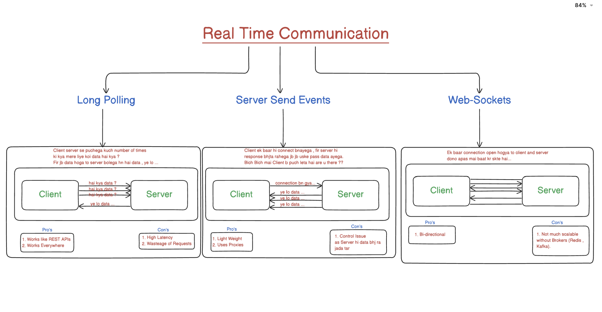

# Master Advance BE Communication

## 1. Introduction
### Explanation :-
- Backend-to-backend (aur backend-to-frontend) communication ka matlab hai ki aapke system ke alag-alag parts kaise data exchange karte hain.
- **Broadly, do paradigms hain** -
  - `Synchronous (blocking, request–response) : Stateless`
  - `Asynchronous (non-blocking, event/message driven) : Statefull`
- In dono ko samajhne se aap scalable, resilient, aur responsive systems design kar sakte ho.
- **Intro** :-
	
1. **General Backend Communication** :
  * Yeh diagram ek generic microservice-style architecture dikhata hai jahan BE 1 ek central coordinator ki tarah kaam karta hai, aur alag-alag backends se synchronous (HTTP/WebSocket) aur asynchronous (Message Queue / Pub-Sub) channels se baat kar raha hai.
	* **HTTP Calls**
	  * `BE 1 → BE 2` - Direct REST/gRPC request–response.
	  * **Use Case** - CRUD APIs, immediate reply chahiye (e.g. user profile fetch).
	* **WebSocket**
	  * `BE 1 ↔ BE 4` - Persistent connection for real-time updates.
	  * **Use Case** - Chat messages, live notifications.
	* **Message Queue**
	  * `BE 1 → Message Queue → BE 3` - Fire-and-forget tasks (async).
	  * **Use Case** - Background jobs, e-mail sending, video processing.
	* **Pub-Sub**
	  * `BE 1 → Pub-Sub Broker → {BE 5, BE 6, BE 7}` - One-to-many event delivery.
	  * **Use Case** - Event streams (e.g. “order placed” broadcast), audit logs, metrics.
* **Flow Analogy** -
  * BE 1 ek control tower
  * HTTP/WebSocket se real-time baat karta hai
  * Jo heavy/later tasks hain unhe queue/pub-sub me daal deta hai, jisse downstream services independently process kar sake


2. **FinTech App (Paytm-style Transfer Flow)** :
  * Yeh diagram dikhaata hai ki jab user ₹100 transfer karta hai, kaise multiple side-effects asynchronously handle hote hain.
	  * **DB Write** -
	    * BE 1 sabse pehle transaction details database me store karta hai.
	  * **Multiple Notification Queues** -
	    * `Email Queue → Email Service (OTP/receipt mail)`
	    * `Phone Queue → Phone Service (SMS alert)`
	    * `Push Notification Queue → Push Service (App notification)`
	  * **Consumer Services** -
	    * Har queue ka apna dedicated consumer service hai, jo apni speed se messages process karta hai.
* **Benefit** - 
  * User ko jaldi “Transfer Success” dikhega (DB write + Acknowledge), aur heavy notifications background me alag threads/machines se chalegi—system zyada resilient aur scalable banega.


3. **Coding Platform (LeetCode-style Submission Flow)** :
  * Yahan BE 1 submission gateway hai jo user ka code run-karne ke liye different compute resources ko route karta hai based on subscription.
	  * **DB Entry** -
	    * problem_id, code, status: processing store.
	  * **Separate Submission Queues** -
	    * `Premium Queue → Big Machines`
	    * Faster CPUs/GPUs, priority processing.
	    * `Free Queue → Small Machines`
	    * Limited resources, lower priority.
	  * **Workers / Executors** -
	    * Big/small machines apne queues se messages uthakar code compile & run karte hain.
	  * **Result Update** -
	    * Jab execution complete ho, BE 1 ko callback aata hai, DB me status: success/fail update hota hai.
* **Why This** -
	* **Quality of Service (QoS)** - Premium users ko fast turnaround.
	* **Resource Isolation** - Free submissions impact premium workloads nahi karte.
	* **Scalability** - Machines horizontally scale ho sakte queues ke hisaab se.


## 2. Latency Vs Coupling
### Explanation :-


## 3. Synchronous vs. Asynchronous Communication
### Explanation :-

| Aspect | Synchronous | Asynchronous |
|--------|-------------|--------------|
| **Flow** | Caller wait karta hai callee se response ke liye | Caller message bhejta hai aur turant aage badh jaata hai |
| **Latency Sensitivity** | Low latency chahiye (turant reply expect karte) | Thoda higher, variable latency tolerate kar sakte |
| **Coupling** | Tight coupling (dono sides up hone chahiye) | Loose coupling (producer/consumer alag bhi ho sakte) |
| **Examples** | HTTP/REST, gRPC (unary), RPC | Message Queues (RabbitMQ, AWS SQS), Pub/Sub, Kafka |
| **Use Cases** | CRUD APIs, authentication, simple RPCs | Event-driven workflows, notifications, data pipelines |


* **Note** -
	* Latency ek aisa metric hai jo batata hai kitna time lagta hai ek request bhejne se lekar response milne tak.
	* Coupling ek measure hai jo batata hai ki do ya zyada modules/components kitne interdependent hain—matlab ek module me change karne se doosre module ko kitna effect padega.

### Analogy
- Synchronous bilkul phone call jaisa—dial karo, pick hone ka wait karo, baat ho jaaye toh hang up.
- Asynchronous waise hi hai jaise email ya WhatsApp message—send karte hi kaam pe lag jao; recipient jab padh ke reply karega.

## 4. Popular Technologies by Category
### Explanation :-
#### 4.1 Synchronous Technologies
- HTTP/REST (Express, Spring, Django REST)
- gRPC (unary calls) — streaming bhi kar sakte, par basic RPC sync hai
- GraphQL queries/mutations

#### 4.2 Asynchronous Technologies
- **Message Brokers:**
  - RabbitMQ (AMQP)
  - Apache Kafka (log-based pub/sub)
  - AWS SQS / SNS (queueing & pub/sub)
- **Event Buses / Pub-Sub:**
  - Google Pub/Sub, NATS, Redis Streams

## 5. Real-Time Communication
### Explanation :-
**Definition:** Mechanisms jisse server se client (aur vice-versa) data push hota hai bina delay ke—used for chat, live dashboards, notifications, collaborative apps.



| Technology | Nature | Direction | Sync/Async? |
|------------|---------|-----------|-------------|
| Long Polling | HTTP request hold rehta hai jab tak data na aa jaye, phir re-issue | Server → Client | Synchronous request, pseudo-async |
| Server-Sent Events | Browser ek long HTTP connection kholta hai; server stream karta hai | Server → Client | Asynchronous (one-way) |
| WebSockets | Full-duplex TCP socket over HTTP handshake; bi-directional stream | Dono taraf (Both) | Asynchronous (two-way) |

- **Long Polling:** baar-baar HTTP requests chalti hain; har ek block hoti hai jab tak update na mile.
- **SSE:** ek continuous text/event stream; sirf server→client, browser mein EventSource se easy.
- **WebSockets:** persistent socket; real-time bi-directional communication.

## 6. Deep Dive: What Is "Real-Time"?
### Explanation :-
1. **Low Latency Push**
   - Server jaise hi data change hota hai, turant client ko bhejta hai.

2. **Persistent Connection**
   - Har message ke saath HTTP handshake nahi karna padta.

3. **Use Cases**
   - Chat/messaging apps
   - Live stock tickers / dashboards
   - Multiplayer games
   - Collaborative editing (e.g. Google Docs)

### Why choose one over another?
- **Long Polling:** sabse easy add karne ke liye existing HTTP/Express apps mein. Overhead zyada.
- **SSE:** one-way feeds ke liye best—notifications, logs. Auto-reconnect, simple text-based.
- **WebSockets:** true bi-directional; chat/gaming ke liye ideal. Thoda setup zyada.

## 7. Diagrams & Analogies
### Explanation :-
### Synchronous (HTTP)
```
Client            Server
│── Request ──▶
         ◀─ Response ──│
```

### Asynchronous (MQ)
```
Producer    Broker      Consumer
│─ Publish ─▶│
               │─ Dispatch ─▶│
```

### WebSockets (RT)
```
Client ◀───────────────── TCP Handshake ─────────────────▶ Server
Client ◀────────────── Bi-directional stream ────────────▶ Server
```

### Analogy for Async
Producer ek mailbox mein letter daalta hai (broker). Consumer jab ready ho, letter uthata hai. Dono saath-saath online hone ki zaroorat nahi.


## 8. WebSockets ka Communication Nature
### Explanation :-
* Asynchronous hi hai.
* Jab aap `socket.send()` call karte ho, woh non-blocking hota hai—server ya client side pe turant return ho jaata hai aur aapka code aage badh jata hai.
* Jab data receive hota hai, browser ya Node.js runtime onmessage/message event fire karta hai.

## 9. Kyun Controversial Kehte Hain ?
### Explanation :-
* **Persistent Connection vs. Request–Response** -
	* HTTP-based sync calls me aap request bhejte ho aur turant response ka wait karte ho.
	* WebSocket me ek baar connection open ho jaata hai (HTTP handshake ke through), phir dono taraf se messages kabhi bhi aa-ja-sakte hain—isme “wait karo” wala concept nahi hota.
* **RPC-on-WebSocket Patterns**
	* Kai log WebSocket pe “synchronous RPC” jaisa pattern implement karte hain :
    ```javascript
      // Client
      socket.send(JSON.stringify({ id: 1, method: 'getData' }));
      // Fir response me same id aaye, phir hi aage ka code chale
    ```
  * Isse lagta hai ki “sync” hai, kyunki aap ek unique ID ke response ka wait kar rahe ho. Lekin underlying send/receive phir bhi async events hain.

## 10. API Surface Confusion
### Explanation :-

| **Method**       | **Blocking?**     | **Nature**                        |
|------------------|-------------------|-----------------------------------|
| `fetch()` (HTTP) | Promise-based     | Sync-like request–response        |
| `socket.send()`  | Non-blocking      | Asynchronous messaging            |

* Dono Promise ya callbacks use karte hain—isko dekh ke beginners confuse ho jaate hain.

## 11. Summary
### Explanation :-
* `WebSockets = Asynchronous`, full-duplex channel over a single TCP connection.
* **Controversy isliye hoti hai kyunki** :
	1.	Ek baar connection establish hone ke baad messages push/pull dono sides se ho sakte (unlike classic sync).
	2.	Log isko `RPC-style sync calls` jaise bhi use kar lete hain, jisse mixed feelings bante hain.
* Aage agar WebSockets ka event-driven flow, backpressure, aur message ordering samajhna hai, batao—step-by-step guide dunga!
