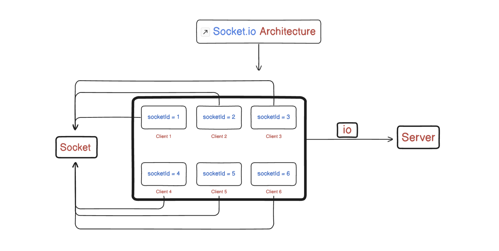
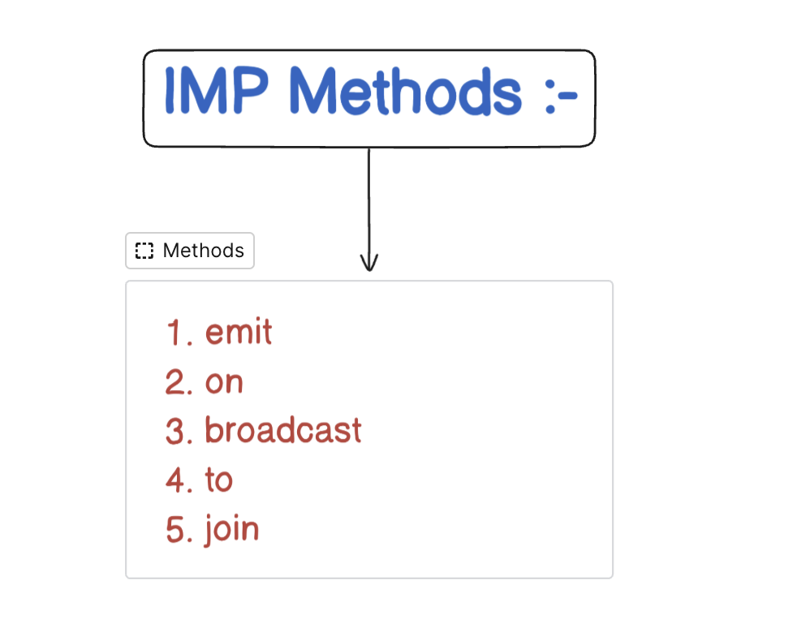

# Master Socket.io

## Socket.IO Explained from First Principles (Hinglish)

---

### 1. What is Real-Time Communication ?
* Real-time communication ka matlab hota hai -
  * Client aur Server ke beech bina baar-baar request bheje continuously data exchange karna.
  * Unlike REST APIs (jo request-response pattern follow karta hai), real-time system push-based hota hai. 
  * Server khud client ko data push kar sakta hai, bina client ke request kiye.

---

### 2. WebSockets – Concept Samajh Le Pehle
* **Problem with REST** -
	* User ne comment kiya → Client ne POST kiya.
	* Ab sabko updated comment list dikhani hai.
	* **REST mein** - har client ko baar-baar GET request bhejna padega.
* **WebSocket kya karta hai** -
  * Ek persistent connection banata hai between client ↔️ server
  * Jisme dono ek dusre ko data real-time mein bhej sakte hain.
* **Mechanism** -
	* WebSocket ek TCP-based protocol hai.
	* HTTP ke initial handshake ke baad yeh ek upgrade kar deta hai connection ko full-duplex WebSocket par.

---

### 3. What is Socket.IO?
* Socket.IO ek library hai jo WebSocket ko use karna super easy banati hai.
	* Supports fallback (agar WebSocket kaam na kare to polling)
	* **Abstraction provide karta hai** - events ke through data bhejna
	* **Works on both** - Frontend (browser) + Backend (Node.js)
* **Fundamental Idea** - Ek library hai jo real-time, bi-directional communication simplify karti hai client-server ke beech.
* **First Principles** -
  1. **Transport Abstraction** - Native WebSocket, HTTP long-polling, etc. automatically manage hoti hain.
  2. **Event-Driven API** - `.on(…)` aur `.emit(…)` se aap custom events bana sakte ho.
  3. **Built on Engine.IO** - Jo low-level polling/WebSocket handshake handle karta.
* **Analogy** -
  * `Socket.IO = UPS courier service` jo decide kar leti ki delivery by air (WebSocket) possible hai ya by road (polling) – aapko sirf parcel dena hai.
* **Few Built-in Events** :

| **Side**  | **Event Name**     | **Kab Fire Hoti Hai**                                                         |
|-----------|--------------------|-------------------------------------------------------------------------------|
| Server    | `connection`       | Jab koi client connect karta hai (handshake complete).                       |
| Server    | `disconnect`       | Jab client disconnect ho jata hai.                                           |
| Client    | `connect`          | Jab client me handshake server se ho jata hai.                               |
| Client    | `disconnect`       | Jab client pe connection drop ho jata hai.                                   |
| Client    | `connect_error`    | Jab connection me error aye.                                                 |
| Client    | `reconnect`        | (auto) reconnection ke attempts ke baad jab reconnect ho.                    |

* **⚠️ Rule** - Jo event name server pe emit ho raha hai, exactly same name client pe listen karega (aur vice-versa).
---

### 4. Why Use Socket.IO?
* **Reliability & Fallbacks** -
  * Agar client ka browser ya network WebSocket allow na kare, to automatically HTTP-polling pe switch ho jata.
- **Built-in Features** -
  1. **Auto Reconnect** – connection drop pe retry logic.
  2. **Acknowledgements** – server ko confirm kar sakte ho ki client ne message receive kiya.
  3. **Rooms & Namespaces** – logical channels for grouping sockets.
- **Developer Productivity** -
  * Boilerplate code bahut kam, event names se hi messaging clear ho jati.

---

### 5. Socket.io Architecture ?

* **Meaning** :
	* `io` → pura Socket.IO Server hota hai
	* `socket` → ek connected client instance hota hai
  * Server ke paas N sockets ho sakte hain, sabke unique `socket.id` hote hain
	* `Server` → multiple clients se connect hota hai
	* `Socket` → ek client ka ek connection represent karta hai
* **So** -
  * `io` is the boss, `socket` is each connected user.

---

### 6. Socket.io IMP Methods ?


| Method     | Purpose                                  |
|------------|------------------------------------------|
| `emit`     | Data bhejna                              |
| `on`       | Event sunna                              |
| `broadcast`| Sabko bhejna (except khud ko)            |
| `to`       | Khas user ya room ko bhejna              |
| `join`     | Kisi room/group me user ko daalna        |

1. **emit()** :
  * Server ya client se data send karne ke liye.
  * **Syntax** :
    * **Server Side** -
      ```javascript
        io.emit("event-name", payload);
        socket.emit("event-name", payload);
      ```
    * **Client Side** - 
      ```javascript
        socket.emit("event-name", payload);
      ```
  * **Components** -
	  * `"event-name"` → custom event jaise send-message, user-joined
	  * `payload` → jo data bhejna hai (object, string, number)
  * **Why Use** -
    * Kisi event ke through data bhejna
	  * **Example** - 
      * Message bhejna, user update bhejna
        ```javascript
          socket.emit("send-message", { user: "Sahil", text: "Hello!" });
        ```

2. **on()** :
  * Kisi event ko listen karna (receive).
  * **Syntax** :
    * **Server Side** -
      ```javascript
        socket.on("send-message", (data) => {
          console.log(data);
        });
      ```
    * **Client Side** - 
      ```javascript
        socket.on("receive-message", (data) => {
          console.log("Got message", data);
        });
      ```
    * **Components** -
	    * `"event-name"` → jo event sunna hai
	    * `callback` → jab event aaye to kya karna
  * **Example** -
      ```javascript
        socket.on("user-joined", (data) => {
          console.log(`${data.username} joined the chat`);
        });
      ```
    
3. **broadcast** :
  * Server pe ek client sabko message bheje — par khud ko nahi
  * **Syntax** :
    ```javascript
      socket.broadcast.emit("event-name", data);
    ```
  * **Components** -
	  * `socket.broadcast.emit()` → same event sabko bhejta hai except current socket
  * **Example** -
    ```javascript
      socket.on("join-chat", (username) => {
        socket.broadcast.emit("user-joined", `${username} joined`);
      });
    ```
    
4. **to()** :
  * Specific socket or room ko emit karne ke liye.
  * **Syntax** :
    ```javascript
      io.to(socketId).emit("event", data);
      io.to("roomName").emit("event", data);
    ```
  * **Components** -
	  * `to()` → specific target (room ya socket.id)
	  * `.emit()` → usko data bhejna
  * **Example** -
    ```javascript
      io.to("user1SocketId").emit("private-msg", "Hi Sahil!");
    ```
    
5. **join()** :
  * Kisi user ko group ya room me add karne ke liye.
  * **Syntax** :
    ```javascript
      socket.join("room-name");
    ```
  * **Example** -
    ```javascript
      socket.on("join-room", (roomName) => {
        socket.join(roomName);
      });
    ```
  * **Use** -
	  * Chat room
	  * Group notification
	  * Game lobby

* **Analogy** :

  | Element        | Real Life Equivalent                      |
  |----------------|--------------------------------------------|
  | `io`           | Event manager                              |
  | `socket`       | Individual guest                           |
  | `emit`         | Guest sending a message                    |
  | `on`           | Guest listening to a message               |
  | `broadcast`    | Mic announcement (except mic holder)       |
  | `to("room")`   | Speaking only to Room A                    |
  | `join("room")` | Guest joining Room A                       |

---

### 7. How is it Different from REST ?

| **Feature**    | **REST API**         | **WebSocket**                           |
|----------------|----------------------|------------------------------------------|
| **Nature**     | Request-Response      | Persistent                               |
| **Direction**  | Client → Server       | Both ways                                |
| **Real-time**  | ❌ Polling needed     | ✅ Yes                                    |
| **Use Case**   | CRUD APIs             | Chat, Notifications, Multiplayer         |

---

### 8. What Can You Implement with Socket.IO?
1. **Chat / Messaging Apps** – group chats, private messages.
2. **Live Notifications** – order status, alerts.
3. **Real-time Dashboards** – stock tickers, analytics.
4. **Multiplayer Games** – position updates, game events.
5. **Collaborative Tools** – shared cursors, whiteboards.
6. **IoT Telemetry** – sensor data streaming.

* **Principle**: "Whenever client and server ko instant data exchange karna hai bina baar-baar HTTP calls, use Socket.IO."

---

### 9. Does Socket.IO Use WebSockets?
* **Yes, Under the Hood** -
  * **Primary transport** = WebSocket.
  * **Fallback** = HTTP long-polling, JSONP polling, etc.
* **First Principles** -
  1. **Detect Capability** - Engine.IO pehle check karta WebSocket support.
  2. **Upgrade Protocol** - Jab possible ho, handshake ke baad WebSocket channel use hota.

---

### 10. Why Socket.IO if Native WebSocket Exists?
* **Native WebSocket = Low-level API** -
  * Aapko khud ping/pong, reconnection, message framing, fallback manage karna padta.
* **Socket.IO Provides** -
  1. Automatic Reconnect & Heartbeat
  2. Event Namespacing (`socket.on('chat',…)` vs `ws.onmessage`)
  3. Rooms/Groups (join/leave without manual tracking)
  4. Binary Support + Acks

* **Principle** - "Abstraction reduces your mental load—network glitches handle hojayenge without extra code."

---

### 11. Client & Server—Dono Sides Use It?
* **Server-Side** -
  * `socket.io` package
* **Client-Side** -
  * `socket.io-client` package
* **Flow** -
  1. Server listen kare sockets pe.
  2. Client connect karega same endpoint pe.
  3. Dono `.emit` aur `.on` se communicate karte.

---

### 12. Installation ?
```bash
# Backend (Node.js/Express)
npm install socket.io

# Frontend (React/Vue/Plain JS)
npm install socket.io-client
```

---

### 13. Express Backend Mein Setup ?
```javascript
import express from 'express';
import cors from 'cors';
import { createServer } from 'http';
import { Server } from "socket.io";

const port = 3000;
const app = express();

const server = createServer(app);

const io = new Server(server , {
  cors : {
    origin: "http://localhost:5173"
  }
});

io.on("connection" , (socket) => {
    console.log("User Connected ...");
    console.log("Socket Id : " , socket.id);
});

server.listen(port , () => {
    console.log(`Chat app listening on port ${port}`)
});
```

#### `🔍 Express + Socket.IO Setup – Line-by-Line Explanation`
  ```js
  import express from 'express';
  ```
  ✅ Import kiya **Express** framework ko  
  📌 Use: Web server banane ke liye, routes handle karne ke liye
  ```js
  import cors from 'cors';
  ```
  ✅ Import kiya **CORS middleware**  
  📌 Use: Frontend (e.g. `localhost:5173`) se backend (e.g. `localhost:3000`) pe request allow karna
  ```js
  import { createServer } from 'http';
  ```
  ✅ Import kiya **native Node.js HTTP module**  
  📌 Use: Express app ko HTTP server me convert karne ke liye
  ```js
  import { Server } from "socket.io";
  ```
  ✅ Import kiya **Socket.IO Server**  
  📌 Use: Real-time communication handle karne ke liye (events, rooms, etc.)
  ```js
  const port = 3000;
  ```
  ✅ Port number define kiya jahan backend chalega
  ```js
  const app = express();
  ```
  ✅ Express ka instance banaya  
  📌 Use: REST APIs aur middleware lagane ke liye
  ```js
  const server = createServer(app);
  ```
  ✅ HTTP server banaya Express app ke upar  
  📌 Zaroori hai taaki Socket.IO ispe bind ho sake
  ```js
  const io = new Server(server , {
    cors : {
      origin: "http://localhost:5173"
    }
  });
  ```
  ✅ Socket.IO ko HTTP server pe mount kiya  
  📌 CORS origin diya jisse frontend access kar sake  
  📌 Ab real-time socket events handle kar sakte hain
  ```js
  io.on("connection" , (socket) => {
      console.log("User Connected ...");
      console.log("Socket Id : " , socket.id);
  });
  ```
  ✅ Jab client connect karta hai, tab `"connection"` event fire hota hai  
  📌 Har client ka unique `socket.id` hota hai  
  📌 Yahin pe `socket.on()` lagake events handle karte hain
  ```js
  server.listen(port , () => {
      console.log(`Chat app listening on port ${port}`)
  });
  ```
  ✅ Server start kiya diya port 3000 pe  
  📌 Console me confirmation print karega

**Flow**:
1. Express + HTTP server create.
2. `new Server(server)` se Socket.IO attach.
3. `io.on("connection")` se client handle.
4. `socket.emit` aur `socket.on` se messaging.

---

### 14. React App Mein Setup ?
```javascript
// src/socket.js
import { io } from "socket.io-client";
const socket = io("http://localhost:3000");
export default socket;

// src/App.jsx
import React, { useEffect } from "react";
import socket from "./socket";
import ChatWindow from "./components/ChatWindow";

function App() {
  // Connecting to Socket
  useEffect(() => {
    socket.on("connect" , () => {
      console.log("Connected to Server : " , socket.id);
    });
  }, [])
  

  return (
    <div>
      Chat App
    </div>
  );
}

export default App;
```

#### `🔍 React Frontend – Socket.IO Setup Explained`
  #### 📁 File: `src/socket.js`
  ```js
  import { io } from "socket.io-client";
  const socket = io("http://localhost:3000");
  export default socket;
  ```
  ✅ Import kiya `socket.io-client` se `io()` function  
  📌 `io("http://localhost:3000")` se backend socket server se connection establish hota hai  
  📌 Export kiya `socket` instance ko taaki har component me use ho sake

---

  ### 📁 File: `src/App.jsx`
  ```js
  import React, { useEffect } from "react";
  import socket from "./socket";
  import ChatWindow from "./components/ChatWindow";
  ```

  ✅ `socket` instance ko import kiya  
  ✅ `ChatWindow` component render karne ke liye import kiya

  ```js
  useEffect(() => {
    socket.on("connect" , () => {
      console.log("Connected to Server : " , socket.id);
    });
  }, []);
  ```
  ✅ `useEffect` React ka hook hai jo component mount hone pe run hota hai  
  📌 `socket.on("connect")` event tab fire hota hai jab socket server se successful connection ho jata hai  
  📌 `socket.id` har client ka unique ID hota hai — server side pe bhi ye ID use hoti hai identify karne ke liye

  ```js
  return (
    <div>
      Chat App
    </div>
  );
  ```
  📌 Basic structure return kar raha hai  
  📌 Iske andar aage jaake ChatWindow render hoga jisme real-time chat logic implement hoga

**Explanation**:
1. `io(...)` se connect.
2. `socket.on` se events listen.
3. `socket.emit` se events bhejo.

---