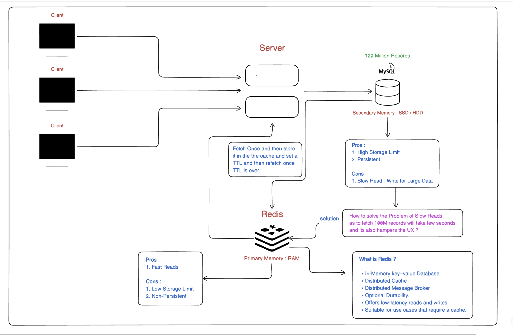
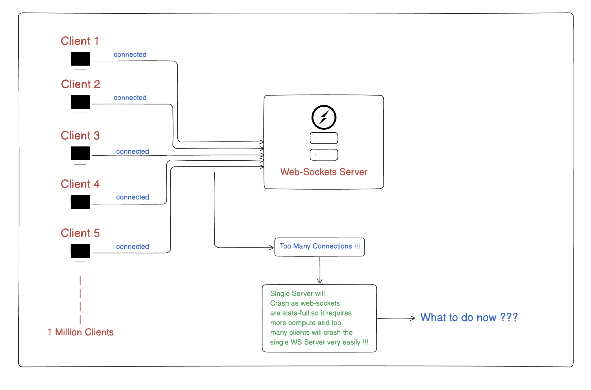
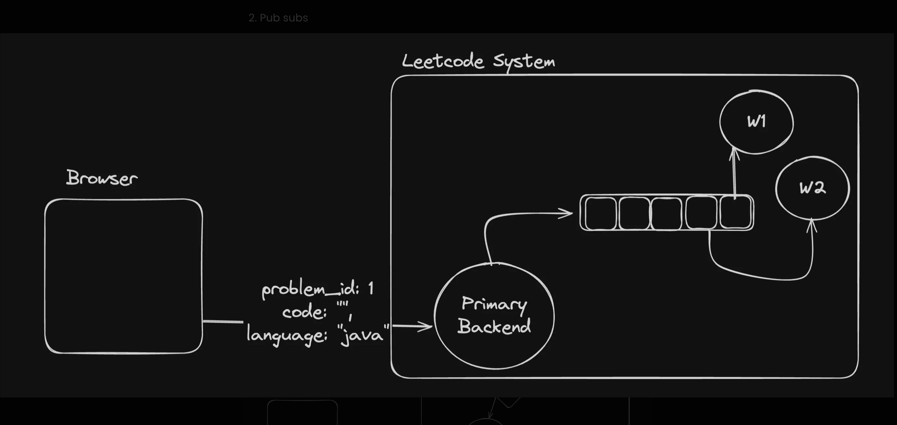
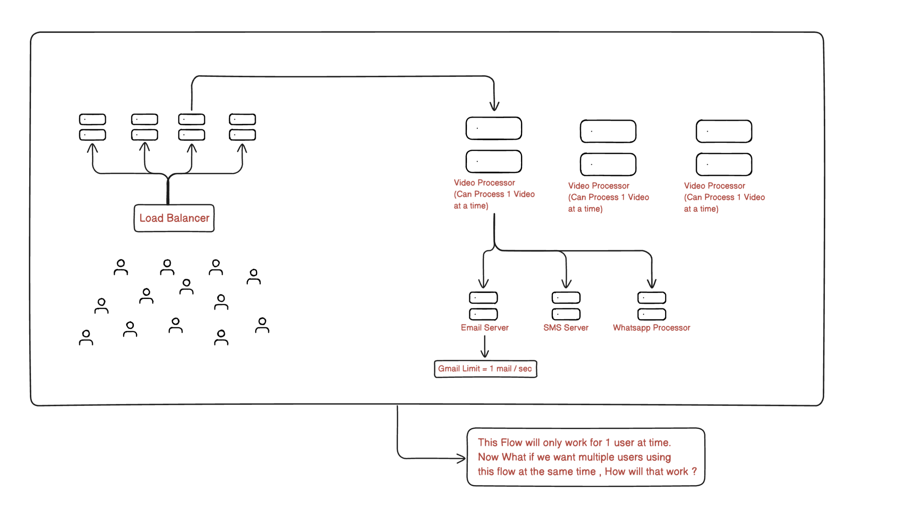
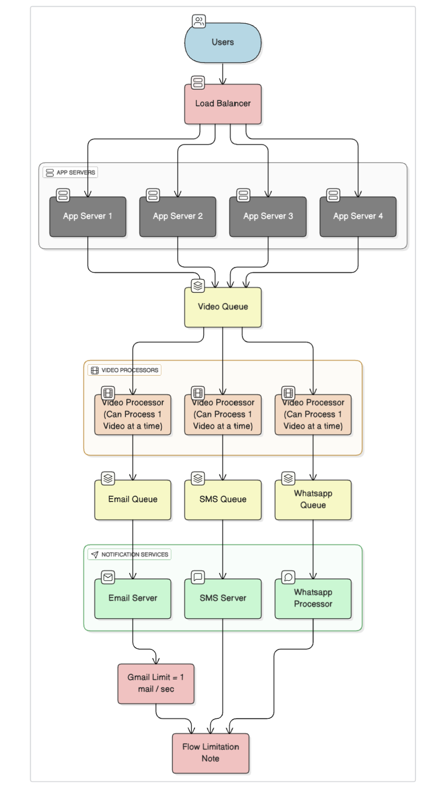
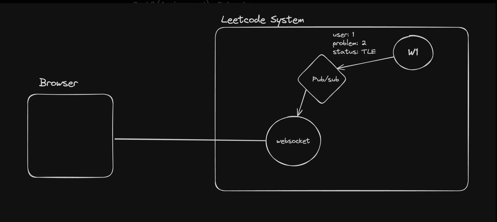

# Master Redis

## Redis Basics

### 1. What is Redis ?
### Explanation :-
- **First Principles** - 
   * Computer ke paas do tarah ki storage hoti hai — 
      * `RAM (fast, volatile)`
      * `Disk/SSD (slow, persistent)`
   * Jab data ko bar-bar read/write karna ho jahan low latency `latency = response time` bohot matter kare, to in-memory store ka use hota hai. 
   * Redis isi tarah ka ek system hai.
- **Definition** - 
   * Redis ek in-memory data structure store hai jo key-value pairs ko RAM me store karke bahut hi kam latency pe data access aur modify karne ki facility deta hai.
- **Origin** - 
   * Redis ka full form hai `REmote DIctionary Server`, lekin aajkal ise bas "Redis" bolte hain. 
   * Yeh open-source hai aur BSD license ke under aata hai.

#### Real-Life Analogy -
   * Socho ek restaurant kitchen me ek chhota fridge (RAM) hai jahan pe sabse zyada use hone wali cheezen (masale, sauces) rakhe hote hain, taaki chef jaldi se le aaye. 
   * Dusri taraf, cold storage room (Disk/DB) me sab kuch store hota hai, but access karne me time lagta hai. 
   * Redis bilkul us chhote fridge jaisa hai—jitni cheezen sabse jaldi chahiye hoti hain, unko yahin store karke rakhta hai.


---

### 2. If you had to define Redis in one line so that someone understands what it is, how would you phrase it ? 
### Explanation :-
* Redis ek open-source, in-memory data structure store hai jo super-fast read/write aur complex data structures (jaise lists, hashes, sets) ke liye use hota hai.
* Is sentence se clear ho jata hai ki :
   - Open-source hai
   - In-memory store (yaani sab kuch RAM me)
   - Key-value ke alawa advanced data structures bhi support karta hai
   - Low latency ke saath kaam karta hai

---

### 3. Why do we use Redis? Is it used for frontend, backend, or both ? 
### Explanation :-
#### Principal :
   * Web/mobile applications me latency aur throughput bahut matter karte hain—khaaskar jab user experience fast chahiye ho. 
   * Jo cheezen har request par baar-baar compute/DB se fetch karna heavy ho, unko cache karne se overall performance bohot improve hoti hai.

#### Use-Case Level:
1. **Backend-Centric Tool** - 
   * Redis khud ek "backend" service hai. 
   * Frontend directly Redis ko nahi call karta; uske liye backend (Node.js/Express/Java/Spring etc.) se baat karta hai.

2. **Caching** - 
   * Agar aapke paas koi heavy database query ya API response hai jo har request me same data fetch karti hai (jaise user profile info, product catalog, analytics counters), to aap pehle Redis me check karte ho. 
   * Agar data wahan mil gaya (cache hit), to disk-based DB call avoid ho jata hai.
   - *Example* - E-commerce me product details lookup—Redis me store karke rapid response dena.

3. **Session Store** - 
   * User login sessions ko track karne ke liye jaise "Express-session" ke saath Redis store use hota hai, taaki servers restart hone pe session persist rahe (agar Redis persistence enabled ho).

4. **Rate Limiting / Throttling** - 
   * API endpoints ko overuse hone se bachane ke liye, Redis me counters (increment commands) rakh kar dekhte hain ki user ne kitni requests bheji—agar limit cross ho gayi to block kar dete.
   - *Example* - "Login attempts" per IP ya per user—Redis me store karke sabse fast counter increment.

5. **Pub/Sub Messaging** - 
   * Real-time notifications/chat systems me publish-subscribe pattern ke liye. 
   * Ek service Redis me message publish karti hai aur doosri service subscribe karke receive kar leti.
   - *Example* - Gaming me live scoreboard updates, chat application me real-time messages.

6. **Data Structures Use-Cases**:
   - `Lists` - Producer-consumer queues, task queues.
   - `Sets` - Unique user IDs, tags, followers list.
   - `Sorted Sets` - Leaderboards (score descending), priority queues.
   - `Hashes` - Storing user object fields (name, age, email) as ek single key me.

7. **Frontend Direct Use?** - 
   * Nahin. 
   * Aap direct browser se Redis nahi connect karte (security reasons). 
   * Hamesha backend middleware (Node.js/Express etc.) ke through connect karenge.

---

### 4. Is there really a need for Redis? Can't its functionality be achieved using normal JavaScript or a regular database ?
### Explanation :-
#### First Principles Perspective :
1. **Latency vs Throughput** - 
   * Agar aap normal JS me in-memory JavaScript object (e.g. const cache = {}) use karo, toh voh sirf current process tak limited rahega. 
   * Agar aapke paas multiple server instances (horizontal scaling) hai, woh cache shared nahi hoga. 
   * Agar ek instance crash ho gaya, data lose ho jayega. 
   * Redis ek distributed, shared in-memory store hai jiski wajah se saare instances ek hi data dekh sakte hain.

2. **Persistence**: 
   * Redis me aap RDB (snapshotting) ya AOF (Append Only File) enable karke persistence rakh sakte ho. 
   * Simple JavaScript object persistent nahin hota.

3. **Advanced Data Structures & Atomic Operations** - 
   * Relational DB can do key-value lookups via indexes, lekin sorted sets, hyperloglog, bitmaps jaisi advanced structures native nahi milti. 
   * Sathi, Redis me atomic operations bohot simple hain (INCR, HSET, LPUSH, ZADD), jo multiple commands combine kiye bina hi safe concurrency ensure karte.

4. **Performance** - 
   * Disk-based relational DBs (MySQL, PostgreSQL) me read/write usually milliseconds me hote hain. 
   * Redis me sub-millisecond latency milta hai. 
   * Agar aapki application me microseconds ka difference matter karta hai (high traffic), to kaam ki batching me bohot farq pad sakta hai.

5. **Specialized Use Cases** -
   * **Leaderboards** - Agar aap ek social gaming platform bana rahe ho, jahan per second thousands of score updates ho rahe hain, toh Redis sorted set real-time ranking provide karega.
   * **Expiring Keys / Session TTL** - Relational DB se session expire manage karna complex ho sakta hai. Redis me EXPIRE command se automatically key expire ho jati hai.

#### When to Skip Redis ? 
   * Agar application scale bohot chota hai (single server, low QPS(Queries Per Second)) aur caching/real-time ki zaroorat nahi. 
   * Simple DB queries optimized hain, to extra layer complexity nahi chahiye.
   * Agar persistence pe focus hai aur data structures simple hain, aur latency big issue nahi hai.

---

### 5. What services does Redis provide, and in which situations do we use each of those services ?
### Explanation :-
* Redis ek multipurpose tool hai jisme bohot saari built-in functionalities hain. 
* Main services/functionalities aur jab/kaise use karoge :

| Service/Feature | Description | Use-Case / Kab Use Kare |
|----------------|-------------|------------------------|
| `Simple Key-Value Store` | Keys ke saath strings, numbers, JSON blobs, koi bhi text data store kar sakte ho. | - **Caching** - DB query ka result stringify karke store karna.<br>- **Configuration/Feature Flags** - Feature flags store kar sakte ho—jaise feature:beta_signup = "true". |
| `Hashes` | Ek single key ke andar multiple fields (field-value pairs) store hote hain, jaise ek object. | - **User Profile** - HSET user:123 name "Rahul" age "30" email "r@a.com".<br>- **Shopping Cart** - HSET cart:alice item1 "2" item2 "5". |
| `Lists` | Ordered lists of strings. Push/pop operations front aur end se. | - **Message Queue** - Producer LPUSH queue:tasks "task1" aur consumer RPOP queue:tasks.<br>- **Activity Feed** - Latest 100 actions store karna (LPUSH feed:alice "liked_post_5"). |
| `Sets` | Unordered collection of unique elements. | - **Unique Visitors** - SADD page:123:visitors "userId"<br>- **User Tags/Interests** - SADD user:Alice:tags "music" "cooking". |
| `Sorted Sets (ZSets)` | Elements with scores, automatically ordered by score. | - **Leaderboards** - ZADD leaderboard 1500 "player123" aur ZREVRANGE leaderboard 0 9 top 10 players.<br>- **Priority Queue** - Tasks with priority scores. |
| `Bitmaps & Bitfields` | Ek large binary array jisme individual bits set/clear kar sakte ho. | - **Daily Active Users** - Bit per user ID set karo—analytics me quickly count karo BITCOUNT active_users:2025-06-02. |
| `HyperLogLog` | Approximate distinct counting with fixed space (probabilistic data structure). | - **Unique IP Count** - High traffic website me approximate unique visitors per day. |
| `Streams` | Immutable append-only log of messages with consumer groups support. | - **Event Sourcing** - Real-time event processing, chat systems, job streams.<br>- **Log Aggregation** - Multiple producers write logs into stream, multiple consumers process. |
| `Pub/Sub (Publish/Subscribe)` | Channels-based messaging—publisher publish karta hai channel pe, aur subscriber receive karta hai. | - **Chat Application** - User1 PUBLISH chat:room1 "Hello"; User2 jo subscribe hain, sabko message milta.<br>- **Real-Time Notifications** - Stock price updates, live sports score. |
| `Geospatial Indexing` | Latitude/Longitude points store karke radius/nearby queries support karta hai. | - **Location-Based Services** - "Kaunse drivers mere 5 km ke andar hain?" ride-sharing apps.<br>- **Nearby Restaurants** - Food delivery app me nearest restaurants dikhana. |
| `Transactions & Lua` | MULTI/EXEC commands for atomic transactions; custom logic via Lua scripting. | - **Atomic Bank Transfer** - MULTI { DECR account:A 100; INCR account:B 100 } EXEC.<br>- **Complex Operations** - Lua script me multiple read/write ek saath. |
| `Expiration / TTL` | Har key ko specific time ke baad automatically delete karne ka feature. | - **OTP Storage** - SET otp:alice 123456 EX 300 (5 minutes baad OTP automatically expire).<br>- **Session Expiry** - EXPIRE session:token 3600 (1 hour). |
| `Persistence (RDB / AOF)` | Data ko disk pe periodically snapshot (RDB) ya har write operation append-only file (AOF) me save karke recover kar sakte hain. | - **Crash Recovery** - Agar Redis restart hota hai, recent data Redis reload karega.<br>- **Backup** - Nightly snapshots RDB. |
| `Replication & Clustering` | Master-Slave replication, Redis Cluster for sharding, high availability, automatic failover. | - **High Availability** - Agar master node down hota hai, slave automatically promote ho jata.<br>- **Scalability** - Data partition karke multiple nodes me store. |

> Note: Har feature ka apna ek "sweet spot" hai—matlab specific problem ke liye Redis me built-in structures itne optimized hain ki custom code likhne ki zaroorat nahi padti.

---

## Examples aur Real-Life Situations

### 1. E-commerce Caching
- **Scenario** - "Products List" endpoint jo 100,000+ items ko DB se fetch karke sort karta hai. Har user request pe DB hit heavy lagta hai.
- **Solution** - Pehli request me DB se "products" fetch karke Redis me SET products:all <JSON> store karo with EXPIRE 300 (5 min TTL). Agli requests me Redis se GET products:all karke direct serve karo.

### 2. Session Management
- **Scenario** - User login hota hai, backend me session create karna hai. Agar aap express-session me default MemoryStore use karo, to production me scalability issue aayega (single instance).
- **Solution** - express-session ke liye connect-redis use karo. Login ke time req.session.userId = user.id rakho. Redis automatically in sessions ko memory me rakhega, durability ke liye persistence enable karo. Multiple Node.js instances same Redis se session share karenge.

### 3. Rate Limiting
- **Scenario** - Public API "/api/send-otp" pe bots continuously requests bhej rahe hain. Aapko per-phone-number limit set karna hai (e.g., 5 requests per hour).
- **Solution** - Jab user OTP maange: INCR otp:requests:+91-9876543210 and if first time, EXPIRE otp:requests:+91-9876543210 3600. Agar count > 5, block karo. Redis atomic increment aur expire support instantly counters manage karega.

### 4. Leaderboards
- **Scenario** - Gaming app me players score update karte rehte, aur top-10 leaderboard dikhana hai. Data continuously change ho raha hai.
- **Solution** - ZADD leaderboard <score> <playerId> jab bhi player score update ho. Top-10 ke liye ZREVRANGE leaderboard 0 9 WITHSCORES. Sorted sets me automatically maintain order.

### 5. Pub/Sub for Real-Time Chat
- **Scenario** - Chatroom me users ek dusre ko real-time messages bhejte hain. Backend multiple instances me scale hua hai.
- **Solution** - Jab user "A" message bheje room "chat:room123", Node.js backend PUBLISH chat:room123 "Hello from A". Sab instances jo SUBSCRIBE chat:room123 hain, unke clients ko message forward kar denge.

### 6. Geospatial Queries
- **Scenario** - Food delivery app me nearest restaurant dikhana hai user location ke aas-pass (5 km radius).
- **Solution** - Restaurants ke coordinates Redis me GEOADD restaurants:coords <lon> <lat> <restaurantId>. Phir query: GEORADIUS restaurants:coords <userLon> <userLat> 5 km. Ye IDs wapas de dega.

---

### Summarizing First-Principle Justification

1. **Memory vs Disk** - CPU se RAM takka access nanoseconds me hota hai, lekin disk/DB se milliseconds lagte hain. Agar aapko microservices me instant data chahiye (very high QPS), Redis provide karta hai in-memory speed.

2. **Distributed vs Local** - JavaScript object ke andar caching sirf current process tak hi limited rahega. Agar aap auto-scaling lagate ho (multiple instances), to data share nahi hoga. Redis ek single source of truth create karta across processes/machines.

3. **Atomic & Specialized Data Structures** - Relational DBs me sorted sets, bitmaps, hyperloglog, streams, pub/sub etc. sab custom code se implement karoge, complexity aur performance degrade ho sakti. Redis ne ye sab data structures C/C++ me highly-optimized form me implement kiye hue hain.

4. **Simplicity & Tooling** - Redis ke saath bohot saare client libraries (Node.js, Python, Java, Go, etc.) available hain. Setting up clustering, replication, persistence bohot straight-forward hai.

---

### Conclusion

- Redis ek powerful in-memory store hai jo data ko bahut hi kam latency se serve karta hai.
- Ek-line definition: "Redis ek open-source, in-memory data structure store hai jo super-fast read/write ke liye use hota hai."
- Use: Mainly backend me caching, session management, rate-limiting, pub/sub, real-time analytics, leaderboards, geospatial indexing, streams, etc.
- **Necessity** -    
   * Agar aapko low-latency, high-throughput, distributed caching aur real-time features chahiye to Redis ko miss nahi kar sakte. 
   * Simple JS object or disk-based DB ye sab use-cases utni efficient tarah nahi solve karte.
- **Services & Use Cases** - 
   * Key-value store, hashes, lists, sets, sorted sets, bitmaps, hyperloglog, geospatial indices, streams, pub/sub—all real-world scenarios me alag-alag problems ke liye best-fit tools.

## Understanding the Need of Redis / Queues / Pub-Sub (Scaling Web-Socket Server)

### 1. Why Scaling WebSocket (WS) Server Is Hard?
### Explanation :-
### Stateful Connections vs. Stateless HTTP
- **HTTP requests are "stateless"** - 
   * Har request me client se server ko sab kuch batana padta hai (headers, cookies, tokens), aur server response dekar connection close kar deta hai.
- **WebSocket connections "stateful" hoti hain** - 
   * Ek baar TCP handshake + WebSocket handshake complete ho gaya, to persistent TCP connection khulta rehta hai, jisme dono taraf (client & server) realtime data bi-di-directional bhej sakte hain.
- **First Principle** - 
   * Persistent connection ka matlab hai "server ke paas har client ka ek open socket handle hota hai" jo memory aur resources consume karta hai. 
   * Ye resource usage simple stateless HTTP request se bohot zyada hai.

### Resource Footprint
- **File Descriptors / Sockets** - 
   * Har WebSocket connection ek OS-level socket file descriptor allocate karta hai. 
   * Agar ek server pe lakhon clients connect ho, to itne file descriptors handle karne padte hain. 
   * Har descriptor server memory aur OS resources occupy karega.
- **Event Loop / Threading** - 
   * Node.js jaisa event-driven model efficiently handle kar sakta hai many connections, lekin underlying C library aur OS kernel resources pe load badhega. 
   * Java/Go servers me threads/goroutines use kar sakte, par unke apne scheduling + memory costs hotey.
- **RAM Usage** - 
   * Har connection ke liye kuch-bahut memory stack aur buffers allocate hote. 
   * Agar 1 million connections hain, to normal server machine (e.g. 16–32 GB RAM) me saral hi khatam ho sakta hai.

### Single Process Limits
- **CPU Core Utilization** - 
   * Ek Node.js process single CPU core pe run karta hai (multithreading/cluster se improve hota hai, lekin phir bhi single process ka ek limit hota hai). 
   * Agar connections bahut saare hon aur heavy message broadcasting ho, to CPU bottleneck jaldi aayega.
- **Network Throughput** - 
   * Ek server instance ke paas limited network interface speed hoti hai (e.g. 1 Gbps). 
   * Agar bahut sare clients se data continuously aa/jaa raha hai, to NIC saturation ho sakta hai.

### Summary (First Principles)
- `Persistent State → High Resource Usage → Single Machine Limitations`
- Isliye, jab user base (connections) bahut bada ho jata, to single WS server instance easily bottleneck me aa jata hai.

### 2. Why We Can't Simply Scale WS Server Horizontally? (Problems Faced)
### Explanation :-
### Connection Affinity (Sticky Sessions)
- WS me ek baar connection establish ho gaya, to client & server ki socket lifetime tak "tie" ho jati hai. 
- Agar traffic load-balancer ke through distribute karte, to ek HTTP request me load-balancer waha direct bhej dega jaha connection open hua tha (sticky session).
- Agar load-balancer ne kisi wajah se connection ko doosre server pe reroute kar diya, to TCP handshake break ho jayega. 
- That means, every WS connection must "stick" to the same server instance for its lifetime.
- **Issue** - 
   * Agar ek server crash ho gaya, to uske sare connections drop ho jayenge. 
   * Clients ko phir se reconnect karna padega, load-balancer unhe naye instance pe assign karega.

### Distributed State & Broadcast Messages
- Agar aap ek WS server farm banaate ho (M1, M2, M3 instances), har instance ke paas apne connections ki state hogi. 
- **Agar aapko "broadcast to all connected clients" karna hai, to** :
   1. M1 pe connected clients ko message send karo
   2. M2 pe connected clients ko message send karo
   3. M3 pe connected clients ko message send karo
- **Problem** - 
   * M1, M2, M3 ke paas "kaun kaun connected hai" state unke local memory me stored hogi. 
   * Unhe ek central "registry" ki zaroorat hai jisse pata chale ki kisi particular user ya room ke clients kaunsa instance pe connected hain.
- Agar ye registry local nahi balki external koi store (Redis, etc.) use karke maintain karen to extra synchronization lagti hai—jo latency + complexity badhati hai.

### Load Balancer Limitations
- **TCP vs. HTTP Load Balancing** - 
   * HTTP requests short-lived hote hain, load-balancer round-robin easily kar sakta hai. 
   * WebSocket ke liye layer-7 load-balancer me "upgrade" request register karke sticky routing maintain karna padta hai.
- **Scaling** - 
   * Agar horizontal scaling me n server instances add karo, to naye connections unme distribute ho jayenge, lekin existing connections easily migrate nahi honge.
- **Overhead** - 
   * Har message broadcast ke liye, load-balancer layer ke through multiple hops + context switches hogi, jo throughput ko reduce karega.

### Session Replication Overhead
- Kahi log "session replication" approach apnaate jahan ek instance local session info doosre instances pe replicate karta hai. 
* Ye ya to "push" model hota (server changes broadcast to peers) ya "pull" model (servers periodically check peers).
- **Drawback** :
  - Extra network chatter.
  - High latency—realtime chat/game me message delay unacceptable ho sakta hai.

### 3. Solution: Kaise Scale Karte Hain WS Servers?
### Explanation :-

### Decoupling via External Pub/Sub or Message Broker
- **Idea** - 
   * Har WS server instance apne client connections handle kare, par "message broadcast" ya "inter-instance communication" ke liye ek centralized message broker use kare. 
   * Commonly Redis Pub/Sub, NATS, RabbitMQ, Kafka, etc.
- **Flow** :
  1. **Publish** - 
      * Agar kisi client ne kuch message bheja (e.g. chat message, game move), server instance A is message ko broker pe PUBLISH channelX "data" karta hai.
  2. **Subscribe** - 
      * Sab WS server instances (A, B, C, …) SUBSCRIBE channelX karte hain. Jab broker (Redis, RabbitMQ) koi new message "channelX" pe publish karta hai, to sab instances notification receive karte hain.
  3. **Forward to Local Clients** - 
      * Har instance locally check karta hai ki uske connected clients me kaun kaun "channelX" subscribe kare hue hain, aur unko message forward kar deta hai via WS.

### Sticky Session + Broker Synergy
- **New Connection** - 
   * Load balancer se new connection kisi available WS instance pe jata hai. Wo instance us client ko "register" (in-memory data structure) me add kar leta hai.
- **Reconnections** - 
   * Agar connection drop ho jaye, client auto-reconnect karke load-balancer se phir se instance assign karate hain. 
   * Application logic me handle karna padta hai "historical subscriptions" restore karne ke liye.
- **Instance Failure Handling** - 
   * Agar instance crash ho gaya, broker pe subscription terminate ho jayega. 
   * Jab instance recover ho ya new instance spin ho, vo phirse SUBSCRIBE karega channels pe. 
   * Clients se phir se subscribe event emit karna padega (ya server se "reconnect state sync" hota hai).

### Sharding Connections
- Agar single broker (Redis) me bahut zyada load ho, to multiple broker cluster use kar sakte (e.g. Redis Cluster). 
- Har cluster ke andar slots assign hote hain, ya multiple channels partition karke message distribution hoti hai.
- WS server instances multiple broker nodes se connect ho ke messages distribute/retrieve kar sakte.

### Backpressure & Flow Control
- Realtime low-latency messaging me kabhi kabhi messages bahut tezi se generate ho jate. 
- Agar subscriber instance backlogged ho (slow network, CPU busy), to backpressure manage karna padta hai. Message broker me consumer groups (Kafka), or rate limiting (Redis Streams + XREADGROUP) use karke flow control achieve hota hai.

### Load Balancing Architectures

#### Option A: Layer-7 LB with Sticky Sessions
- WebSocket "upgrade" request me cookie-based sticky session ya IP-hash load-balancing set karo. 
- Har connection ek hi instance pe jaye aur persistent rahe.
- **Pros** - Simple to setup
- **Cons** - If that instance fails, clients reconnect; state lost unless broker/DB se restore kare.

#### Option B: Layer-4 (TCP) LB with Broker
- LB doesn't care which instance—just round-robin TCP connections. 
- Phir lb-retries se WS handshake ho ke instance select ho. 
- Broker ensure karega ki sab instances messages receive kar sakte.
- **Pros** - Flexible, no sticky session
- **Cons** - Extra logic for session resumption, ID keep track.

### Autoscaling + Kubernetes
- K8s me WS pods deploy karke Horizontal Pod Autoscaler (HPA) CPU/memory metrics ke basis pe scale-up/scale-down karo.
- Redis (or chosen broker) bhi replicated cluster me run ho—high availability.
- **Example** - Grafana metrics trace karo "WS connections per pod" aur "message throughput" dekh ke autoscale policies set karo.

### 4. How Redis, Queues, Pub/Sub, Message Brokers Help in Scaling WS Servers
### Explanation :-
### Redis Pub/Sub (Simple Broker)
#### Publish/Subscribe Model :
- Tombek WS instance client se message receive karega, aur Redis me PUBLISH room:123 "message" karega.
- Baaki sab WS instances jo SUBSCRIBE room:123 hain, immediately woh message receive karenge.
- Phir har instance locally filter karta hai "kaun kaun us room me hai?" aur sirf un clients ko WS se forward karta hai.

#### Advantages :
1. **Low Latency** - Redis is in-memory, so pub/sub message delivery sub-millisecond hota hai (local network).
2. **Decoupled Instances** - WS instances apni local memory me connections store karte, lekin broadcasting ka burden Redis handle karta.
3. **Simplicity** - Redis Pub/Sub API bahut straightforward hai (PUBLISH, SUBSCRIBE).

#### Limitations :
- Redis Pub/Sub me message persistence nahi hoti. 
- Agar server ya Redis crash ho, message lost ho jata.
- Consumer group support nahi hota—sab subscribers saath-saath saare messages receive karte. 
- Agar koi instance down ho, uske messages drop.

### Redis Streams (Persistent Queue + Consumer Groups)
#### Use-Case:
- Agar aapko reliable messaging chahiye (guaranteed delivery), to Redis Streams better hai.
- **Producer** - 
   * XADD messages:stream * roomId "123" payload "..."
- **Consumer Group** - 
   * WS instances ek consumer group create karke XREADGROUP use karte. 
   * Har instance ko message exclusively assign ho sakta hai, aur acknowledgement (XACK) bhejke stream se remove karne / position update karne ka option hota hai.

#### Advantages:
1. **Persistence** - Streams data disk me bhi store hota hai (agar Redis persistence on ho). Crash ke baad bhi recover ho skta hai.
2. **Consumer Offsets** - Har WS instance apna "last consumed ID" track karta hai—restarts pe resume kar sakta hai.
3. **Backpressure Control** - Buffer build-up ho, to slow consumers piche chal sakte, baaki consumers continue.

### Message Brokers (RabbitMQ, Kafka, NATS)

#### RabbitMQ (AMQP) :
##### Exchanges & Queues :
- WS instance as producer publishes to exchange.
- Queues bind hoke messages receive karte. 
- WS instances as consumer queues se messages fetch karke clients forward karte.

##### Benefits:
1. **Routing Flexibility** - Direct, topic, fanout exchange—complex routing.
2. **Reliability** - Message ack/nack, dead-letter queues.

#### Kafka :
##### Topic-partitions Model :
- WS instances ek topic ke consumer group me subscribe karte. Each partition me ordered log.
- **Ordering Guarantee** - Single partition me messages ordered; cross-partition ordering eventual.
- **High Throughput** - Disk-backed, batch-oriented I/O.
- **Use-Case** - Agar messages bahut high volume me generate ho rahe (millions/sec), aur durable storage + replay capabilities chahiye.

#### NATS (Lightweight):
- **Simple Pub/Sub & Request/Reply** - 
   * Ideal for microservices. 
   * In-memory by default, but JetStream add-on se persistence milta hai.

### Queues (Task Queues)
#### Background Processing :
- Agar kuch heavy computation ho rahi hai jab message aata hai (e.g., image processing, DB writes), to instantly WS me client ko ack kar ke message ko queue me push karo. 
- Background worker queue se message pick karke heavy task complete kare.

#### Examples:
- BullMQ or Bee-Queue (Node.js libraries using Redis).
- WS instance queue.add({ userId, data }). Worker queue.process((job) => { /* heavy work */ }).

### Combining Pub/Sub & Queues
#### Realtime Broadcast + Reliable Processing :
   1. Client sends chat message to WS instance A.
   2. A:
      - Publish to Redis Stream (persistent).
      - Publish to Redis Pub/Sub (fast broadcast).
      - Push to Background Queue (for persistence in DB / moderation / analytics).
   3. All WS instances subscribe to Pub/Sub for immediate forwarding.
   4. Background workers consume from queue/stream to write chat to database, analytics, push notifications, etc.

### Shared State (Presence, Rooms, Counters)
#### Presence Tracking :
   - Agar aapko pata karna hai "kaun online hai?", to har login event me SADD online_users userId (Redis Set). 
   - Logout me SREM online_users userId. Agar user crash ho jata (no proper logout), use EXPIRE ke saath ephemeral keys ya heartbeats use karo:
   - SET user:123:heartbeat 1 EX 30 aur client har 20 seconds pe ping kare. 
   - Agar key expire ho gayi, to user offline samjho.

#### Room Membership :
- SADD room:123 users: [user1, user2, …]. Agar client kisi room se bahar nikalta, SREM. 
- Broadcast ke time SMEMBERS room:123 se member list mil jati.

## First-Principle Summary
1. **Persistent State → Resource Constraints**: WebSocket connections OS-level resources (sockets, buffers) lete hain, isliye single server ka limit jaldi aata hai.
2. **State Distribution**: Multiple WS instances me "kaun connected hai" state natively distributed nahi hoti. Broadcasting ke liye central coordination/channels chahiye.
3. **Centralized Pub/Sub / Streams / Queues**: Redis (ya kisi message broker) ko isliye use karte hain kyunki:
   - **In-Memory Speed**: Sub-ms message fanout.
   - **Atomic Operations**: Pub/Sub, Streams aise data structures provide karte jo distributed instances ko synchronize karte.
   - **Persistence Option**: Redis Streams, Kafka jaise tools message durability & replay support karte.
4. **Load Balancing + Affinity**: WebSocket sessions local server pe "stick" hote. External broker se hi instance-agnostic messaging possible hai.

Is approach se hum horizontally scale kar sakte hain :
- New WS instances spin up / spin down karna as needed (autoscaling).
- Central broker ensure kare ki har message har instance tak pahunche.
- Resource utilization balanced rahe (CPU, RAM, NIC).

## Understanding Queues | Pub-subs | Redis

### 1. What are Queues ?
### Explanation :-

* **Definition (Data Structure)** :
	* Queue ek “First-In, First-Out” (FIFO) data structure hai. 
   * Jo item sabse pehle enqueue (add) hota hai, woh sabse pehle dequeue (remove) hota hai.
	* **Real-world analogy** - Bank ki line—jo pehle aata hai, pehle service lega.
* **Message Queue (Software Context)** -
	* Queues ek asynchronous communication mechanism provide karte hain, jahan producers (message bhejne wale) “messages” ko queue me push karte hain, aur consumers (message process karne wale) un messages ko khinch (pull) ke process karte hain, apni speed se.
	* Ye messages ek reliable, ordered list me store hote hain (till processed) aur consumer acknowledge karte hi remove ho jaate.

### 2. Why Do We Need Queues?
### Explanation :-

1.	**Decoupling Producers & Consumers**
	* Producers (e.g., WebSocket server jo client se event receive karta) aur consumers (e.g., background worker jo heavy processing karta) ek hi process me tightly coupled hone se bach jaate.
	* Agar producer bahut tez messages bhej raha hai, to consumer apni pace se pull (consume) karke process karega.
2.	**Load Smoothing**
	* Real-time / bursty traffic me kabhi kabhi bahut zyada requests ek saath aati hain.
	* Agar sab requests direct database/API ko hit karein, to backend overload ho sakta hai. Queue buffer provide karta hai—peak load me temporary messages ko rakhta, consumers queue se sequentially process karte.
3.	**Reliability & Retry Logic**
	* Agar consumer crash ho jaye ya processing fail ho jaye, message queue me message reappear ho sakta hai (nack/requeue) taaki retry ho sake.
	* Database me direct insert/operation failures ko handle karna complex ho sakta; queue built-in retry/ack mechanisms provide karta hai.
4.	**Scalability**
	* Multiple consumer instances spawn kar ke same queue ko process kar sakte—horizontal scaling easier ho jaata hai.
	* **Example** - 1 background worker → CPU-bound processing bohot slow; 5 workers same queue se messages read kar ke parallel process karenge.

### 3. How Can We Use Queues?
### Explanation :-

* **First Principles Approach** -
	* Producer ke paas ek kaam (job) hai jo consumer ko asynchronously bhejna hai.
	* `Producer → “job message” → Queue`
	* `Consumer → Queue se message pull (dequeue) → Process → Acknowledge`
	1.	**Choose a Queue System**
      * **In-Memory / Embedded** -
         * **BullMQ / Bee-Queue (Node.js + Redis)** - Simple jobs, low-to-medium volume. Redis ke data structures (lists, sorted sets) use karte.
         * **Standalone Message Brokers** -
            * **RabbitMQ (AMQP)** - Reliable, routing, exchanges, multiple queue patterns.
            * **Apache Kafka** - High throughput, distributed commit log, consumer groups.
            * **Redis Streams** - Persistence + consumer groups in Redis.
	2.	**Define the Job Structure (Message Payload)**
      * Ek JSON object banate jisme essential fields ho :
         * **jobType** - e.g., "send-email", "process-image", "update-leaderboard"
         * **payload** - Actual data required (userID, imageURL, score, etc.)
         * **metadata** - Timestamp, retry-count, priority (optional)
	3.	**Producer Side Integration**
	   * Jab WebSocket server ya HTTP server ko koi event mile (e.g., client ne “uploadImage” emit kiya) :
         1.	Validate request.
         2.	Create job message structure.
         3.	Enqueue: QueueSystem.enqueue(queueName, jobMessage).
   	* Immediate response client ko send karo (acknowledgment). 
      * Background me job queue me add ho gaya.
	4.	**Consumer Side Integration**
	   * Background worker process lanch karte—ye continuously queue listen karega :
         1.	**Dequeue** - QueueSystem.dequeue(queueName).
         2.	**Process** - Jo bhi heavy/slow operation hai (image thumbnail creation, DB update, email send).
         3.	**Acknowledge** - Success → Confirm to queue that message processed; Failure → Decide retry or dead-letter.
	5.	**Error Handling & Retries**
   	* Agar consumer processing fail ho jaye (third-party API down, timeout), to message ko requeue karke “retryCount++” karo.
	   * Agar retryCount cross threshold (e.g., >3), to message ko “dead-letter queue” me send karo for manual inspection.
	6.	**Scaling Consumers**
      * Agar job backlog banta jayega (queue length badh rahi hai), to naya worker instance spin up karo.
      * Load balancer (or container orchestrator) metrics dekh ke, horizontal scaling configure karo:
      * “If queue length > 1000, add one more worker pod.”
	7.	**Monitoring & Metrics**
      * Queue length, processing rate (jobs/sec), average processing time.
      * Alert: “If message latency (time from enqueue to complete) > X ms, investigate.”

### 4. What Are Pub-Subs?
### Explanation :-

* **Publish-Subscribe (Pub/Sub) Pattern** -
	* Ek messaging pattern jahan publishers messages ko ek “topic” ya “channel” pe bhejte (publish), aur subscribers un topics/channels ko subscribe karke messages receive karte hain.
	* **Different from Queue** - 
      * Queue ek message ko sirf ek consumer ko assign karta (competing consumer model). 
      * Pub/Sub me ek published message multiple subscribers ko ek saath deliver hota (fan-out).
	* **Real-World Analogy** -
      * Newspaper subscription:
      * Publisher nayi newspaper edition nikalta hai.
      * Subscribers wo log hain jinhone subscription li hai—sabko copy send ho jayegi.
      * Agar ek non-subscriber ho, usko copy nahi milegi.

### 5. Why Do We Need Pub-Subs?
### Explanation :-
1.	**Decoupled Broadcast (Fan-Out)**
	* Jab aapko ek event multiple consumers (services or instances) tak deliver karna ho.
	* **Example** - Chat room me ek user message bhejta hai—sab online participants ko broadcast karna.
2.	**Real-Time Notifications**
	* Stock price updates, live sports scores, social media feed updates—sabko jald se jald notify karna.
3.	**Service Decoupling**
	* Microservices architecture me, ek service (e.g., Order Service) orders create hone par “order_created” event publish karegi.
	* Alag-alag services (Inventory Service, Billing Service, Notification Service) sab “order_created” topic ko subscribe karke apna kaam alag se kar sakti.
	* Services ek dusre se directly nahi coupled—sirf event bus (broker) ke through interact karte.
4.	**Dynamic Consumer Discovery**
	* Subscribers runtime pe add ya remove ho sakte. 
   * Publisher ko pata hi nahi hota kaun subscribe karega; sirf channel pe publish karta hai.

### 6. How Can We Use Pub-Subs?
### Explanation :-
* **First Principles Approach** -
	* Publisher ek message (event) generate karta hai—kisi “channel” (label) ke under.
	* Broker / Pub-Sub System us message ko temporarily hold karta hai aur sab subscribers ko deliver karta hai.
	* Subscribers jab active hote hain, woh channel pe messages receive karte.
1.	**Choose a Pub-Sub Mechanism**
	* **Redis Pub/Sub** -
	   * Fast, in-memory, simple API (PUBLISH channel message, SUBSCRIBE channel).
	   * **Limitation** - Non-persistent (agar subscriber offline hai, usko message miss ho jayega).
	   * Redis Streams (Pub/Sub + Persistence):
	   * XADD streamName, XREADGROUP groupName consumerName ...—durable stream with consumer groups.
      * If subscriber offline, jab on hoga to missed messages padh sakta.
	* **RabbitMQ (AMQP)** -
	   * **Exchanges** - Direct, Fanout, Topic, Headers.
	   * Publishers send to an exchange; exchange routes to one or more queues based on binding rules; consumers read from queues.
	* **Apache Kafka** -
	   * Topics & Partitions: High-throughput, distributed log.
	   * Consumer groups ensure each message processed by exactly one consumer in group, but can also do broadcast by giving independent consumer groups.
	* **NATS** - Lightweight, simple pub-sub.
2.	**Define Channels/Topics**
	* **Naming Conventions** - room:123, order_created, user:456:notifications, stock_updates:NIFTY.
	* Use meaningful labels so subscribers know which channel to subscribe.
3.	**Publish Side Integration**
	* **Example (Redis**) -
   ```js
      // Pseudo-code (conceptual)
      const channel = "room:123";
      const message = JSON.stringify({
         userId: "alice",
         text: "Hello everyone!",
         timestamp: Date.now()
      });
      redisClient.publish(channel, message);
   ```
   * Publisher doesn’t care who is listening—basically fire-and-forget.
4.	**Subscribe Side Integration**
	* **Example (Redis)** -
   ```js
      // Pseudo-code (conceptual)
      redisSubscriber.subscribe("room:123", (err, count) => { /* subscribed */ });
      redisSubscriber.on("message", (channel, message) => {
      // Parse message and forward to local WS clients in that room
      const payload = JSON.parse(message);
      // For each client in room: send via ws.send(payload)
      });
   ```
   * Consumer Group (Redis Streams / Kafka):
	* **Advanced** - XGROUP CREATE streamName groupName $
	* Consumer XREADGROUP from stream, process, then XACK. 
   * Agar consumer crash ho to pending messages back to group for retry.
5.	**Scaling with Pub/Sub**
	* **Multiple WS Instances** -
	   * Har WS instance apne connected clients ka local registry maintain karega (“kaun kaun us room/party/chat me connected hai”).
	   * Sab instances SUBSCRIBE room:123. 
      Agar koi message publish hota, toh sab instances receive karega.
	   * **Fir har instance filter karega** - “Mere local clients me kaun- kaun us room me hai? Unko forward karo.”
	   * **No Sticky Sessions Needed for Broadcast** -
	      * Since sab instances same channel subscribe kar rahe, load balancer se jo server assign ho, wahan connection establish ho. 
         * Broadcast messages har instance tak aa rahen, local clients ko jayenge.
	   * **Failure Tolerance** -
	      * Agar ek WS instance crash ho jaye, baaki instances messages receive karte rahenge. 
         * Crash hui instance pe jo clients they, unhe client-side me reconnect karwana hoga. 
         * (Reconnect logic WebSocket client me handle kar sakte.)
6.	**Reliability & Ordering**
	* **Redis Pub/Sub Limitation** - Non-persistent—agar subscriber temporarily disconnected, to messages miss ho jayenge. Acceptable agar best-effort real-time chahiye.
	* **Redis Streams / Kafka Advantage** - Persistent, ordered, replay.
	* Subscriber offline → jab wapas aayega to missed events consume kar sakta.
7.	**Example Use-Cases**
	* **Chat Application** -
	   * Rooms: Each chat-room ek channel.
	   * User A sends chat → WS Server A publishes on “room:456”.
	   * Servers B, C subscribed → unke local clients me A aur B jo us room me hai, unko message forward.
	* **Live Notifications / Alerts** -
	   * E-commerce: PUBLISH product:789:discount "20% off!".
	   * Sab instances jo us product ke page per users connected hain, unko real-time notify karo.
	* **Microservices Event Bus** -
	   * Order Created: Order Service PUBLISH order_created {orderId, userId, items}.
	   * Inventory Service SUBSCRIBE order_created → stock update kare.
	   * Billing Service SUBSCRIBE order_created → invoice generate kare.
	   * Notification Service SUBSCRIBE order_created → user ko email/SMS bheje.

## Understanding Fan-Out Architecture

### Story : Ek Restaurant (Cloud Kitchen) ka Scenario
* **Scene Setup**
	* Tumhara ek popular cloud kitchen hai, “FastBites.”
	* Har customer apna order mobile app se place karta hai: “Burger + Fries,” “Pizza,” “Salad,” waise.
	* Kitchen ke paas Ek Board hai jisme saare orders likhe jaate (ye tumhara “Queue” hai).
	* Cook(s) har order ko board se uthake prepare karte hain (ye tumhare “Workers” hain).
	* Jab order ready ho jaata hai, to uske baare me “Order Ready” ki bell baji (ye tumhara “Publish” event hai).
	* Delivery Boys sab “order ready” ki bell sunte hi jaldi se pick‐up carry kar lete hain (ye tumhare “Subscribers”/“Consumers” hain).
* **Is analogy me** :
	* Customer app se order bhejna = Producer / Publisher camera order karna (job enqueue karna).
	* Kitchen Board (Order Board) = Queue (FIFO).
	* Cooks = Workers / Consumers (jo queue se order leke process karte hain).
	* Bell (Order Ready Notification) = Pub/Sub Publish Event (jab worker ne kaam complete kara).
	* Delivery Boys = Pub/Sub Subscribers (jo ready orders ke notifications sunte hi kaam shuru karte).

⸻

#### 1. Queue (FIFO) – Ek‐ek Order Sequentially Process Karna
* **Story‐based Flow** -
	1.	Customer (Publisher) mobile app se “ORDER #123: Burger + Fries” bhejta hai → woh order board pe enqueue ho jaata hai :
   ```js
      [Board / Queue]
      • Order #120: Pizza
      • Order #121: Salad
      • Order #122: Sandwich
      • Order #123: Burger + Fries   ← (abhi naya add hua)
   ```
   2.	Cook 1 (Worker) board pe sabse upar (FIFO = “first in, first out”) wala order uthata hai. Sabse pehle “Order #120: Pizza” hatata aur banana shuru karta hai.
	3.	Jab Cook 1 “Pizza” bana leta hai, to woh board se “Order #120” hata deta (dequeue) aur next pe “Order #121” pe chala jaata hai.
	4.	Cook 2 (dusra worker) bhi same board se latest top order uthata hai—agar Cook 1 already “Pizza” hatake bana raha hai, to Cook 2 “Order #121: Salad” se shuru karega.
	5.	Isi tarah sab orders ek‐ek karke queue se nikaal ke ban jaate.
* **“Push vs Pull” Mechanism** -
	* **Push Model (Producer‐Driven)** -
	   * Jab customer order place kare, system turant message push karta hai ek cook (ya worker) ke side ko: “Here’s a new order, go cook!”
	   * Iska matlab hai ke producer (customer side) active role leke directly worker ko bolta hai: “Yaar, order aa gaya, please handle kar lo.”
	   * **Flow** -
	      1.	**Publisher** - “Naya order aa gaya → directly worker ko batao.”
	      2.	Worker turant us order ko process kare.
	      * **Problem** - Agar cook already busy ho, to baar‐baar push karna “Are you free? Are you free?” ka silang‐sila ho sakta, ya worker overload ho jaye.
	* **Pull Model (Worker‐Driven)** -
	   * Jab customer order place kare, sirf board pe enqueue ho jaata hai.
	   * Cooks (Workers) apni marzi se board inspect karte (poll/BLPOP), “Acha, koi naya order me bana sakta hoon?”
	   * **Worker** - “Haan, board me koi order hain? Let me pull one and start cooking.”
	   * Pull me worker continuously (ya blocking pop se) queue me check karta hai. 
      * Jab order milta, tab process karta hai. Agar queue empty hai, to worker wait/retry karega.
	* **Advantage** - Workers apni speed se queue se job nikaalenge; agar busy hain, automatically queue me jaye to wo order un tak nahi pahunchega jab tak woh free na ho.

   ##### “Queue data structure hai, aur push/pull kaise fit hota?”
   * Data structure ke roop me queue ek simple “list” hai jisme tum enqueue (rear me add) aur dequeue (front se remove) operations karte ho.
   * Push model me aap directly “enqueue to a specific worker” ki soch lete, lekin technically queue me entry rehti, par system us order ko turant wo worker ko “bejh deta” (apperance me push).
   * Pull model me worker khud queue se “dequeue” karta hai. Redis me ye LPUSH + BRPOP pattern se bhi hota hai: producer LPUSH queue jobData, worker BRPOP queue timeout se job nikal lega jab available ho.

⸻

#### 2. Pub/Sub – Bell Bajao, Sabko Batao
* **Story‐based Flow** - 
   * **Apart from cooking orders, tumhare kitchen me ek bell bhi hai** :
      * Jab Cook ne “Order #120” banake pack kar diya (job complete), to woh turant bell bajata hai (“Order #120 taiyaar hai!”).
      * Delivery Boys (Subscribers) poore restaurant me us bell ki awaaz sunte hi jaagte, check karte hai “Kaunsa order ready hua?”
      * Agar bell me message aata hai “Order #120 taiyaar hai,” to saare delivery boys jo nearby counters pe ready hain, apni line lagayege. Par sirf ek pick‐up karega (jisko sabse zyaada convenient lagta, ya jo sabse pehle reach karega).
      * Delivery boy apne app se “Subscription” karta hai is bell ki awaaz ke liye:

   * **SUBSCRIBE "order_ready_notifications"** - 
      * Jab bhi cook bell bajata -
         * **PUBLISH "order_ready_notifications" "Order #120 is ready."**  
	         * Sab delivery boys ko turant notify hota hai, par kaun sa boy kiske pas deliver karega, yeh unka personal logic hai.
* **Queue vs Pub/Sub Difference** - 
	1.	**Queue (Order Board)** - 
	   * Each job (order) sirf ek worker (cook) ko process karna hai → one‐to‐one (ya one‐to‐many but competing: ek job ek worker).
	   * **FIFO** - Pehle order place hua, pehle banaya jaata. Duplication nahin—ek hi order do cooks ko nahi milega (unless manually duplicate ho).
	2.	**Pub/Sub (Bell Notifications)** -
	   * Each event (order ready) sab subscribers (delivery boys) ko send hota hai → one‐to‐many (fan‐out).
	   * Bell bajane se ek hi message multiple log sunte hain. Har subscriber ko message milta hai (chahe woh same action na kare).

* **“Message Broker” kya hai?**
	* Message Broker wo “middleman” hota hai jo publishers aur subscribers (ya producers aur consumers) ke beech me messages route karta hai.
	* **Redis, RabbitMQ, Kafka barkhaare message brokers hain. Wo sunte hai** -
	   * “Publisher ke pass PUBLISH channelA ‘Hello’ ki request,”
	   * Phir broker ko determine karna hota hai ki kaun kaun subscribers chaahte hain channelA ka message.
	   * Broker turant un sabko message deliver kar deta hai.
	* **Story** -
	   * Bell hamara “message broker” hai—jab Cook bell bajata hai, bell resonance ko sab delivery boys (subscribers) sunte hain. Redis me yahi kaam PUBLISH + SUBSCRIBE.
* **Push vs Pull in Pub/Sub** - 
	* **Push model (Pub/Sub me)** -
	   * Jab Cook (publisher) bell bajata hai, bell automatically signal sab subscribers ke paas pohochata hai—koi subscriber actively pull nahi kar raha (hain?).
	   * Message broker (bell) sub‐millisecond me “bell sound” push karta hai sab registered listeners ko.
	* **Pull model (Queue me)** -
	   * Cooks (workers) “poll” karte hain board ko (“koi naya order aya ya nahi?”). 
      * Agar nahi, to wait karte (BRPOP). 
      * **Ye “blocking pull” hai** - jab tak order naa mile, worker idle hai.
	   * Jab queue me item aata, wo worker turant unblock ho ke order process karta.

⸻

#### 3. “Workers”, “Publishers”, “Subscribers” ka Definition ?
1.	**Publisher (Producer)** -
	* Wo entity jo job/message create karke queue me ya channel me “dalega.”
	* **Example (Queue)** - Customer app jo enqueue “Order #123”.
	* **Example (Pub/Sub)** - Cook jo PUBLISH order_ready_notifications "Order #120 is ready!".
2.	**Worker (Consumer)** -
	* **Queue context** - Jo lambe‐chalne wale jobs (orders) ko pick karke process kare (cook).
	* **Pull‐mechanism** - Worker poll karega queue se BRPOP / BLPOP.
	* Kaam complete karne ke baad, optionally “ack” ya next step ke liye publish kare (jaise “bell bajao”).
3.	**Subscriber** -
	* **Pub/Sub context** - Wo entities jo ek ya zyada “channels” ko subscribe karke “jo publisher PUBLISH karega, woh message unko bahut jaldi mil jayega.”
	* **Example** - Delivery boy SUBSCRIBE order_ready_notifications karke khada hai.
4.	**Message Broker** -
	* **Pub/Sub / Queue Middleman** -
	* **Queue me** - Jab producer RPUSH jobs jobData karta, broker (Redis) us job ko queue me add karke store kar leta. Jab worker BRPOP jobs kare, broker job de deta.
	* **Pub/Sub me** - Jab publisher PUBLISH channel msg, broker turant us msg ko sab subscribers ko push kar deta.

⸻

#### 4. Ab Ek‐ek Concept Ko Clear Karte Hain ?
1. **Queue Data Structure** -
	* **Kya hai?**
	   * **FIFO list** - `enqueue(item) → rear me add; dequeue() → front se remove`.
	* **Why use?**
	   * **Sequential processing** - jo kaam sabse pehle aya, pehle ho.
	   * **Backpressure / Load Smoothing** - Agar loads spike ho rahe, to queue unhe buffer karta; workers apni speed se jobs process karte.
	* **Kaise use?**
	   1.	**Enqueue** - LPUSH queueName jobData (ya RPUSH choice dependent).
	   2.	**Dequeue** - BRPOP queueName timeout (blocking pop; agar empty hai, wait karo).
	   3.	`Work done → worker next job ke liye phir BRPOP kare.`
	* **Examples** -
	   * Background image processing
	   * Email sending tasks
	   * Batch report generation
2. **Push vs Pull (Queue Context)** -
	* **Push** - Producer directly heartbeats a particular worker.
	* **Pull** - Worker hi bipartisan queue se poll/dequeue karta.
	* **Redis Implementation (mainly pull)** :
      * **Producer (enqueue job)** -
         * `LPUSH myQueue "{ \"taskId\": 1, ... }"`
      * **Worker (blocking until job arrives)** -
         * `BRPOP myQueue 0   # “0” means wait indefinitely`
	      * BRPOP me agar queue empty, to worker idle/wait. Jaise hi LPUSH aata, BRPOP unblocks, data return karta, worker process karta.
3. **Pub/Sub Pattern** -
	* **Kya hai?**
	   * Publish/Subscribe ek fan‐out pattern: Publisher messages “channels” pe bhejta; Subscribers in channels se messages “listen” karte; jab bhi koi PUBLISH, broker unko real‐time push karta.
	* **Why use?**
	   1.	**Real‐time Updates** - Chat applications, notifications, live dashboards.
	   2.	**Decoupled Broadcast** - Publisher ko na pata subscriber kaun hai; system loosely coupled rahe.
	   3.	**Scalability** - Multiple servers subscribe karke large scale me message distribute karna.
	* **Kaise use?**
	   * **Subscribe** -
         * `SUBSCRIBE myChannel`
         * Ab ye connection block ho gaya—koi message aayega to print karega
	   * **Publish** -
         * `PUBLISH myChannel "Hello Subscribers!"`
         * Sab active subscribers ko “Hello Subscribers!” mil jayega
	   * **Node.js (ioredis)** -
         ```js
            const subscriber = new Redis();
            const publisher  = new Redis();

            subscriber.subscribe('notifications', () => {
            console.log('Subscribed to notifications channel');
            });
            subscriber.on('message', (channel, message) => {
            console.log(`Received msg on ${channel}: ${message}`);
            });

            // Publisher side
            await publisher.publish('notifications', 'New event occurred!');
         ```
	   * **How is it different from Queue?**
	      * **Queue** - Ek message sirf ek worker process karega (competing consumers).
	      * **Pub/Sub** - Ek message sab subscribers ko milta hai (fan‐out).
4. **Message Broker** - 
	* **Kya hai?**
	   * Broker ek aisa software layer hai jo publishers se messages leta aur consumers/subscribers ko route karta, chahe woh queue mode me ho (FIFO) ya pub/sub mode me ho (fan‐out).
	* **Examples** -
	   * Redis: Embedded in‐memory broker with both Queue (Lists) aur Pub/Sub features.
	   * RabbitMQ: AMQP broker, advanced routing (exchanges, bindings), TTL, dead‐letter, etc.
	   * Kafka: Distributed commit‐log broker, partitions, consumer groups, long‐term retention.
	* **Kyu use?**
	   * Agar aapko asynchronous communication chahiye: producer aur consumer ek hi process/thread me nahin ho.
	   * Agar multiple services ko decoupled rakhna ho: agar ek service down ho, broker messages retain ya discarde, depending on config.
	   * Agar large scale, high throughput, durability chahiye, to specialized brokers like Kafka.
   * **Push / Pull Clarification** -
	   1.	**Queue (Pull Model)** -
	      * **Producer** - LPUSH queue jobData (just place data in queue)
	      * **Worker** - BRPOP queue 0 (blocks until job arrives, then process)
	      * **Data Flow** - `Producer → Queue → Worker (worker actively pull)`
	   2.	**Pub/Sub (Push Model)** -
	      * **Subscriber** - SUBSCRIBE channelName (blocking; waiting for messages)
	      * **Publisher** - PUBLISH channelName messageData
	      * Broker pushes message to all connected subscribers immediately.
	      * **Data Flow** - `Publisher → Broker → Subscribers (broker pushes)`
   * **Workers kya hai?** -
      * **Definition** - Workers wo processes/threads/houses/jobs chalanewale entities hain jo queue se jobs uthate (pull) aur unko process ya execute karte.
      * **Role** - Queue me jo tasks enqueued hue, wo workers pick karke actual kaam tamam karte.
      * **Examples** -
         * In a Node.js app - A separate worker script jo continuously BRPOP se jobs process karta (image processing, email send).
   * **Publisher aur Subscriber (Roles)** -
      1.	**Publisher (Producer)** -
         * Wo code/service/module jo “naya kaam” generate karta hai: queue me daalta (task) ya pub/sub channel me message bhejta (event).
         * **Examples** -
            * User registration API → “send welcome email” job enqueue karega.
            * Inventory service → “stock updated” event PUBLISH karega.
      2.	**Subscriber / Worker (Consumer)** -
         * **Subscriber** - Pub/Sub context me, wo processes jo SUBSCRIBE karke “jo publisher bol raha hai, usko sunte” hai.
         * Worker (Consumer): Queue context me, wo “jobs ko queue se nikal ke process” karne wale.
         * **Examples** -
            * Email Worker → queue se “send email” job nikaalegi, SMTP server se email bhejegi.
            * Notification Service → subscribe karega “stock updated” channel se, jab PUBLISH stock:updated hota hai, subscriber turant message receive karega aur UI clients ko push notification karega.
